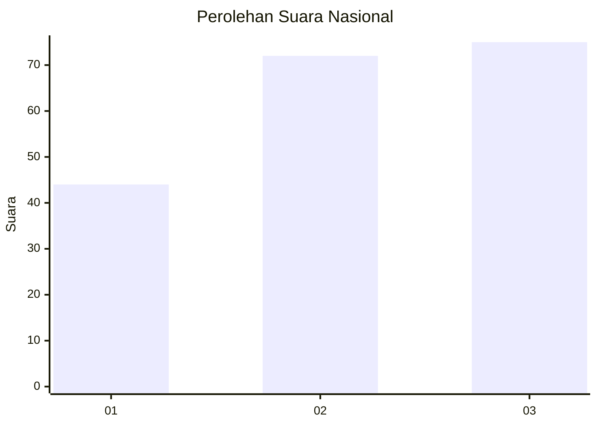
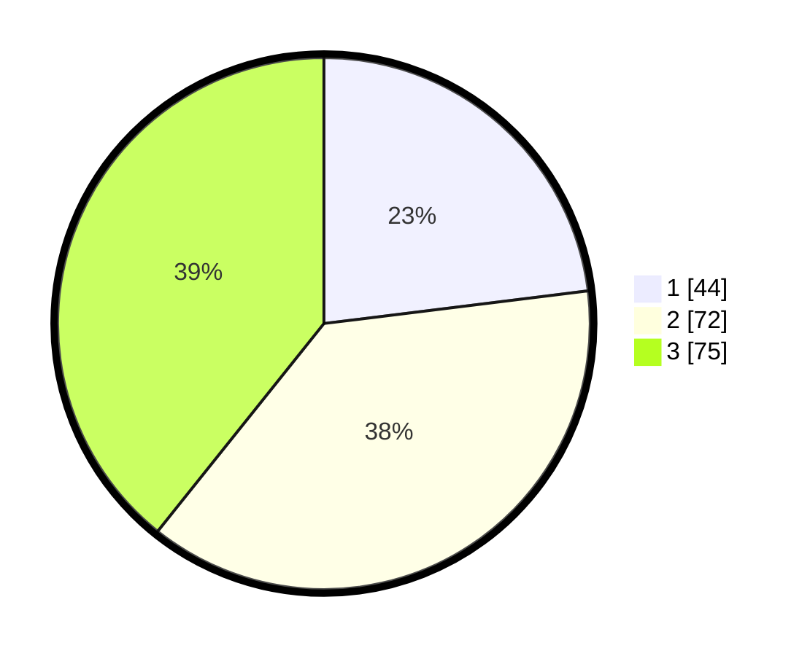

# Hasil

## Grafik

## Tabel

| No. | Nama Paslon    | Suara | Suara (raw) | Persentase |
|:--- |:-------------- | -----:| -----------:| ----------:|
| 1   | ANIES MUHAIMIN | 44    | [44][p-1]   | 23,04      |
| 2   | PRABOWO GIBRAN | 72    | [72][p-2]   | 37,70      |
| 3   | GANJAR MAHFUD  | 75    | [75][p-3]   | 39,27      |

[p-1]: https://github.com/gigit-pemilu/pemilu-2024/blob/main/pilpres/hitung-suara/sub/34-di-yogyakarta/sub/02-bantul/sub/12-banguntapan/sub/2003-jagalan/sub/006-tps/sub/paslon-1.txt
[p-2]: https://github.com/gigit-pemilu/pemilu-2024/blob/main/pilpres/hitung-suara/sub/34-di-yogyakarta/sub/02-bantul/sub/12-banguntapan/sub/2003-jagalan/sub/006-tps/sub/paslon-2.txt
[p-3]: https://github.com/gigit-pemilu/pemilu-2024/blob/main/pilpres/hitung-suara/sub/34-di-yogyakarta/sub/02-bantul/sub/12-banguntapan/sub/2003-jagalan/sub/006-tps/sub/paslon-3.txt

## Foto C Plano

https://sirekap-obj-formc.kpu.go.id/bdc1/pemilu/ppwp/34/02/12/20/03/3402122003006-20240220-194257--c5c71f0e-6a7b-4ef2-bd7d-c7723a0f607f.jpg

https://sirekap-obj-formc.kpu.go.id/bdc1/pemilu/ppwp/34/02/12/20/03/3402122003006-20240220-194603--f73a722d-222e-47cc-9080-138ec6963566.jpg

https://sirekap-obj-formc.kpu.go.id/bdc1/pemilu/ppwp/34/02/12/20/03/3402122003006-20240220-194807--429cfb19-537d-4b1e-9d83-9280f3da6148.jpg

## Metadata

| Key        | Value               |
| ---------- | ------------------- |
| Time Stamp | 2024-02-20 20:00:00 |

