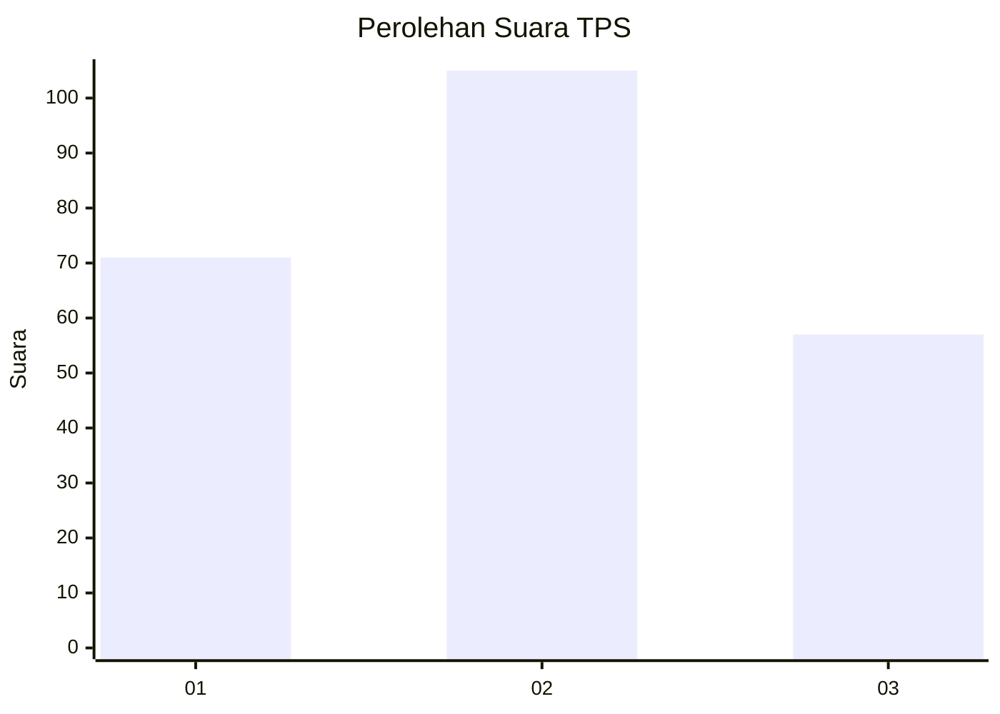
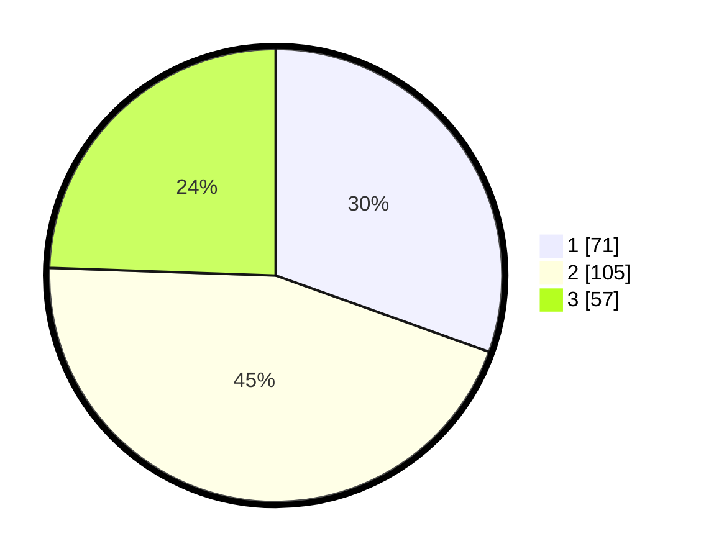

# Hasil

## Grafik

## Tabel

| No. | Nama Paslon    | Suara | Suara (raw) | Persentase |
|:--- |:-------------- | -----:| -----------:| ----------:|
| 1   | ANIES MUHAIMIN | 71    | [71][p-1]   | 30,47      |
| 2   | PRABOWO GIBRAN | 105   | [105][p-2]  | 45,06      |
| 3   | GANJAR MAHFUD  | 57    | [57][p-3]   | 24,46      |

[p-1]: https://github.com/gigit-pemilu/pemilu-2024-34-di-yogyakarta/blob/main/pilpres/hitung-suara/sub/34-di-yogyakarta/sub/02-bantul/sub/12-banguntapan/sub/2003-jagalan/sub/007-tps/sub/paslon-1.txt
[p-2]: https://github.com/gigit-pemilu/pemilu-2024-34-di-yogyakarta/blob/main/pilpres/hitung-suara/sub/34-di-yogyakarta/sub/02-bantul/sub/12-banguntapan/sub/2003-jagalan/sub/007-tps/sub/paslon-2.txt
[p-3]: https://github.com/gigit-pemilu/pemilu-2024-34-di-yogyakarta/blob/main/pilpres/hitung-suara/sub/34-di-yogyakarta/sub/02-bantul/sub/12-banguntapan/sub/2003-jagalan/sub/007-tps/sub/paslon-3.txt

## Foto C Plano

https://sirekap-obj-formc.kpu.go.id/5c19/pemilu/ppwp/34/02/12/20/03/3402122003007-20240220-195448--f5662295-ad83-4ff7-bc98-b85d1680b47d.jpg

https://sirekap-obj-formc.kpu.go.id/5c19/pemilu/ppwp/34/02/12/20/03/3402122003007-20240220-195930--95291bfe-d736-4d12-ba61-c487bcf5a138.jpg

https://sirekap-obj-formc.kpu.go.id/5c19/pemilu/ppwp/34/02/12/20/03/3402122003007-20240220-195811--2f5961a1-3103-4453-a718-15b47a72ad73.jpg

## Metadata

| Key        | Value               |
| ---------- | ------------------- |
| Time Stamp | 2024-02-24 22:31:28 |

