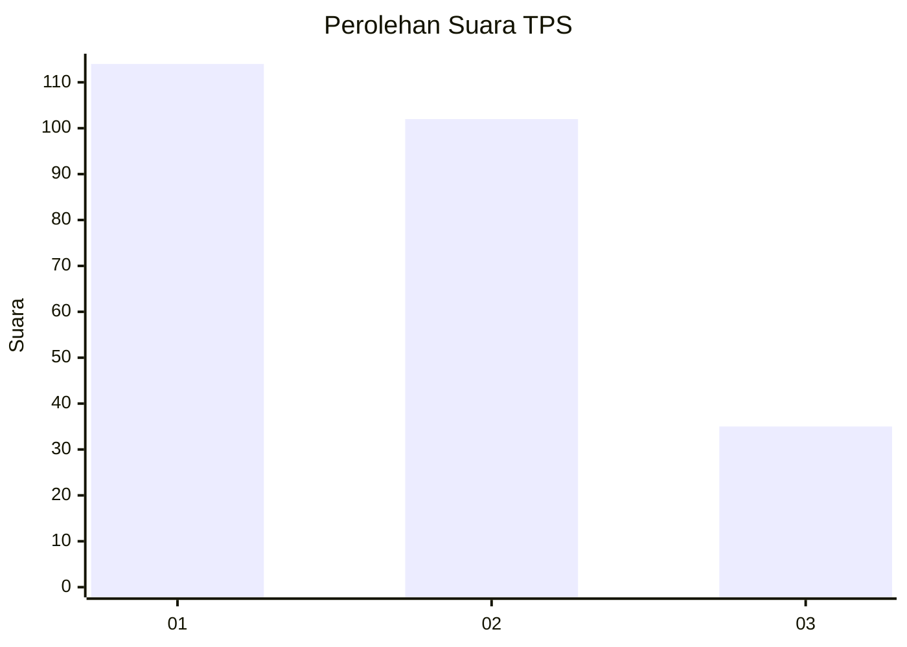
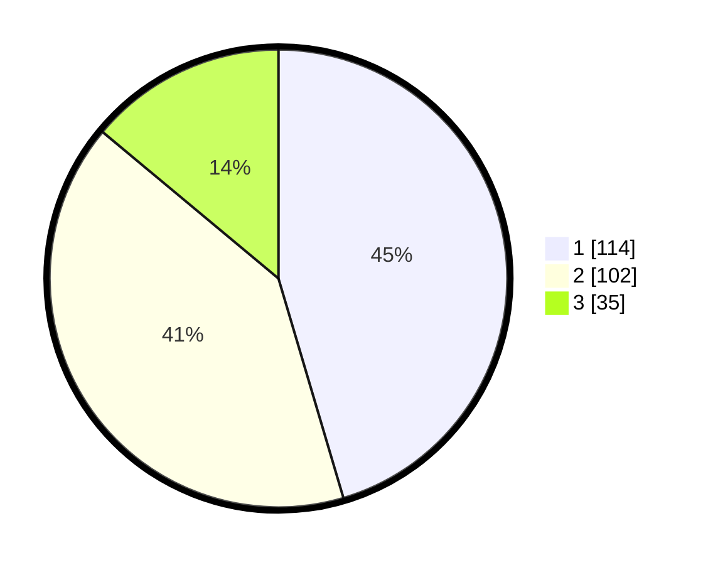

# Hasil

## Grafik

## Tabel

| No. | Nama Paslon    | Suara | Suara (raw) | Persentase |
|:--- |:-------------- | -----:| -----------:| ----------:|
| 1   | ANIES MUHAIMIN | 114   | [114][p-1]  | 45,42      |
| 2   | PRABOWO GIBRAN | 102   | [102][p-2]  | 40,64      |
| 3   | GANJAR MAHFUD  | 35    | [35][p-3]   | 13,94      |

[p-1]: https://github.com/gigit-pemilu/pemilu-2024-34-di-yogyakarta/blob/main/pilpres/hitung-suara/sub/34-di-yogyakarta/sub/02-bantul/sub/12-banguntapan/sub/2003-jagalan/sub/008-tps/sub/paslon-1.txt
[p-2]: https://github.com/gigit-pemilu/pemilu-2024-34-di-yogyakarta/blob/main/pilpres/hitung-suara/sub/34-di-yogyakarta/sub/02-bantul/sub/12-banguntapan/sub/2003-jagalan/sub/008-tps/sub/paslon-2.txt
[p-3]: https://github.com/gigit-pemilu/pemilu-2024-34-di-yogyakarta/blob/main/pilpres/hitung-suara/sub/34-di-yogyakarta/sub/02-bantul/sub/12-banguntapan/sub/2003-jagalan/sub/008-tps/sub/paslon-3.txt

## Foto C Plano

https://sirekap-obj-formc.kpu.go.id/9685/pemilu/ppwp/34/02/12/20/03/3402122003008-20240221-124111--2cbe3463-39da-4949-a97c-24467ff57e1d.jpg

https://sirekap-obj-formc.kpu.go.id/9685/pemilu/ppwp/34/02/12/20/03/3402122003008-20240221-124203--ed215264-1854-4239-ae47-405f65b77b9e.jpg

https://sirekap-obj-formc.kpu.go.id/9685/pemilu/ppwp/34/02/12/20/03/3402122003008-20240221-124258--7baa4981-209f-43ba-9cb8-ae4253faadab.jpg

## Metadata

| Key        | Value               |
| ---------- | ------------------- |
| Time Stamp | 2024-02-24 22:31:28 |

