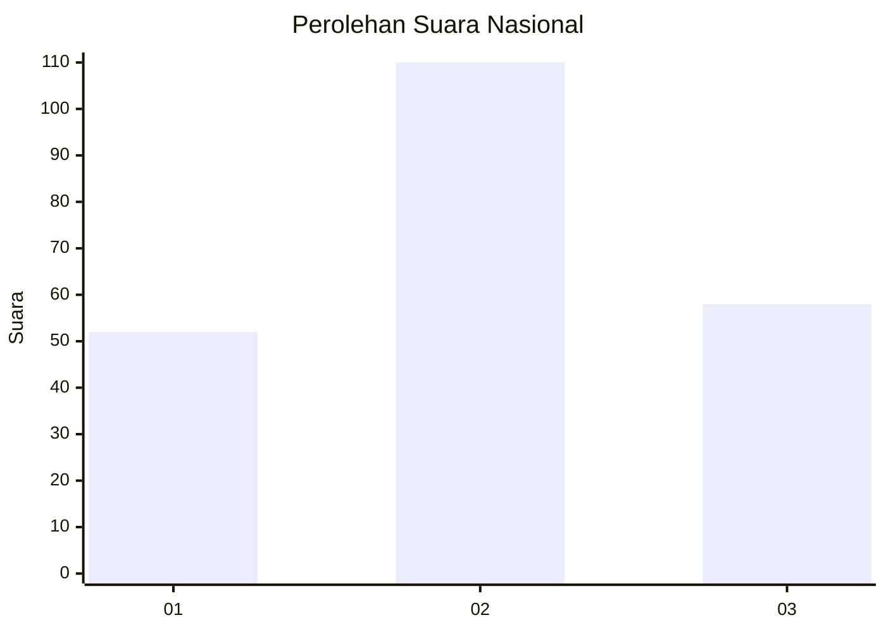
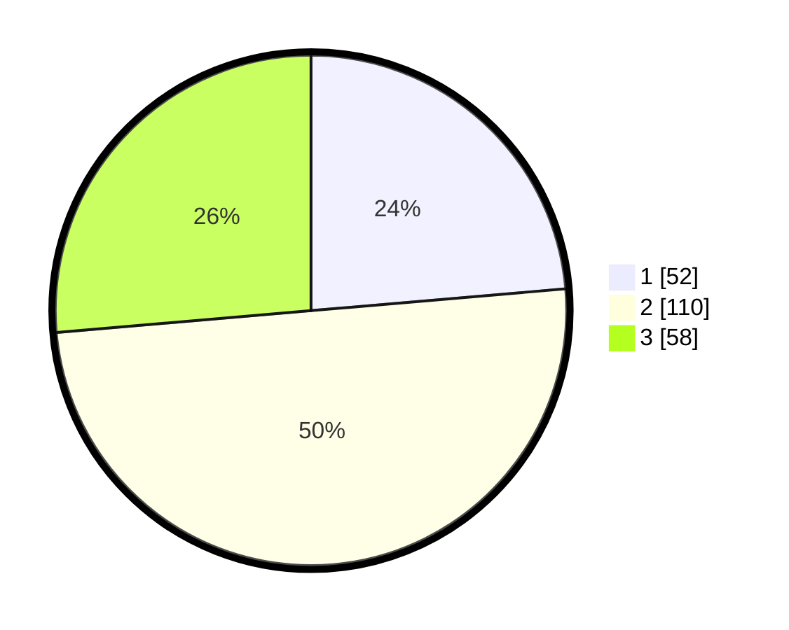

# Hasil

## Grafik

## Tabel

| No. | Nama Paslon    | Suara | Suara (raw) | Persentase |
|:--- |:-------------- | -----:| -----------:| ----------:|
| 1   | ANIES MUHAIMIN | 52    | [52][p-1]   | 23,64      |
| 2   | PRABOWO GIBRAN | 110   | [110][p-2]  | 50,00      |
| 3   | GANJAR MAHFUD  | 58    | [58][p-3]   | 26,36      |

[p-1]: https://github.com/gigit-pemilu/pemilu-2024/blob/main/pilpres/hitung-suara/sub/34-di-yogyakarta/sub/02-bantul/sub/12-banguntapan/sub/2003-jagalan/sub/009-tps/sub/paslon-1.txt
[p-2]: https://github.com/gigit-pemilu/pemilu-2024/blob/main/pilpres/hitung-suara/sub/34-di-yogyakarta/sub/02-bantul/sub/12-banguntapan/sub/2003-jagalan/sub/009-tps/sub/paslon-2.txt
[p-3]: https://github.com/gigit-pemilu/pemilu-2024/blob/main/pilpres/hitung-suara/sub/34-di-yogyakarta/sub/02-bantul/sub/12-banguntapan/sub/2003-jagalan/sub/009-tps/sub/paslon-3.txt

## Foto C Plano

https://sirekap-obj-formc.kpu.go.id/650c/pemilu/ppwp/34/02/12/20/03/3402122003009-20240215-025020--528933fa-3cf4-40a8-b874-f52c46e128e7.jpg

https://sirekap-obj-formc.kpu.go.id/650c/pemilu/ppwp/34/02/12/20/03/3402122003009-20240215-030846--ca4fbfd3-cbdf-46ca-af3c-c83055832ce8.jpg

https://sirekap-obj-formc.kpu.go.id/650c/pemilu/ppwp/34/02/12/20/03/3402122003009-20240215-025412--1f6b0baa-0bfb-4113-9798-24a1b93b3bd0.jpg

## Metadata

| Key        | Value               |
| ---------- | ------------------- |
| Time Stamp | 2024-02-24 22:31:28 |

