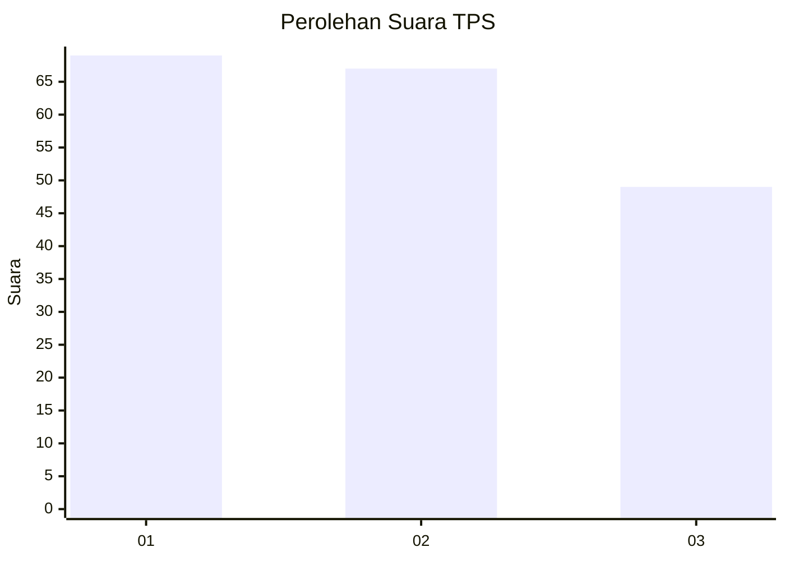
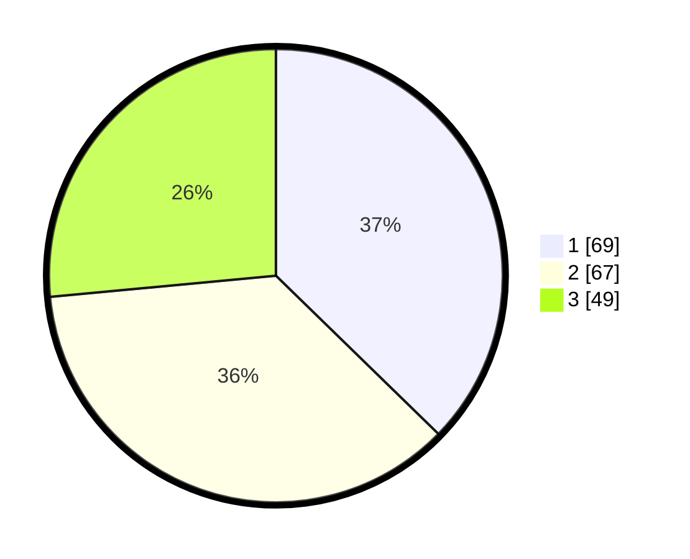

# Hasil

## Grafik

## Tabel

| No. | Nama Paslon    | Suara | Suara (raw) | Persentase |
|:--- |:-------------- | -----:| -----------:| ----------:|
| 1   | ANIES MUHAIMIN | 69    | [69][p-1]   | 37,30      |
| 2   | PRABOWO GIBRAN | 67    | [67][p-2]   | 36,22      |
| 3   | GANJAR MAHFUD  | 49    | [49][p-3]   | 26,49      |

[p-1]: https://github.com/gigit-pemilu/pemilu-2024-34-di-yogyakarta/blob/main/pilpres/hitung-suara/sub/34-di-yogyakarta/sub/02-bantul/sub/12-banguntapan/sub/2004-singosaren/sub/003-tps/sub/paslon-1.txt
[p-2]: https://github.com/gigit-pemilu/pemilu-2024-34-di-yogyakarta/blob/main/pilpres/hitung-suara/sub/34-di-yogyakarta/sub/02-bantul/sub/12-banguntapan/sub/2004-singosaren/sub/003-tps/sub/paslon-2.txt
[p-3]: https://github.com/gigit-pemilu/pemilu-2024-34-di-yogyakarta/blob/main/pilpres/hitung-suara/sub/34-di-yogyakarta/sub/02-bantul/sub/12-banguntapan/sub/2004-singosaren/sub/003-tps/sub/paslon-3.txt

## Foto C Plano

https://sirekap-obj-formc.kpu.go.id/8d6e/pemilu/ppwp/34/02/12/20/04/3402122004003-20240214-212932--19971c65-c31c-433a-b283-3b7fd95ea176.jpg

https://sirekap-obj-formc.kpu.go.id/8d6e/pemilu/ppwp/34/02/12/20/04/3402122004003-20240214-213037--936992c0-db0a-425c-93b7-165eac7c22a6.jpg

## Metadata

| Key        | Value               |
| ---------- | ------------------- |
| Time Stamp | 2024-02-19 06:16:00 |

