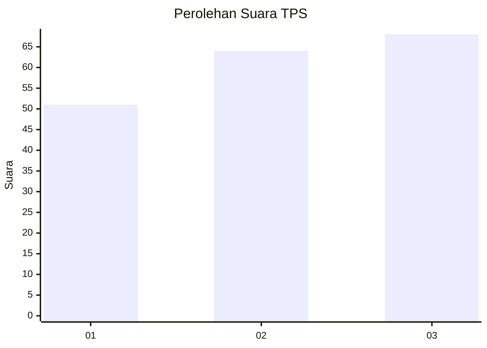
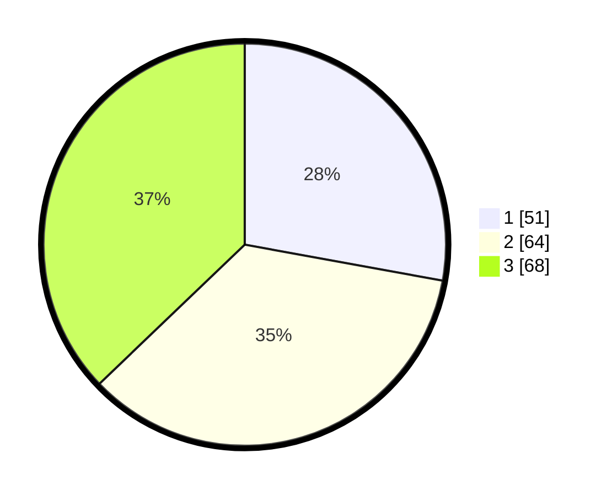

# Hasil

## Grafik

## Tabel

| No. | Nama Paslon    | Suara | Suara (raw) | Persentase |
|:--- |:-------------- | -----:| -----------:| ----------:|
| 1   | ANIES MUHAIMIN | 51    | [51][p-1]   | 27,87      |
| 2   | PRABOWO GIBRAN | 64    | [64][p-2]   | 34,97      |
| 3   | GANJAR MAHFUD  | 68    | [68][p-3]   | 37,16      |

[p-1]: https://github.com/gigit-pemilu/pemilu-2024-34-di-yogyakarta/blob/main/pilpres/hitung-suara/sub/34-di-yogyakarta/sub/02-bantul/sub/12-banguntapan/sub/2004-singosaren/sub/005-tps/sub/paslon-1.txt
[p-2]: https://github.com/gigit-pemilu/pemilu-2024-34-di-yogyakarta/blob/main/pilpres/hitung-suara/sub/34-di-yogyakarta/sub/02-bantul/sub/12-banguntapan/sub/2004-singosaren/sub/005-tps/sub/paslon-2.txt
[p-3]: https://github.com/gigit-pemilu/pemilu-2024-34-di-yogyakarta/blob/main/pilpres/hitung-suara/sub/34-di-yogyakarta/sub/02-bantul/sub/12-banguntapan/sub/2004-singosaren/sub/005-tps/sub/paslon-3.txt

## Foto C Plano

https://sirekap-obj-formc.kpu.go.id/f312/pemilu/ppwp/34/02/12/20/04/3402122004005-20240214-233939--1b2a3544-515b-4b1d-862b-75628286960f.jpg

https://sirekap-obj-formc.kpu.go.id/f312/pemilu/ppwp/34/02/12/20/04/3402122004005-20240214-234102--7c925e23-4dc3-44a1-a5b5-e89abc108003.jpg

https://sirekap-obj-formc.kpu.go.id/f312/pemilu/ppwp/34/02/12/20/04/3402122004005-20240214-234944--6bca0082-d741-43bf-b906-23ebe4bb98bd.jpg

## Metadata

| Key        | Value               |
| ---------- | ------------------- |
| Time Stamp | 2024-02-19 06:16:00 |

