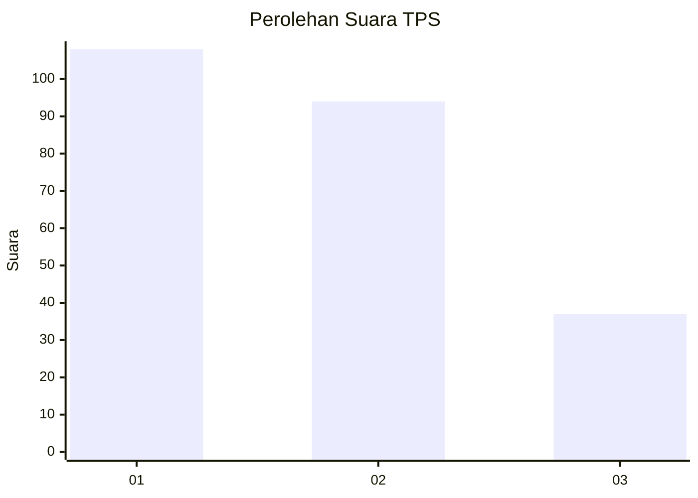
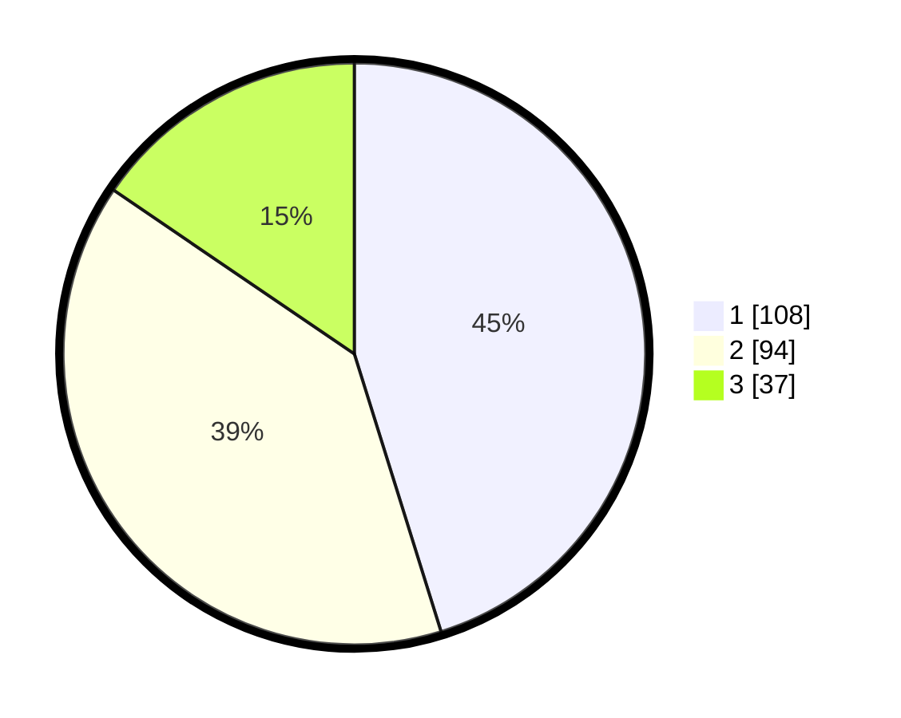

# Hasil

## Grafik

## Tabel

| No. | Nama Paslon    | Suara | Suara (raw) | Persentase |
|:--- |:-------------- | -----:| -----------:| ----------:|
| 1   | ANIES MUHAIMIN | 108   | [108][p-1]  | 45,19      |
| 2   | PRABOWO GIBRAN | 94    | [94][p-2]   | 39,33      |
| 3   | GANJAR MAHFUD  | 37    | [37][p-3]   | 15,48      |

[p-1]: https://github.com/gigit-pemilu/pemilu-2024-34-di-yogyakarta/blob/main/pilpres/hitung-suara/sub/34-di-yogyakarta/sub/02-bantul/sub/12-banguntapan/sub/2004-singosaren/sub/007-tps/sub/paslon-1.txt
[p-2]: https://github.com/gigit-pemilu/pemilu-2024-34-di-yogyakarta/blob/main/pilpres/hitung-suara/sub/34-di-yogyakarta/sub/02-bantul/sub/12-banguntapan/sub/2004-singosaren/sub/007-tps/sub/paslon-2.txt
[p-3]: https://github.com/gigit-pemilu/pemilu-2024-34-di-yogyakarta/blob/main/pilpres/hitung-suara/sub/34-di-yogyakarta/sub/02-bantul/sub/12-banguntapan/sub/2004-singosaren/sub/007-tps/sub/paslon-3.txt

## Foto C Plano

https://sirekap-obj-formc.kpu.go.id/0dce/pemilu/ppwp/34/02/12/20/04/3402122004007-20240217-133039--351a11de-6c53-4fd9-925f-84e9a322ea38.jpg

https://sirekap-obj-formc.kpu.go.id/0dce/pemilu/ppwp/34/02/12/20/04/3402122004007-20240217-133121--a43f9ec0-ded7-4854-aaaa-78a6200db008.jpg

https://sirekap-obj-formc.kpu.go.id/0dce/pemilu/ppwp/34/02/12/20/04/3402122004007-20240217-133207--15a394c7-9e30-4009-8f7b-259037fab643.jpg

## Metadata

| Key        | Value               |
| ---------- | ------------------- |
| Time Stamp | 2024-02-24 22:31:28 |

