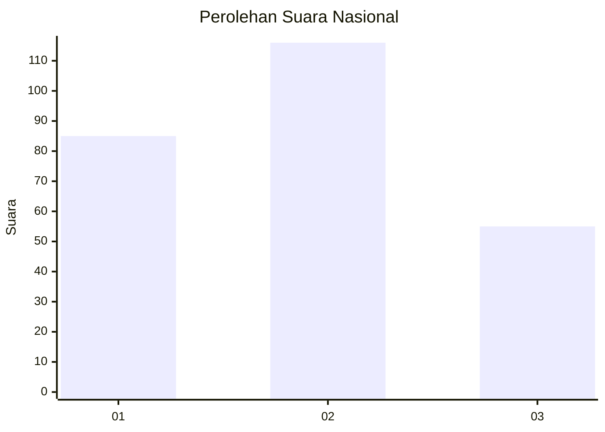
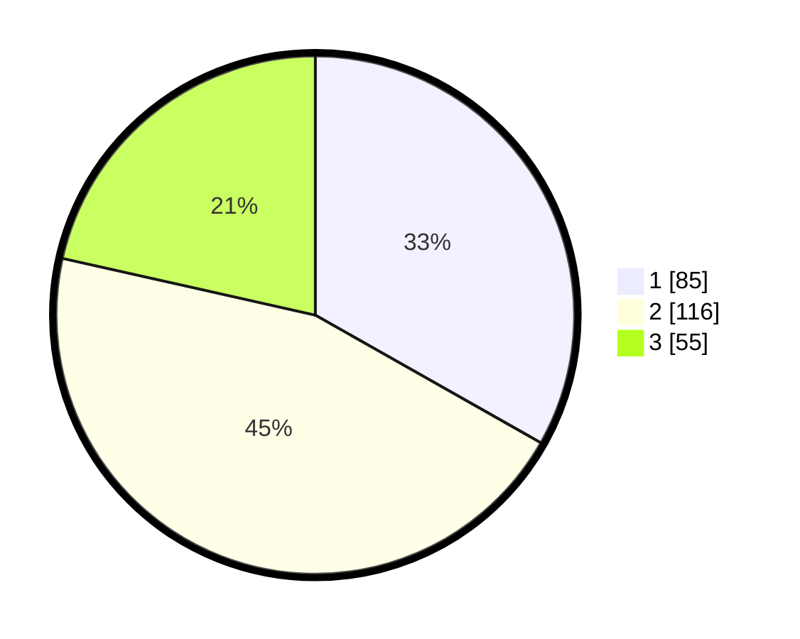

# Hasil

## Grafik

## Tabel

| No. | Nama Paslon    | Suara | Suara (raw) | Persentase |
|:--- |:-------------- | -----:| -----------:| ----------:|
| 1   | ANIES MUHAIMIN | 85    | [85][p-1]   | 33,20      |
| 2   | PRABOWO GIBRAN | 116   | [116][p-2]  | 45,31      |
| 3   | GANJAR MAHFUD  | 55    | [55][p-3]   | 21,48      |

[p-1]: https://github.com/gigit-pemilu/pemilu-2024/blob/main/pilpres/hitung-suara/sub/34-di-yogyakarta/sub/02-bantul/sub/12-banguntapan/sub/2004-singosaren/sub/009-tps/sub/paslon-1.txt
[p-2]: https://github.com/gigit-pemilu/pemilu-2024/blob/main/pilpres/hitung-suara/sub/34-di-yogyakarta/sub/02-bantul/sub/12-banguntapan/sub/2004-singosaren/sub/009-tps/sub/paslon-2.txt
[p-3]: https://github.com/gigit-pemilu/pemilu-2024/blob/main/pilpres/hitung-suara/sub/34-di-yogyakarta/sub/02-bantul/sub/12-banguntapan/sub/2004-singosaren/sub/009-tps/sub/paslon-3.txt

## Foto C Plano

https://sirekap-obj-formc.kpu.go.id/d1ec/pemilu/ppwp/34/02/12/20/04/3402122004009-20240215-055943--8ef6a96d-a7a0-42a1-8d8a-1881b69b9eff.jpg

https://sirekap-obj-formc.kpu.go.id/d1ec/pemilu/ppwp/34/02/12/20/04/3402122004009-20240215-060009--4f6f4801-9a91-4492-a845-89b356253eb7.jpg

https://sirekap-obj-formc.kpu.go.id/d1ec/pemilu/ppwp/34/02/12/20/04/3402122004009-20240215-060120--3939ddb9-21d1-4719-aa8e-7d39c90f0a78.jpg

## Metadata

| Key        | Value               |
| ---------- | ------------------- |
| Time Stamp | 2024-02-19 06:16:00 |

