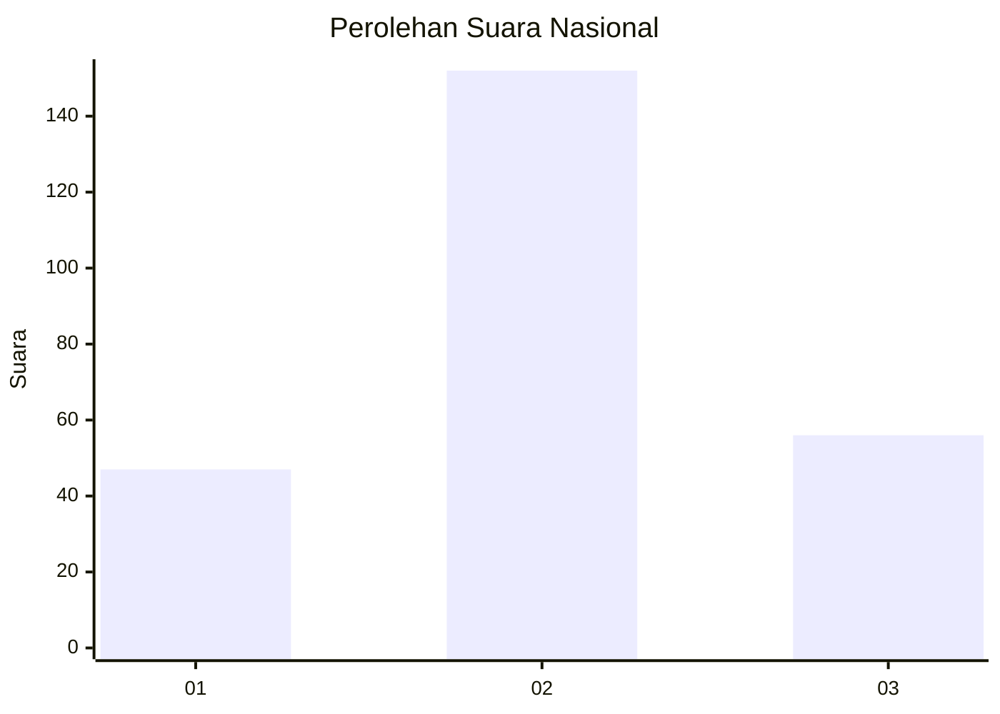
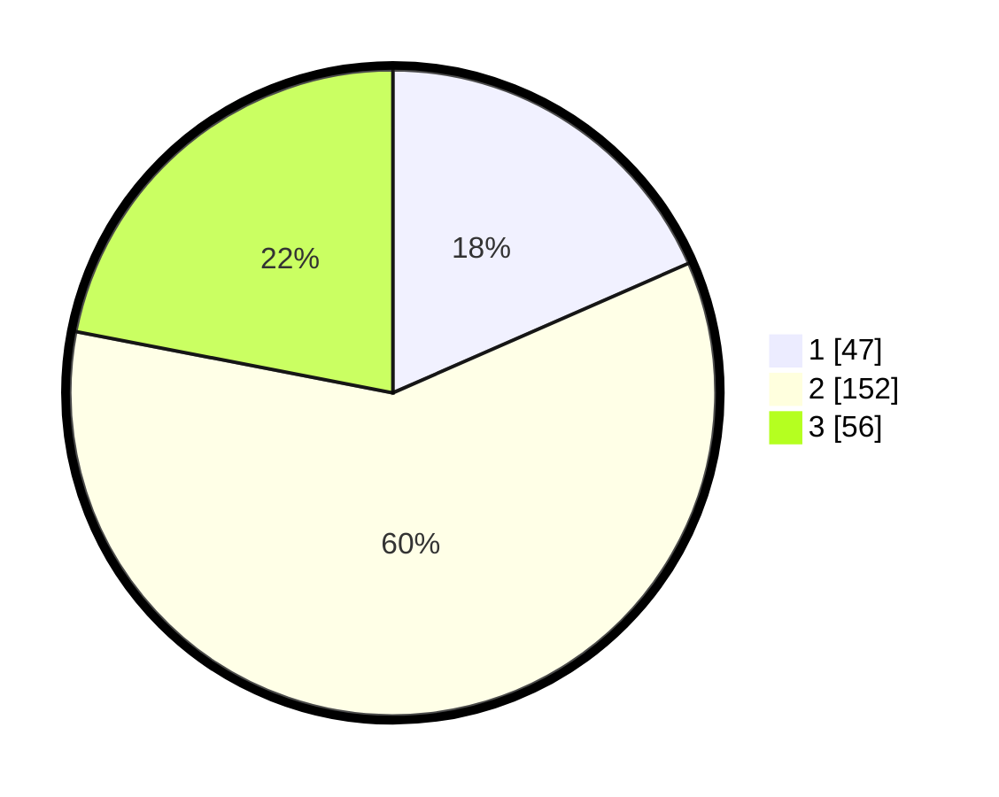

# Hasil

## Grafik

## Tabel

| No. | Nama Paslon    | Suara | Suara (raw) | Persentase |
|:--- |:-------------- | -----:| -----------:| ----------:|
| 1   | ANIES MUHAIMIN | 47    | [47][p-1]   | 18,43      |
| 2   | PRABOWO GIBRAN | 152   | [152][p-2]  | 59,61      |
| 3   | GANJAR MAHFUD  | 56    | [56][p-3]   | 21,96      |

[p-1]: https://github.com/gigit-pemilu/pemilu-2024/blob/main/pilpres/hitung-suara/sub/34-di-yogyakarta/sub/02-bantul/sub/12-banguntapan/sub/2004-singosaren/sub/010-tps/sub/paslon-1.txt
[p-2]: https://github.com/gigit-pemilu/pemilu-2024/blob/main/pilpres/hitung-suara/sub/34-di-yogyakarta/sub/02-bantul/sub/12-banguntapan/sub/2004-singosaren/sub/010-tps/sub/paslon-2.txt
[p-3]: https://github.com/gigit-pemilu/pemilu-2024/blob/main/pilpres/hitung-suara/sub/34-di-yogyakarta/sub/02-bantul/sub/12-banguntapan/sub/2004-singosaren/sub/010-tps/sub/paslon-3.txt

## Foto C Plano

https://sirekap-obj-formc.kpu.go.id/6772/pemilu/ppwp/34/02/12/20/04/3402122004010-20240215-051629--a67c8683-21fa-4b46-bd53-1d3035cefe8e.jpg

https://sirekap-obj-formc.kpu.go.id/6772/pemilu/ppwp/34/02/12/20/04/3402122004010-20240215-021933--9dd18fd3-263b-4486-a74c-cc7099472824.jpg

https://sirekap-obj-formc.kpu.go.id/6772/pemilu/ppwp/34/02/12/20/04/3402122004010-20240215-020659--0befe795-e41b-4f89-b7a0-29f6eb510509.jpg

## Metadata

| Key        | Value               |
| ---------- | ------------------- |
| Time Stamp | 2024-02-15 12:00:28 |

