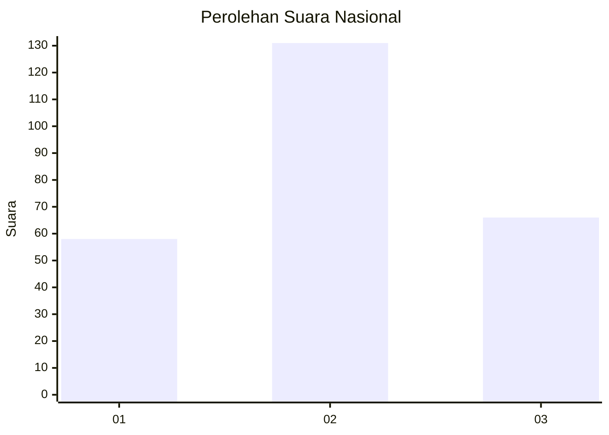
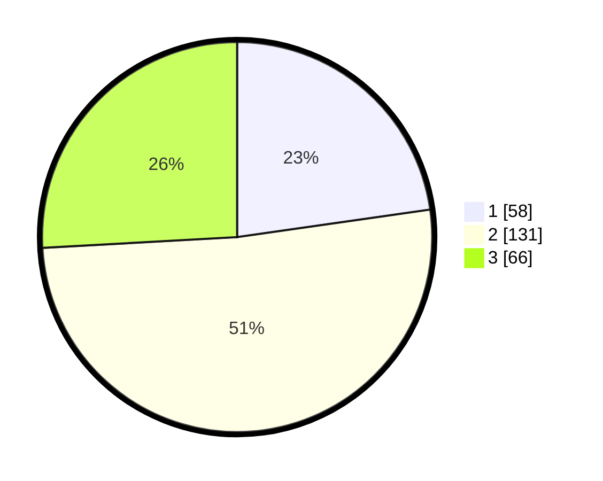

# Hasil

## Grafik

## Tabel

| No. | Nama Paslon    | Suara | Suara (raw) | Persentase |
|:--- |:-------------- | -----:| -----------:| ----------:|
| 1   | ANIES MUHAIMIN | 58    | [58][p-1]   | 22,75      |
| 2   | PRABOWO GIBRAN | 131   | [131][p-2]  | 51,37      |
| 3   | GANJAR MAHFUD  | 66    | [66][p-3]   | 25,88      |

[p-1]: https://github.com/gigit-pemilu/pemilu-2024/blob/main/pilpres/hitung-suara/sub/34-di-yogyakarta/sub/02-bantul/sub/12-banguntapan/sub/2004-singosaren/sub/012-tps/sub/paslon-1.txt
[p-2]: https://github.com/gigit-pemilu/pemilu-2024/blob/main/pilpres/hitung-suara/sub/34-di-yogyakarta/sub/02-bantul/sub/12-banguntapan/sub/2004-singosaren/sub/012-tps/sub/paslon-2.txt
[p-3]: https://github.com/gigit-pemilu/pemilu-2024/blob/main/pilpres/hitung-suara/sub/34-di-yogyakarta/sub/02-bantul/sub/12-banguntapan/sub/2004-singosaren/sub/012-tps/sub/paslon-3.txt

## Foto C Plano

https://sirekap-obj-formc.kpu.go.id/a595/pemilu/ppwp/34/02/12/20/04/3402122004012-20240215-004120--d5a77eda-7345-4ed0-bb23-09ee00dfa0c8.jpg

https://sirekap-obj-formc.kpu.go.id/a595/pemilu/ppwp/34/02/12/20/04/3402122004012-20240215-004300--27dac49b-d1b0-4372-b8ce-49cc1d0ddbbb.jpg

https://sirekap-obj-formc.kpu.go.id/a595/pemilu/ppwp/34/02/12/20/04/3402122004012-20240215-004406--0f5a562d-8d8f-41b0-91a4-2b2b2e8950a1.jpg

## Metadata

| Key        | Value               |
| ---------- | ------------------- |
| Time Stamp | 2024-02-19 06:16:00 |

