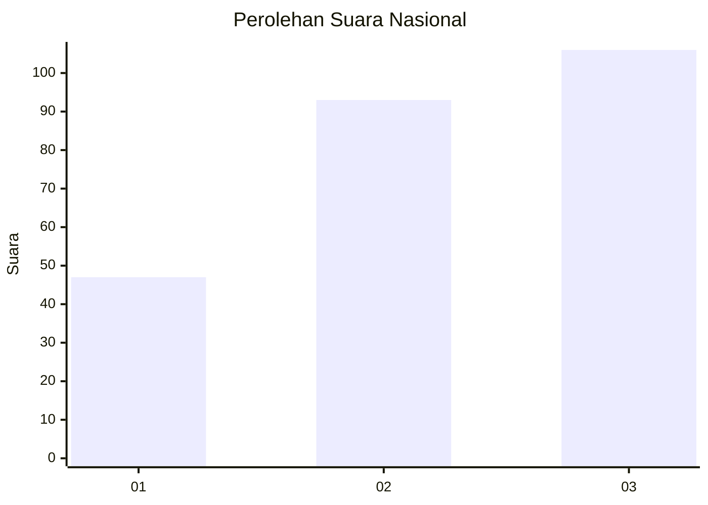
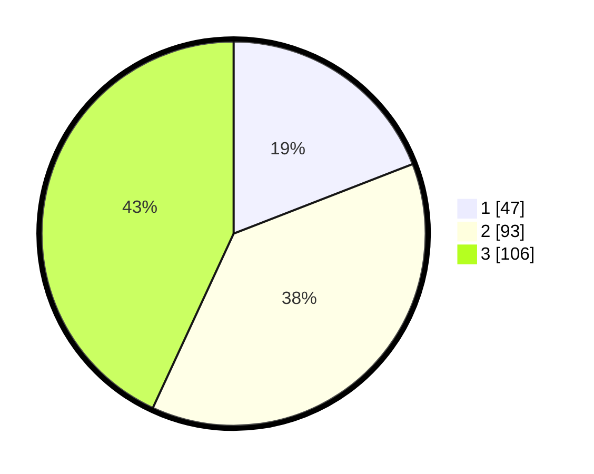

# Hasil

## Grafik

## Tabel

| No. | Nama Paslon    | Suara | Suara (raw) | Persentase |
|:--- |:-------------- | -----:| -----------:| ----------:|
| 1   | ANIES MUHAIMIN | 47    | [47][p-1]   | 19,11      |
| 2   | PRABOWO GIBRAN | 93    | [93][p-2]   | 37,80      |
| 3   | GANJAR MAHFUD  | 106   | [106][p-3]  | 43,09      |

[p-1]: https://github.com/gigit-pemilu/pemilu-2024/blob/main/pilpres/hitung-suara/sub/34-di-yogyakarta/sub/02-bantul/sub/12-banguntapan/sub/2005-jambidan/sub/003-tps/sub/paslon-1.txt
[p-2]: https://github.com/gigit-pemilu/pemilu-2024/blob/main/pilpres/hitung-suara/sub/34-di-yogyakarta/sub/02-bantul/sub/12-banguntapan/sub/2005-jambidan/sub/003-tps/sub/paslon-2.txt
[p-3]: https://github.com/gigit-pemilu/pemilu-2024/blob/main/pilpres/hitung-suara/sub/34-di-yogyakarta/sub/02-bantul/sub/12-banguntapan/sub/2005-jambidan/sub/003-tps/sub/paslon-3.txt

## Foto C Plano

https://sirekap-obj-formc.kpu.go.id/36ee/pemilu/ppwp/34/02/12/20/05/3402122005003-20240214-213410--831f3a8d-33c4-4835-875c-356922d3b655.jpg

https://sirekap-obj-formc.kpu.go.id/36ee/pemilu/ppwp/34/02/12/20/05/3402122005003-20240214-213426--d3790569-cf39-49c5-9a26-b968302fe4b4.jpg

https://sirekap-obj-formc.kpu.go.id/36ee/pemilu/ppwp/34/02/12/20/05/3402122005003-20240214-213444--2d1ecf46-2c58-412c-9f55-0b73068d93c7.jpg

## Metadata

| Key        | Value               |
| ---------- | ------------------- |
| Time Stamp | 2024-02-24 22:31:28 |

