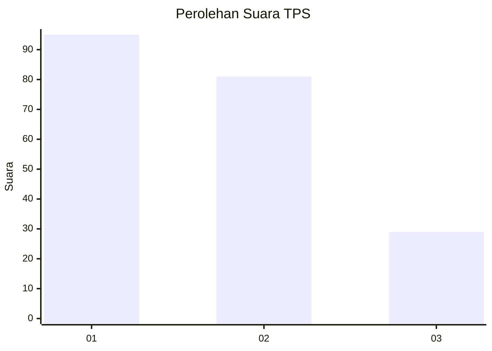
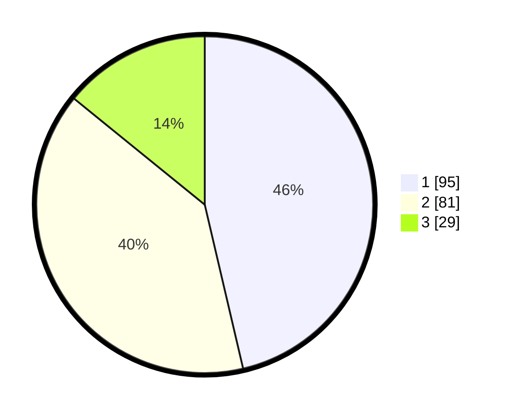

# Hasil

## Grafik

## Tabel

| No. | Nama Paslon    | Suara | Suara (raw) | Persentase |
|:--- |:-------------- | -----:| -----------:| ----------:|
| 1   | ANIES MUHAIMIN | 95    | [95][p-1]   | 46,34      |
| 2   | PRABOWO GIBRAN | 81    | [81][p-2]   | 39,51      |
| 3   | GANJAR MAHFUD  | 29    | [29][p-3]   | 14,15      |

[p-1]: https://github.com/gigit-pemilu/pemilu-2024-34-di-yogyakarta/blob/main/pilpres/hitung-suara/sub/34-di-yogyakarta/sub/02-bantul/sub/12-banguntapan/sub/2005-jambidan/sub/007-tps/sub/paslon-1.txt
[p-2]: https://github.com/gigit-pemilu/pemilu-2024-34-di-yogyakarta/blob/main/pilpres/hitung-suara/sub/34-di-yogyakarta/sub/02-bantul/sub/12-banguntapan/sub/2005-jambidan/sub/007-tps/sub/paslon-2.txt
[p-3]: https://github.com/gigit-pemilu/pemilu-2024-34-di-yogyakarta/blob/main/pilpres/hitung-suara/sub/34-di-yogyakarta/sub/02-bantul/sub/12-banguntapan/sub/2005-jambidan/sub/007-tps/sub/paslon-3.txt

## Foto C Plano

https://sirekap-obj-formc.kpu.go.id/8356/pemilu/ppwp/34/02/12/20/05/3402122005007-20240214-214530--662133ad-13f4-4868-b6e3-6dc8cbe6400c.jpg

https://sirekap-obj-formc.kpu.go.id/8356/pemilu/ppwp/34/02/12/20/05/3402122005007-20240214-213433--501d19de-a01d-4569-bc22-208e8ddeba07.jpg

https://sirekap-obj-formc.kpu.go.id/8356/pemilu/ppwp/34/02/12/20/05/3402122005007-20240214-213625--14fb4a89-dde6-4a67-93dc-7f7405f5ca3f.jpg

## Metadata

| Key        | Value               |
| ---------- | ------------------- |
| Time Stamp | 2024-02-21 16:00:00 |

