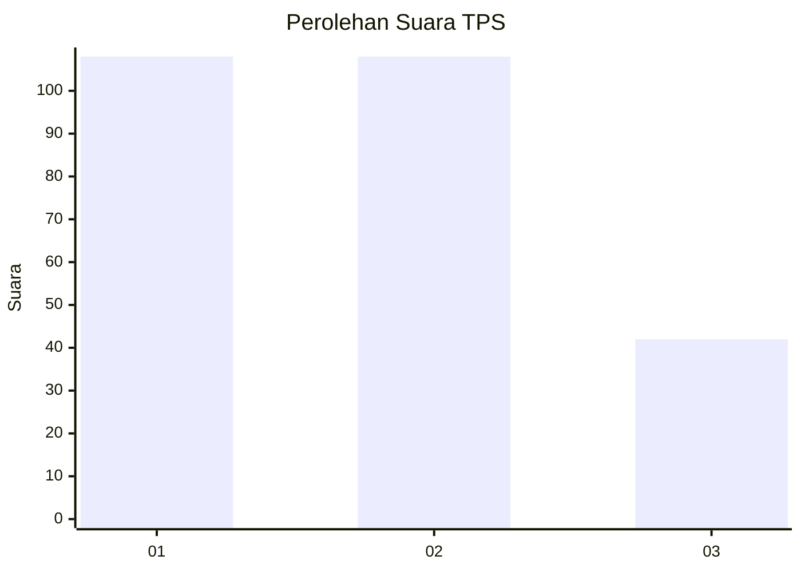
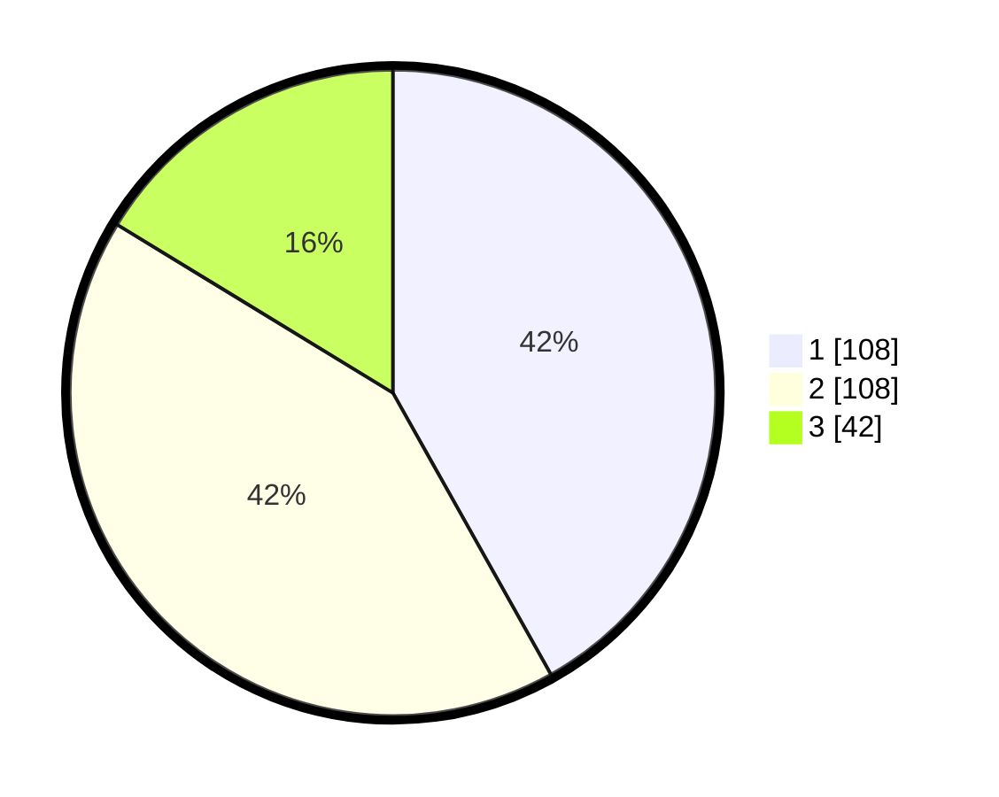

# Hasil

## Grafik

## Tabel

| No. | Nama Paslon    | Suara | Suara (raw) | Persentase |
|:--- |:-------------- | -----:| -----------:| ----------:|
| 1   | ANIES MUHAIMIN | 108   | [108][p-1]  | 41,86      |
| 2   | PRABOWO GIBRAN | 108   | [108][p-2]  | 41,86      |
| 3   | GANJAR MAHFUD  | 42    | [42][p-3]   | 16,28      |

[p-1]: https://github.com/gigit-pemilu/pemilu-2024-34-di-yogyakarta/blob/main/pilpres/hitung-suara/sub/34-di-yogyakarta/sub/02-bantul/sub/12-banguntapan/sub/2005-jambidan/sub/008-tps/sub/paslon-1.txt
[p-2]: https://github.com/gigit-pemilu/pemilu-2024-34-di-yogyakarta/blob/main/pilpres/hitung-suara/sub/34-di-yogyakarta/sub/02-bantul/sub/12-banguntapan/sub/2005-jambidan/sub/008-tps/sub/paslon-2.txt
[p-3]: https://github.com/gigit-pemilu/pemilu-2024-34-di-yogyakarta/blob/main/pilpres/hitung-suara/sub/34-di-yogyakarta/sub/02-bantul/sub/12-banguntapan/sub/2005-jambidan/sub/008-tps/sub/paslon-3.txt

## Foto C Plano

https://sirekap-obj-formc.kpu.go.id/b524/pemilu/ppwp/34/02/12/20/05/3402122005008-20240214-141204--e3834851-a2de-4a00-87ba-8fd786462131.jpg

https://sirekap-obj-formc.kpu.go.id/b524/pemilu/ppwp/34/02/12/20/05/3402122005008-20240214-141242--cf09fc57-fc5c-40f7-8b97-f50453449d5e.jpg

https://sirekap-obj-formc.kpu.go.id/b524/pemilu/ppwp/34/02/12/20/05/3402122005008-20240214-141310--851ea137-1c6a-4f9a-94e7-4c8f2c89d035.jpg

## Metadata

| Key        | Value               |
| ---------- | ------------------- |
| Time Stamp | 2024-02-15 20:30:46 |

## DATA PEMILIH TETAP

Jumlah pemilih dalam DPT: **267**.
 * L: **126**.
 * P: **141**.

## DATA PENGGUNA HAK PILIH

Jumlah pengguna hak pilih dalam DPT: **248**.
 * L: **118**.
 * P: **130**.

Jumlah pengguna hak pilih dalam DPTb: **9**.
 * L: **1**.
 * P: **8**.

Jumlah pengguna hak pilih dalam DPK: **4**.
 * L: **2**.
 * P: **2**.

Jumlah pengguna hak pilih: **261**.
 * L: **121**.
 * P: **140**.

## JUMLAH SUARA SAH DAN TIDAK SAH

JUMLAH SELURUH SUARA SAH: **258**.

JUMLAH SUARA TIDAK SAH: **3**.

JUMLAH SELURUH SUARA SAH DAN SUARA TIDAK SAH: **261**.

