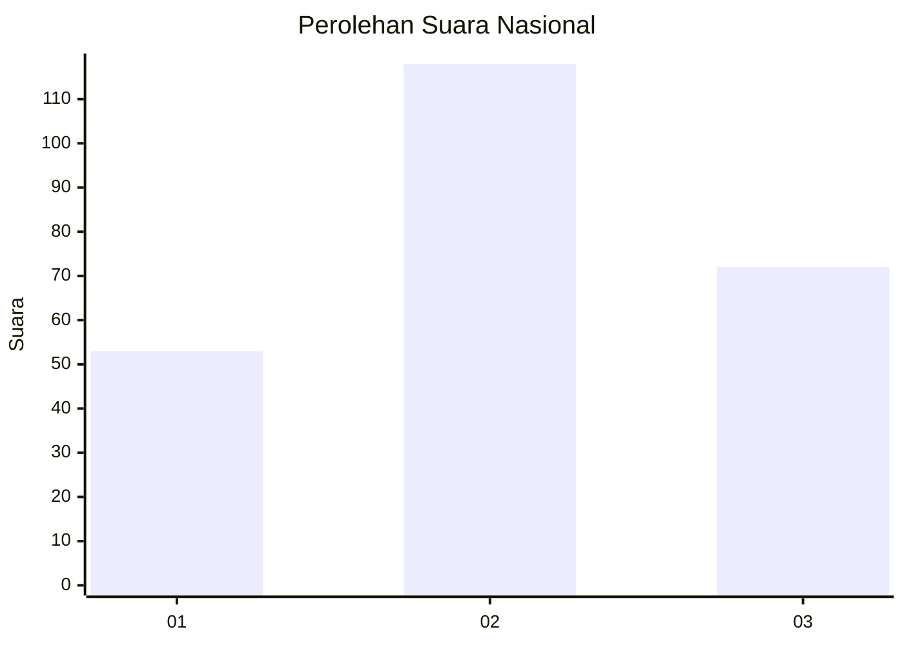
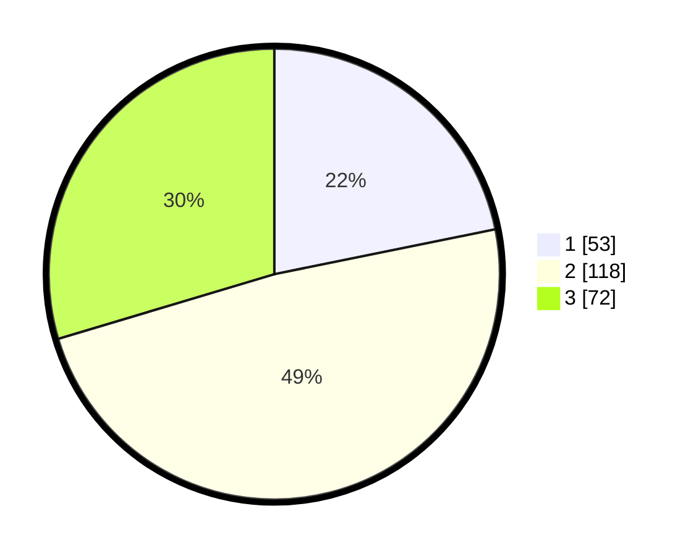

# Hasil

## Grafik

## Tabel

| No. | Nama Paslon    | Suara | Suara (raw) | Persentase |
|:--- |:-------------- | -----:| -----------:| ----------:|
| 1   | ANIES MUHAIMIN | 53    | [53][p-1]   | 21,81      |
| 2   | PRABOWO GIBRAN | 118   | [118][p-2]  | 48,56      |
| 3   | GANJAR MAHFUD  | 72    | [72][p-3]   | 29,63      |

[p-1]: https://github.com/gigit-pemilu/pemilu-2024/blob/main/pilpres/hitung-suara/sub/34-di-yogyakarta/sub/02-bantul/sub/12-banguntapan/sub/2005-jambidan/sub/009-tps/sub/paslon-1.txt
[p-2]: https://github.com/gigit-pemilu/pemilu-2024/blob/main/pilpres/hitung-suara/sub/34-di-yogyakarta/sub/02-bantul/sub/12-banguntapan/sub/2005-jambidan/sub/009-tps/sub/paslon-2.txt
[p-3]: https://github.com/gigit-pemilu/pemilu-2024/blob/main/pilpres/hitung-suara/sub/34-di-yogyakarta/sub/02-bantul/sub/12-banguntapan/sub/2005-jambidan/sub/009-tps/sub/paslon-3.txt

## Foto C Plano

https://sirekap-obj-formc.kpu.go.id/bdac/pemilu/ppwp/34/02/12/20/05/3402122005009-20240214-214040--80118b81-23e0-4151-bffb-3db820234839.jpg

https://sirekap-obj-formc.kpu.go.id/bdac/pemilu/ppwp/34/02/12/20/05/3402122005009-20240214-214402--28f37c7a-b6fe-4d9f-99f6-6933ff0264ef.jpg

https://sirekap-obj-formc.kpu.go.id/bdac/pemilu/ppwp/34/02/12/20/05/3402122005009-20240214-214629--0dbc79e6-93e5-4dac-93da-48ab1765f58d.jpg

## Metadata

| Key        | Value               |
| ---------- | ------------------- |
| Time Stamp | 2024-02-24 22:31:28 |

