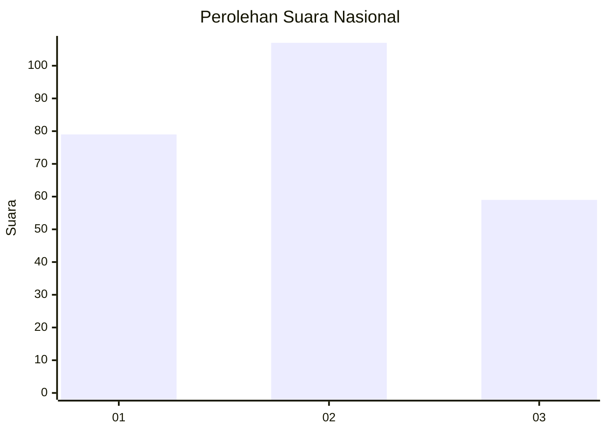
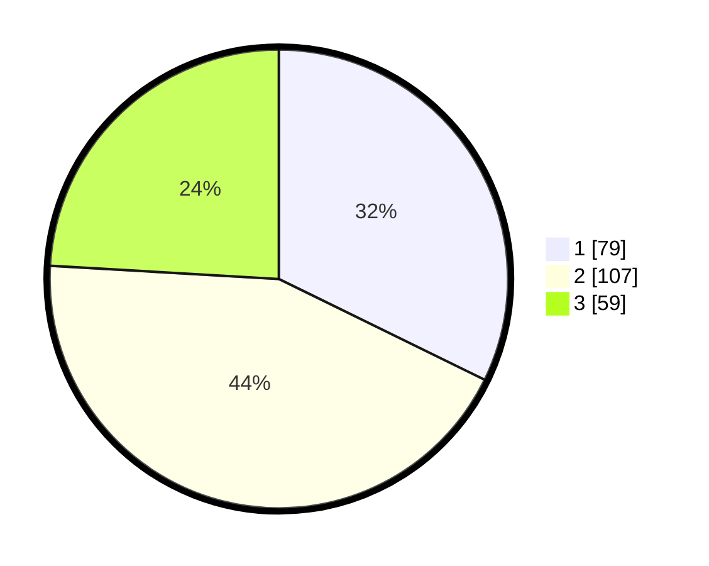

# Hasil

## Grafik

## Tabel

| No. | Nama Paslon    | Suara | Suara (raw) | Persentase |
|:--- |:-------------- | -----:| -----------:| ----------:|
| 1   | ANIES MUHAIMIN | 79    | [79][p-1]   | 32,24      |
| 2   | PRABOWO GIBRAN | 107   | [107][p-2]  | 43,67      |
| 3   | GANJAR MAHFUD  | 59    | [59][p-3]   | 24,08      |

[p-1]: https://github.com/gigit-pemilu/pemilu-2024/blob/main/pilpres/hitung-suara/sub/34-di-yogyakarta/sub/02-bantul/sub/12-banguntapan/sub/2005-jambidan/sub/011-tps/sub/paslon-1.txt
[p-2]: https://github.com/gigit-pemilu/pemilu-2024/blob/main/pilpres/hitung-suara/sub/34-di-yogyakarta/sub/02-bantul/sub/12-banguntapan/sub/2005-jambidan/sub/011-tps/sub/paslon-2.txt
[p-3]: https://github.com/gigit-pemilu/pemilu-2024/blob/main/pilpres/hitung-suara/sub/34-di-yogyakarta/sub/02-bantul/sub/12-banguntapan/sub/2005-jambidan/sub/011-tps/sub/paslon-3.txt

## Foto C Plano

https://sirekap-obj-formc.kpu.go.id/d244/pemilu/ppwp/34/02/12/20/05/3402122005011-20240214-233814--6ef9271a-6182-41ff-8bcf-c5cc68e6dc42.jpg

https://sirekap-obj-formc.kpu.go.id/d244/pemilu/ppwp/34/02/12/20/05/3402122005011-20240214-233950--d814689d-da36-490c-805b-408ca5ed7c47.jpg

https://sirekap-obj-formc.kpu.go.id/d244/pemilu/ppwp/34/02/12/20/05/3402122005011-20240214-234112--c77833f2-2a9c-435c-9c70-1f2636c8ecd6.jpg

## Metadata

| Key        | Value               |
| ---------- | ------------------- |
| Time Stamp | 2024-02-24 22:31:28 |

