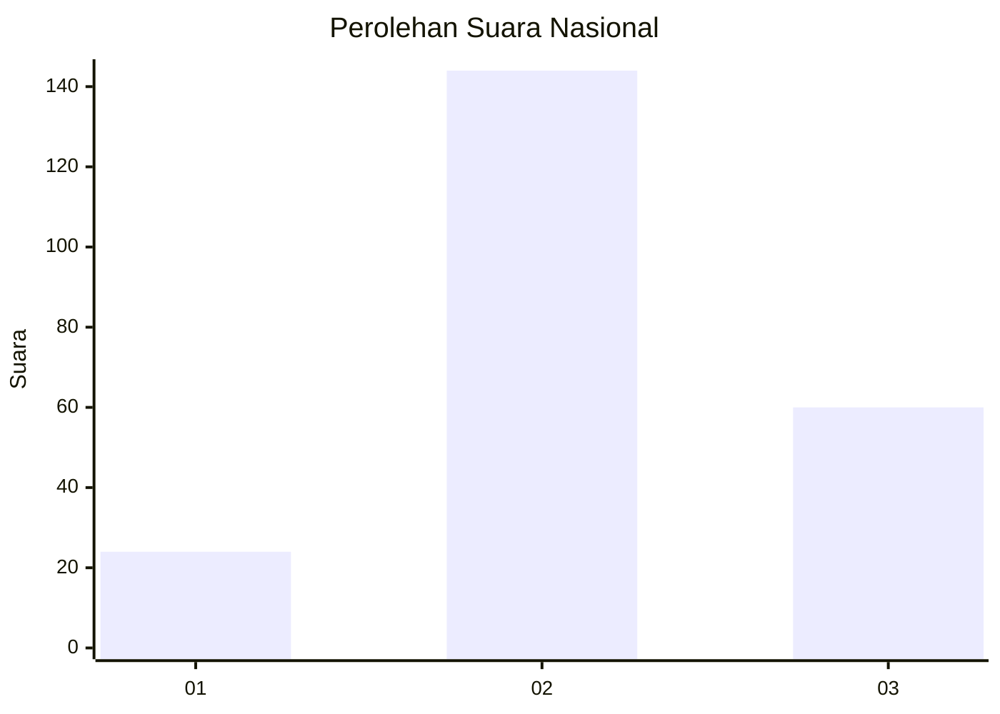
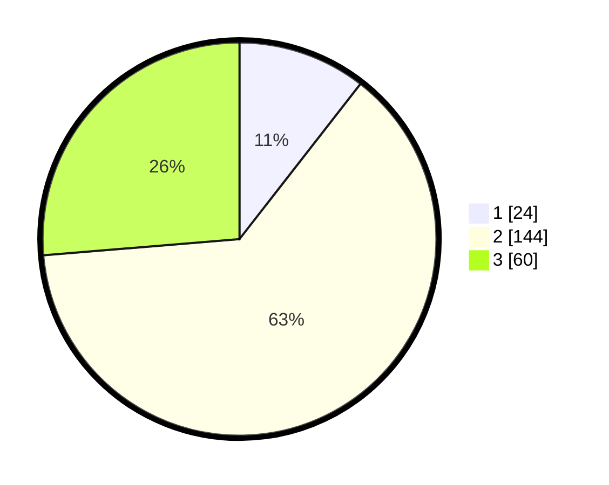

# Hasil

## Grafik

## Tabel

| No. | Nama Paslon    | Suara | Suara (raw) | Persentase |
|:--- |:-------------- | -----:| -----------:| ----------:|
| 1   | ANIES MUHAIMIN | 24    | [24][p-1]   | 10,53      |
| 2   | PRABOWO GIBRAN | 144   | [144][p-2]  | 63,16      |
| 3   | GANJAR MAHFUD  | 60    | [60][p-3]   | 26,32      |

[p-1]: https://github.com/gigit-pemilu/pemilu-2024/blob/main/pilpres/hitung-suara/sub/34-di-yogyakarta/sub/02-bantul/sub/12-banguntapan/sub/2005-jambidan/sub/012-tps/sub/paslon-1.txt
[p-2]: https://github.com/gigit-pemilu/pemilu-2024/blob/main/pilpres/hitung-suara/sub/34-di-yogyakarta/sub/02-bantul/sub/12-banguntapan/sub/2005-jambidan/sub/012-tps/sub/paslon-2.txt
[p-3]: https://github.com/gigit-pemilu/pemilu-2024/blob/main/pilpres/hitung-suara/sub/34-di-yogyakarta/sub/02-bantul/sub/12-banguntapan/sub/2005-jambidan/sub/012-tps/sub/paslon-3.txt

## Foto C Plano

https://sirekap-obj-formc.kpu.go.id/d0c7/pemilu/ppwp/34/02/12/20/05/3402122005012-20240215-000630--85757de7-4655-47e4-93fe-de4aec47a5d2.jpg

https://sirekap-obj-formc.kpu.go.id/d0c7/pemilu/ppwp/34/02/12/20/05/3402122005012-20240215-000753--481eb9f2-e1ea-4c16-be93-4468b3b1660d.jpg

https://sirekap-obj-formc.kpu.go.id/d0c7/pemilu/ppwp/34/02/12/20/05/3402122005012-20240215-001005--12c52c33-65d3-44a7-8177-2d2f4a5d3bf0.jpg

## Metadata

| Key        | Value               |
| ---------- | ------------------- |
| Time Stamp | 2024-02-25 10:00:00 |

