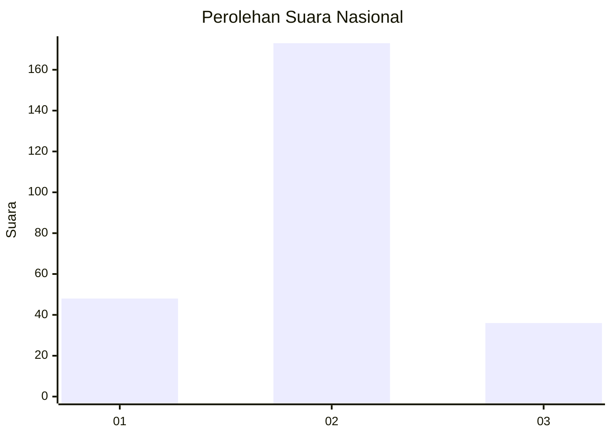
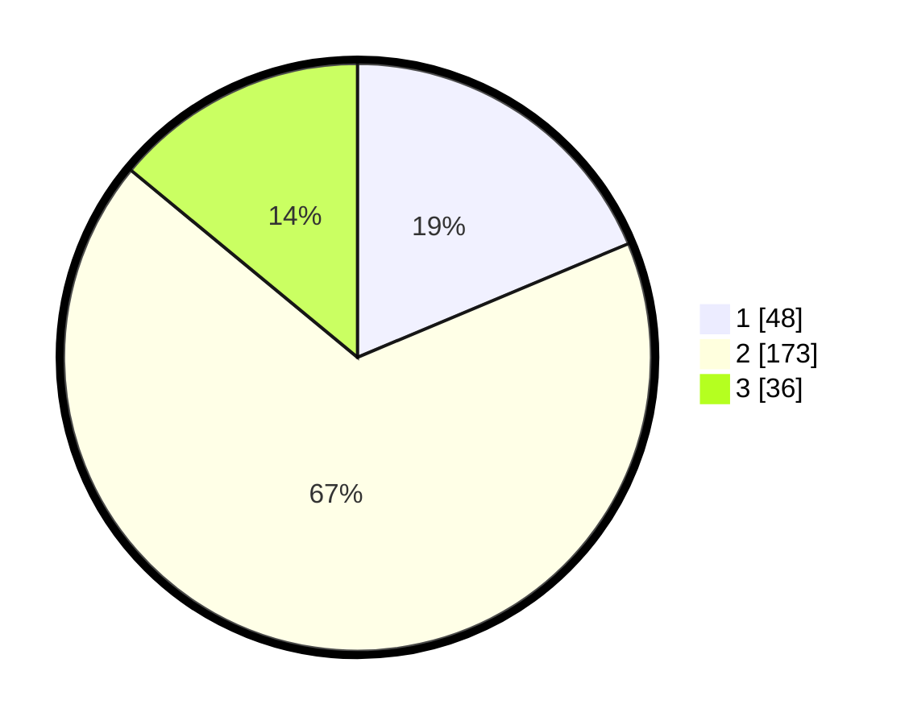

# Hasil

## Grafik

## Tabel

| No. | Nama Paslon    | Suara | Suara (raw) | Persentase |
|:--- |:-------------- | -----:| -----------:| ----------:|
| 1   | ANIES MUHAIMIN | 48    | [48][p-1]   | 18,68      |
| 2   | PRABOWO GIBRAN | 173   | [173][p-2]  | 67,32      |
| 3   | GANJAR MAHFUD  | 36    | [36][p-3]   | 14,01      |

[p-1]: https://github.com/gigit-pemilu/pemilu-2024/blob/main/pilpres/hitung-suara/sub/34-di-yogyakarta/sub/02-bantul/sub/12-banguntapan/sub/2005-jambidan/sub/016-tps/sub/paslon-1.txt
[p-2]: https://github.com/gigit-pemilu/pemilu-2024/blob/main/pilpres/hitung-suara/sub/34-di-yogyakarta/sub/02-bantul/sub/12-banguntapan/sub/2005-jambidan/sub/016-tps/sub/paslon-2.txt
[p-3]: https://github.com/gigit-pemilu/pemilu-2024/blob/main/pilpres/hitung-suara/sub/34-di-yogyakarta/sub/02-bantul/sub/12-banguntapan/sub/2005-jambidan/sub/016-tps/sub/paslon-3.txt

## Foto C Plano

https://sirekap-obj-formc.kpu.go.id/f95d/pemilu/ppwp/34/02/12/20/05/3402122005016-20240215-004819--8d28c408-b5ba-414e-b4b2-92cf42735942.jpg

https://sirekap-obj-formc.kpu.go.id/f95d/pemilu/ppwp/34/02/12/20/05/3402122005016-20240215-004943--ab083a46-6441-4480-8f13-ae8445217d23.jpg

https://sirekap-obj-formc.kpu.go.id/f95d/pemilu/ppwp/34/02/12/20/05/3402122005016-20240215-005339--15da2b97-ec59-41c8-b564-d0908212f7fa.jpg

## Metadata

| Key        | Value               |
| ---------- | ------------------- |
| Time Stamp | 2024-02-15 19:00:26 |

