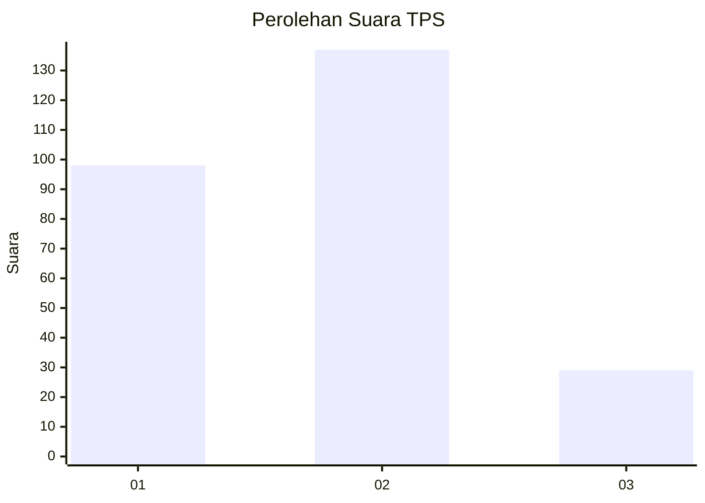
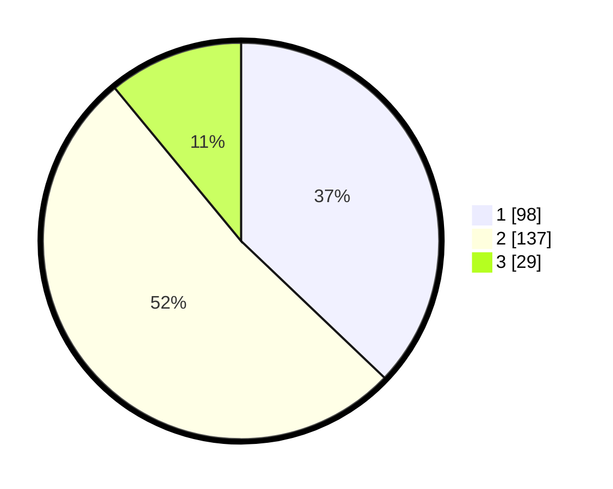

# Hasil

## Grafik

## Tabel

| No. | Nama Paslon    | Suara | Suara (raw) | Persentase |
|:--- |:-------------- | -----:| -----------:| ----------:|
| 1   | ANIES MUHAIMIN | 98    | [98][p-1]   | 37,12      |
| 2   | PRABOWO GIBRAN | 137   | [137][p-2]  | 51,89      |
| 3   | GANJAR MAHFUD  | 29    | [29][p-3]   | 10,98      |

[p-1]: https://github.com/gigit-pemilu/pemilu-2024-34-di-yogyakarta/blob/main/pilpres/hitung-suara/sub/34-di-yogyakarta/sub/02-bantul/sub/12-banguntapan/sub/2005-jambidan/sub/020-tps/sub/paslon-1.txt
[p-2]: https://github.com/gigit-pemilu/pemilu-2024-34-di-yogyakarta/blob/main/pilpres/hitung-suara/sub/34-di-yogyakarta/sub/02-bantul/sub/12-banguntapan/sub/2005-jambidan/sub/020-tps/sub/paslon-2.txt
[p-3]: https://github.com/gigit-pemilu/pemilu-2024-34-di-yogyakarta/blob/main/pilpres/hitung-suara/sub/34-di-yogyakarta/sub/02-bantul/sub/12-banguntapan/sub/2005-jambidan/sub/020-tps/sub/paslon-3.txt

## Foto C Plano

https://sirekap-obj-formc.kpu.go.id/57d8/pemilu/ppwp/34/02/12/20/05/3402122005020-20240214-201431--f33e27a9-fbd5-4cca-8ec8-4e74f51ebb37.jpg

https://sirekap-obj-formc.kpu.go.id/57d8/pemilu/ppwp/34/02/12/20/05/3402122005020-20240214-201612--3ea6143a-232f-434a-8ee8-db58c67224e1.jpg

https://sirekap-obj-formc.kpu.go.id/57d8/pemilu/ppwp/34/02/12/20/05/3402122005020-20240215-031730--0c8d8b8b-f93c-4947-a362-36f74772683e.jpg

## Metadata

| Key        | Value               |
| ---------- | ------------------- |
| Time Stamp | 2024-02-15 04:00:24 |

