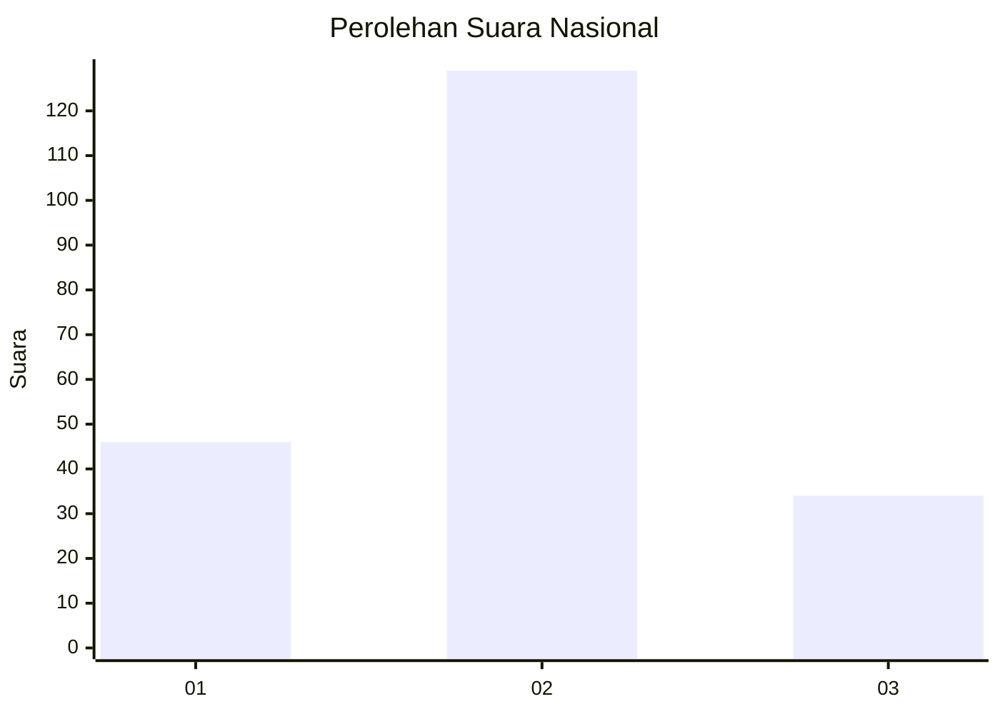

# Hasil

## Grafik

## Tabel

| No. | Nama Paslon    | Suara | Suara (raw) | Persentase |
|:--- |:-------------- | -----:| -----------:| ----------:|
| 1   | ANIES MUHAIMIN | 46    | [46][p-1]   | 22,01      |
| 2   | PRABOWO GIBRAN | 129   | [129][p-2]  | 61,72      |
| 3   | GANJAR MAHFUD  | 34    | [34][p-3]   | 16,27      |

[p-1]: https://github.com/gigit-pemilu/pemilu-2024/blob/main/pilpres/hitung-suara/sub/34-di-yogyakarta/sub/02-bantul/sub/12-banguntapan/sub/2005-jambidan/sub/023-tps/sub/paslon-1.txt
[p-2]: https://github.com/gigit-pemilu/pemilu-2024/blob/main/pilpres/hitung-suara/sub/34-di-yogyakarta/sub/02-bantul/sub/12-banguntapan/sub/2005-jambidan/sub/023-tps/sub/paslon-2.txt
[p-3]: https://github.com/gigit-pemilu/pemilu-2024/blob/main/pilpres/hitung-suara/sub/34-di-yogyakarta/sub/02-bantul/sub/12-banguntapan/sub/2005-jambidan/sub/023-tps/sub/paslon-3.txt

## Foto C Plano

https://sirekap-obj-formc.kpu.go.id/de85/pemilu/ppwp/34/02/12/20/05/3402122005023-20240214-230839--e43e624d-b240-41c4-8264-0f30fcb46874.jpg

https://sirekap-obj-formc.kpu.go.id/de85/pemilu/ppwp/34/02/12/20/05/3402122005023-20240214-201803--30e7fddc-baef-4852-ae39-f4f16bed37d8.jpg

https://sirekap-obj-formc.kpu.go.id/de85/pemilu/ppwp/34/02/12/20/05/3402122005023-20240214-202120--a0d0fce7-d8e9-440c-9b89-8019b8386720.jpg

## Metadata

| Key        | Value               |
| ---------- | ------------------- |
| Time Stamp | 2024-02-24 22:31:28 |

