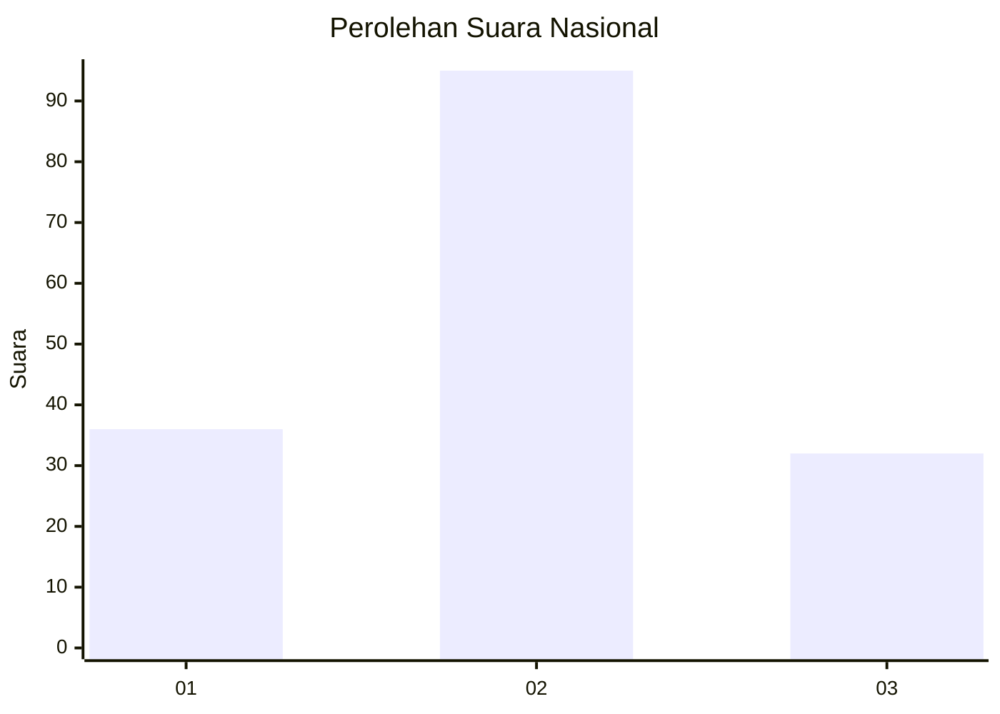
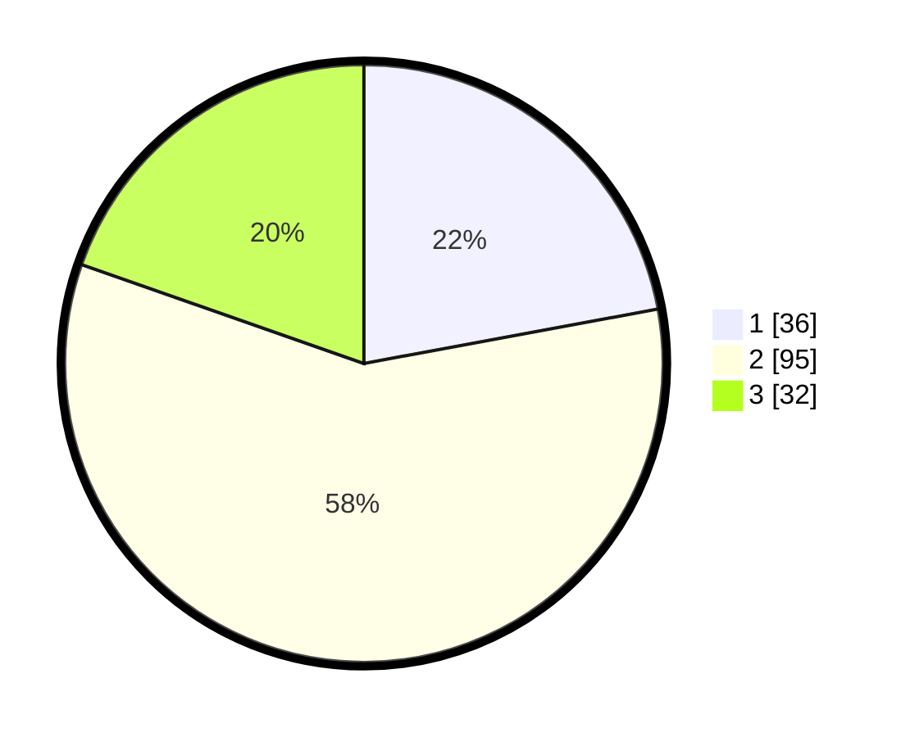

# Hasil

## Grafik

## Tabel

| No. | Nama Paslon    | Suara | Suara (raw) | Persentase |
|:--- |:-------------- | -----:| -----------:| ----------:|
| 1   | ANIES MUHAIMIN | 36    | [36][p-1]   | 22,09      |
| 2   | PRABOWO GIBRAN | 95    | [95][p-2]   | 58,28      |
| 3   | GANJAR MAHFUD  | 32    | [32][p-3]   | 19,63      |

[p-1]: https://github.com/gigit-pemilu/pemilu-2024/blob/main/pilpres/hitung-suara/sub/34-di-yogyakarta/sub/02-bantul/sub/12-banguntapan/sub/2005-jambidan/sub/025-tps/sub/paslon-1.txt
[p-2]: https://github.com/gigit-pemilu/pemilu-2024/blob/main/pilpres/hitung-suara/sub/34-di-yogyakarta/sub/02-bantul/sub/12-banguntapan/sub/2005-jambidan/sub/025-tps/sub/paslon-2.txt
[p-3]: https://github.com/gigit-pemilu/pemilu-2024/blob/main/pilpres/hitung-suara/sub/34-di-yogyakarta/sub/02-bantul/sub/12-banguntapan/sub/2005-jambidan/sub/025-tps/sub/paslon-3.txt

## Foto C Plano

https://sirekap-obj-formc.kpu.go.id/b2bd/pemilu/ppwp/34/02/12/20/05/3402122005025-20240214-222316--c3e732ed-b4a5-4cf4-82cc-d42852aa2c2e.jpg

https://sirekap-obj-formc.kpu.go.id/b2bd/pemilu/ppwp/34/02/12/20/05/3402122005025-20240214-204857--7709e536-c8c7-4afe-ba5b-06b22fb213de.jpg

https://sirekap-obj-formc.kpu.go.id/b2bd/pemilu/ppwp/34/02/12/20/05/3402122005025-20240215-015921--245b8f79-f29e-427e-85db-da60c7ccfe6b.jpg

## Metadata

| Key        | Value               |
| ---------- | ------------------- |
| Time Stamp | 2024-02-15 02:10:27 |

