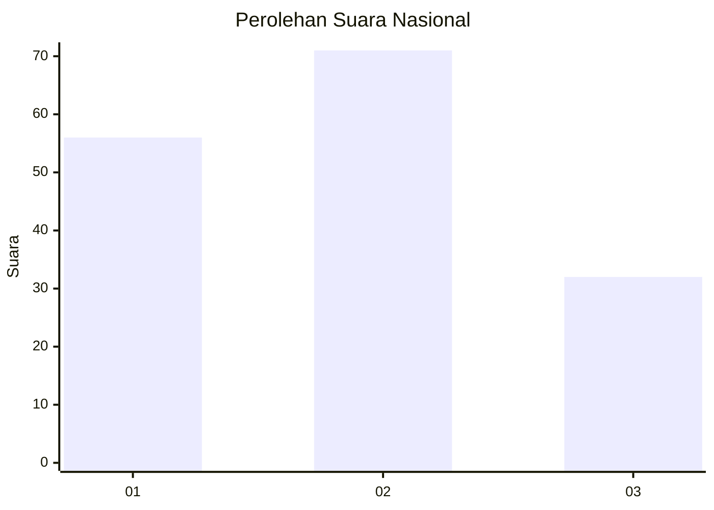
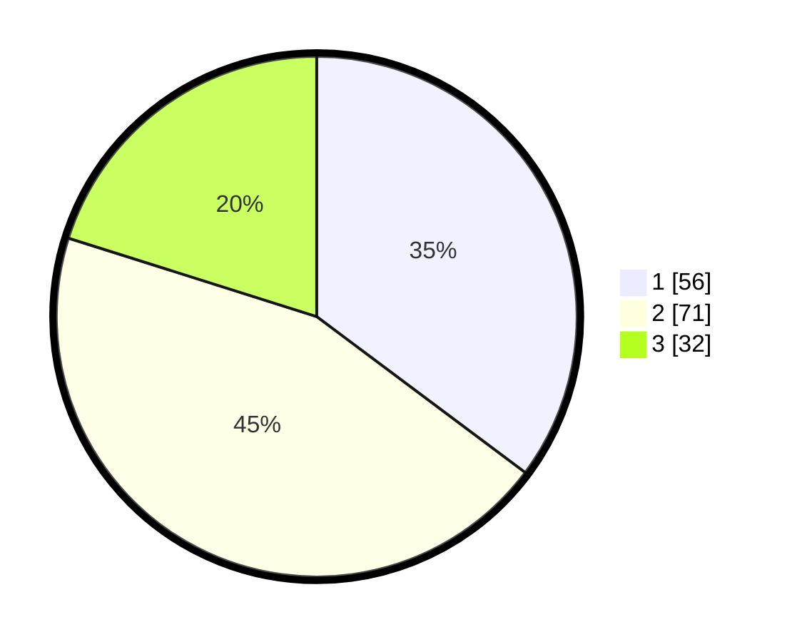

# Hasil

## Grafik

## Tabel

| No. | Nama Paslon    | Suara | Suara (raw) | Persentase |
|:--- |:-------------- | -----:| -----------:| ----------:|
| 1   | ANIES MUHAIMIN | 56    | [56][p-1]   | 35,22      |
| 2   | PRABOWO GIBRAN | 71    | [71][p-2]   | 44,65      |
| 3   | GANJAR MAHFUD  | 32    | [32][p-3]   | 20,13      |

[p-1]: https://github.com/gigit-pemilu/pemilu-2024/blob/main/pilpres/hitung-suara/sub/34-di-yogyakarta/sub/02-bantul/sub/12-banguntapan/sub/2005-jambidan/sub/026-tps/sub/paslon-1.txt
[p-2]: https://github.com/gigit-pemilu/pemilu-2024/blob/main/pilpres/hitung-suara/sub/34-di-yogyakarta/sub/02-bantul/sub/12-banguntapan/sub/2005-jambidan/sub/026-tps/sub/paslon-2.txt
[p-3]: https://github.com/gigit-pemilu/pemilu-2024/blob/main/pilpres/hitung-suara/sub/34-di-yogyakarta/sub/02-bantul/sub/12-banguntapan/sub/2005-jambidan/sub/026-tps/sub/paslon-3.txt

## Foto C Plano

https://sirekap-obj-formc.kpu.go.id/97c2/pemilu/ppwp/34/02/12/20/05/3402122005026-20240215-004419--9b0461da-c3bf-46f4-bf55-7fe349cf8d24.jpg

https://sirekap-obj-formc.kpu.go.id/97c2/pemilu/ppwp/34/02/12/20/05/3402122005026-20240215-004502--96a16f66-589d-4948-bbf3-69c69541a14d.jpg

https://sirekap-obj-formc.kpu.go.id/97c2/pemilu/ppwp/34/02/12/20/05/3402122005026-20240215-004516--55d19fef-312e-40f8-9f4f-7b6bb6c6622f.jpg

## Metadata

| Key        | Value               |
| ---------- | ------------------- |
| Time Stamp | 2024-02-15 09:00:24 |

