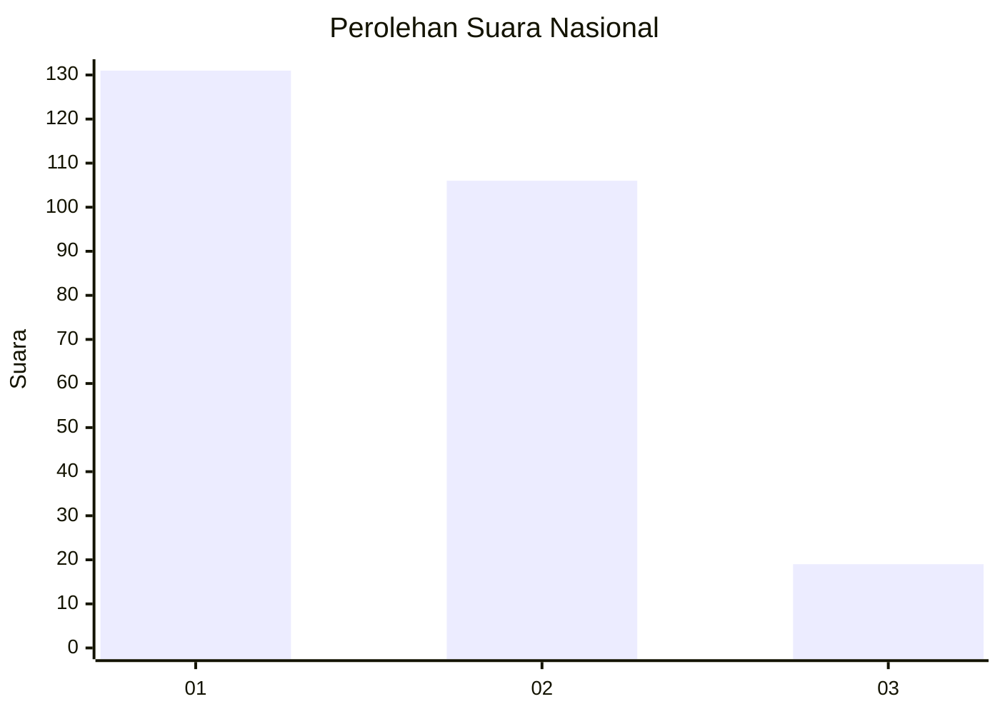
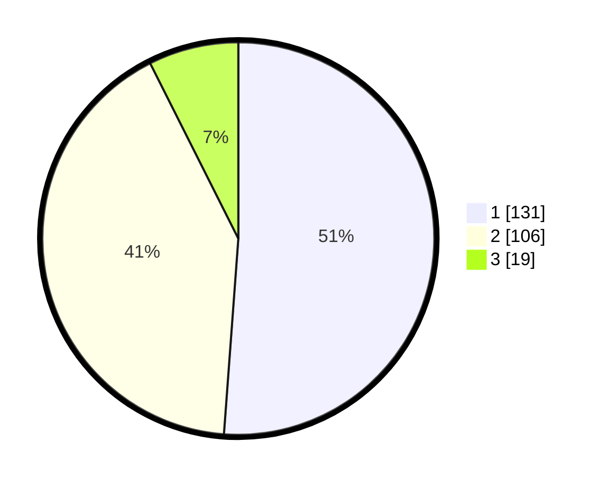

# Hasil

## Grafik

## Tabel

| No. | Nama Paslon    | Suara | Suara (raw) | Persentase |
|:--- |:-------------- | -----:| -----------:| ----------:|
| 1   | ANIES MUHAIMIN | 131   | [131][p-1]  | 51,17      |
| 2   | PRABOWO GIBRAN | 106   | [106][p-2]  | 41,41      |
| 3   | GANJAR MAHFUD  | 19    | [19][p-3]   | 7,42       |

[p-1]: https://github.com/gigit-pemilu/pemilu-2024/blob/main/pilpres/hitung-suara/sub/34-di-yogyakarta/sub/02-bantul/sub/12-banguntapan/sub/2005-jambidan/sub/027-tps/sub/paslon-1.txt
[p-2]: https://github.com/gigit-pemilu/pemilu-2024/blob/main/pilpres/hitung-suara/sub/34-di-yogyakarta/sub/02-bantul/sub/12-banguntapan/sub/2005-jambidan/sub/027-tps/sub/paslon-2.txt
[p-3]: https://github.com/gigit-pemilu/pemilu-2024/blob/main/pilpres/hitung-suara/sub/34-di-yogyakarta/sub/02-bantul/sub/12-banguntapan/sub/2005-jambidan/sub/027-tps/sub/paslon-3.txt

## Foto C Plano

https://sirekap-obj-formc.kpu.go.id/f610/pemilu/ppwp/34/02/12/20/05/3402122005027-20240215-021807--3d241c46-5eb2-43f0-a402-2c9950b7565b.jpg

https://sirekap-obj-formc.kpu.go.id/f610/pemilu/ppwp/34/02/12/20/05/3402122005027-20240215-021940--2be1c4e0-9fb9-4115-b21c-48317f9196b5.jpg

https://sirekap-obj-formc.kpu.go.id/f610/pemilu/ppwp/34/02/12/20/05/3402122005027-20240215-022320--1875896b-038e-4b92-b1d8-157d330585c4.jpg

## Metadata

| Key        | Value               |
| ---------- | ------------------- |
| Time Stamp | 2024-02-25 10:00:00 |

