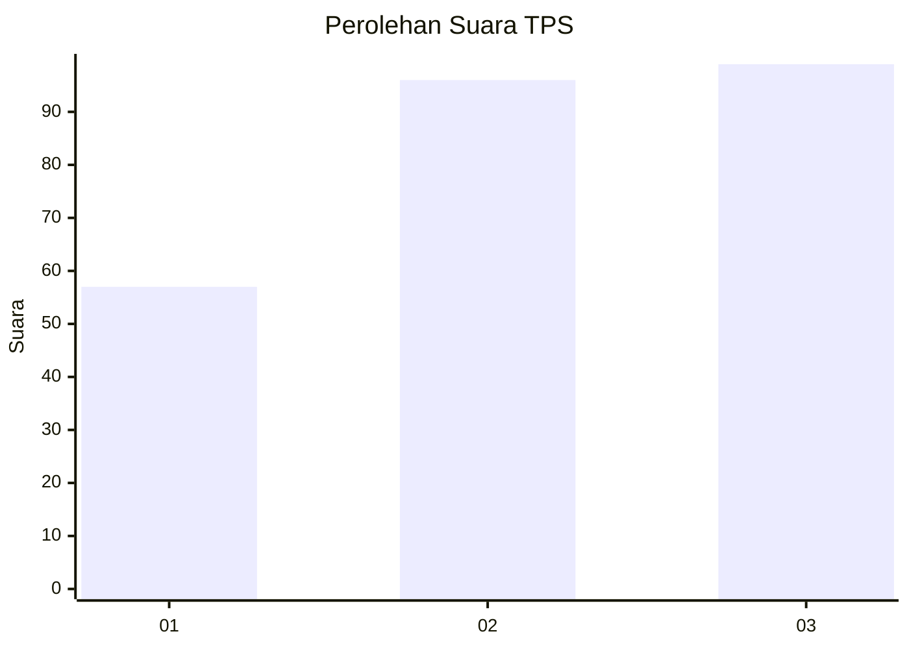
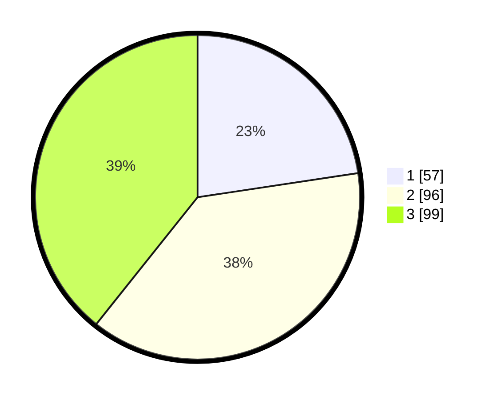

# Hasil

## Grafik

## Tabel

| No. | Nama Paslon    | Suara | Suara (raw) | Persentase |
|:--- |:-------------- | -----:| -----------:| ----------:|
| 1   | ANIES MUHAIMIN | 57    | [57][p-1]   | 22,62      |
| 2   | PRABOWO GIBRAN | 96    | [96][p-2]   | 38,10      |
| 3   | GANJAR MAHFUD  | 99    | [99][p-3]   | 39,29      |

[p-1]: https://github.com/gigit-pemilu/pemilu-2024-34-di-yogyakarta/blob/main/pilpres/hitung-suara/sub/34-di-yogyakarta/sub/02-bantul/sub/12-banguntapan/sub/2006-potorono/sub/003-tps/sub/paslon-1.txt
[p-2]: https://github.com/gigit-pemilu/pemilu-2024-34-di-yogyakarta/blob/main/pilpres/hitung-suara/sub/34-di-yogyakarta/sub/02-bantul/sub/12-banguntapan/sub/2006-potorono/sub/003-tps/sub/paslon-2.txt
[p-3]: https://github.com/gigit-pemilu/pemilu-2024-34-di-yogyakarta/blob/main/pilpres/hitung-suara/sub/34-di-yogyakarta/sub/02-bantul/sub/12-banguntapan/sub/2006-potorono/sub/003-tps/sub/paslon-3.txt

## Foto C Plano

https://sirekap-obj-formc.kpu.go.id/1718/pemilu/ppwp/34/02/12/20/06/3402122006003-20240214-231208--66ed10a5-e520-4235-bea9-2bc59ac14eba.jpg

https://sirekap-obj-formc.kpu.go.id/1718/pemilu/ppwp/34/02/12/20/06/3402122006003-20240214-231325--0ba64817-24eb-4d57-abac-9f83edbb8dea.jpg

https://sirekap-obj-formc.kpu.go.id/1718/pemilu/ppwp/34/02/12/20/06/3402122006003-20240214-231427--5e6f3d59-2878-42dc-856f-d65c72940b45.jpg

## Metadata

| Key        | Value               |
| ---------- | ------------------- |
| Time Stamp | 2024-02-24 22:31:28 |

