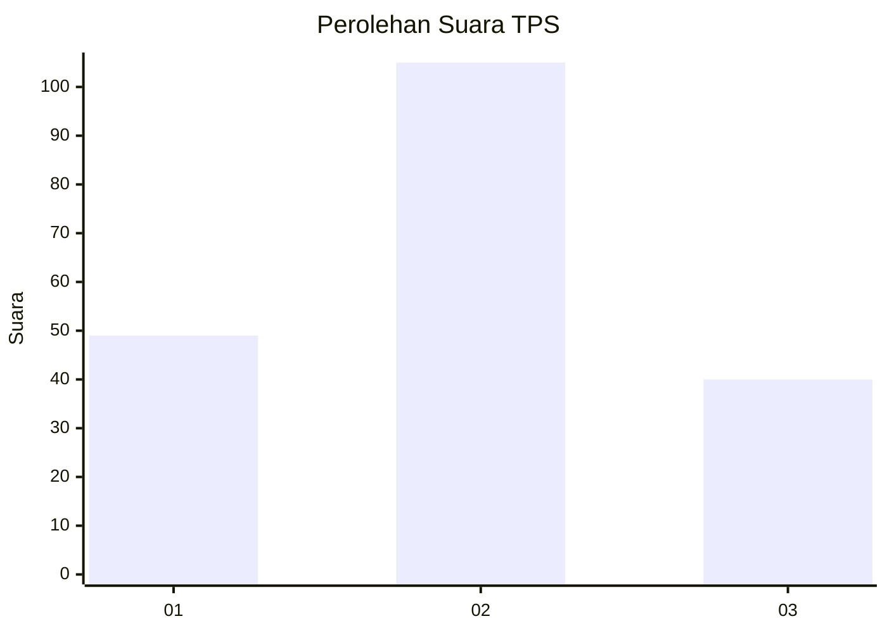
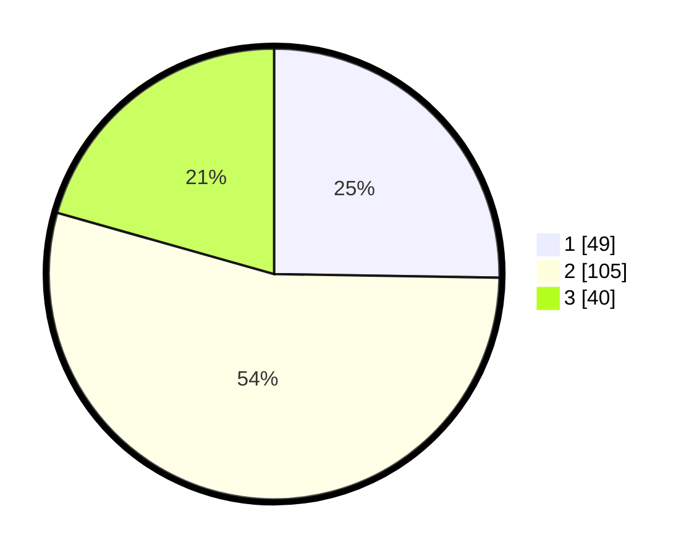

# Hasil

## Grafik

## Tabel

| No. | Nama Paslon    | Suara | Suara (raw) | Persentase |
|:--- |:-------------- | -----:| -----------:| ----------:|
| 1   | ANIES MUHAIMIN | 49    | [49][p-1]   | 25,26      |
| 2   | PRABOWO GIBRAN | 105   | [105][p-2]  | 54,12      |
| 3   | GANJAR MAHFUD  | 40    | [40][p-3]   | 20,62      |

[p-1]: https://github.com/gigit-pemilu/pemilu-2024-34-di-yogyakarta/blob/main/pilpres/hitung-suara/sub/34-di-yogyakarta/sub/02-bantul/sub/12-banguntapan/sub/2006-potorono/sub/007-tps/sub/paslon-1.txt
[p-2]: https://github.com/gigit-pemilu/pemilu-2024-34-di-yogyakarta/blob/main/pilpres/hitung-suara/sub/34-di-yogyakarta/sub/02-bantul/sub/12-banguntapan/sub/2006-potorono/sub/007-tps/sub/paslon-2.txt
[p-3]: https://github.com/gigit-pemilu/pemilu-2024-34-di-yogyakarta/blob/main/pilpres/hitung-suara/sub/34-di-yogyakarta/sub/02-bantul/sub/12-banguntapan/sub/2006-potorono/sub/007-tps/sub/paslon-3.txt

## Foto C Plano

https://sirekap-obj-formc.kpu.go.id/0599/pemilu/ppwp/34/02/12/20/06/3402122006007-20240217-092449--76a048bf-7956-4462-90fd-ed03479357ed.jpg

https://sirekap-obj-formc.kpu.go.id/0599/pemilu/ppwp/34/02/12/20/06/3402122006007-20240217-092253--fa6a4999-cf9d-4c9e-a5d9-05c6961da0df.jpg

https://sirekap-obj-formc.kpu.go.id/0599/pemilu/ppwp/34/02/12/20/06/3402122006007-20240217-092355--3e8828bb-041a-4348-8091-60f606d96df3.jpg

## Metadata

| Key        | Value               |
| ---------- | ------------------- |
| Time Stamp | 2024-02-25 12:00:00 |

