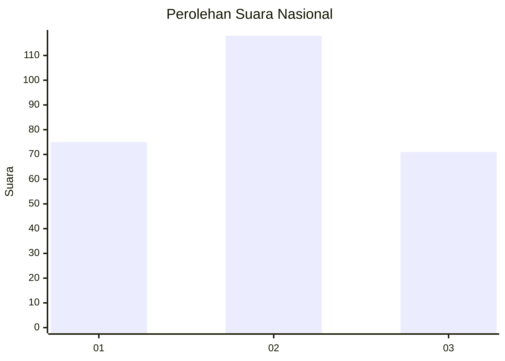
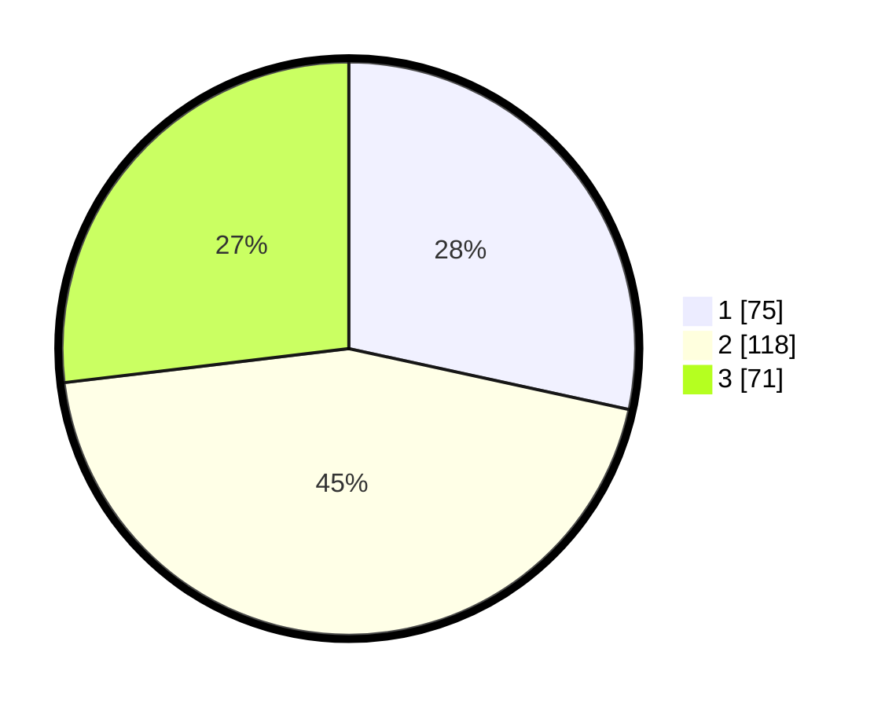

# Hasil

## Grafik

## Tabel

| No. | Nama Paslon    | Suara | Suara (raw) | Persentase |
|:--- |:-------------- | -----:| -----------:| ----------:|
| 1   | ANIES MUHAIMIN | 75    | [75][p-1]   | 28,41      |
| 2   | PRABOWO GIBRAN | 118   | [118][p-2]  | 44,70      |
| 3   | GANJAR MAHFUD  | 71    | [71][p-3]   | 26,89      |

[p-1]: https://github.com/gigit-pemilu/pemilu-2024/blob/main/pilpres/hitung-suara/sub/34-di-yogyakarta/sub/02-bantul/sub/12-banguntapan/sub/2006-potorono/sub/013-tps/sub/paslon-1.txt
[p-2]: https://github.com/gigit-pemilu/pemilu-2024/blob/main/pilpres/hitung-suara/sub/34-di-yogyakarta/sub/02-bantul/sub/12-banguntapan/sub/2006-potorono/sub/013-tps/sub/paslon-2.txt
[p-3]: https://github.com/gigit-pemilu/pemilu-2024/blob/main/pilpres/hitung-suara/sub/34-di-yogyakarta/sub/02-bantul/sub/12-banguntapan/sub/2006-potorono/sub/013-tps/sub/paslon-3.txt

## Foto C Plano

https://sirekap-obj-formc.kpu.go.id/9c4f/pemilu/ppwp/34/02/12/20/06/3402122006013-20240214-155305--b1bad2cf-d3a2-4e45-9fba-2b206a9c4619.jpg

https://sirekap-obj-formc.kpu.go.id/9c4f/pemilu/ppwp/34/02/12/20/06/3402122006013-20240214-155856--f8f3f2a6-85d2-453f-9597-8944dda70a8e.jpg

https://sirekap-obj-formc.kpu.go.id/9c4f/pemilu/ppwp/34/02/12/20/06/3402122006013-20240219-084755--c264d827-2c23-4b06-aa77-694b81c3cf82.jpg

## Metadata

| Key        | Value               |
| ---------- | ------------------- |
| Time Stamp | 2024-02-19 09:00:00 |

