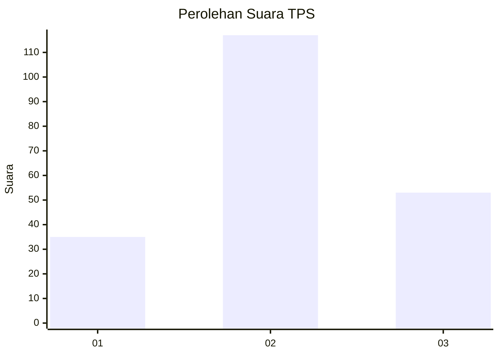
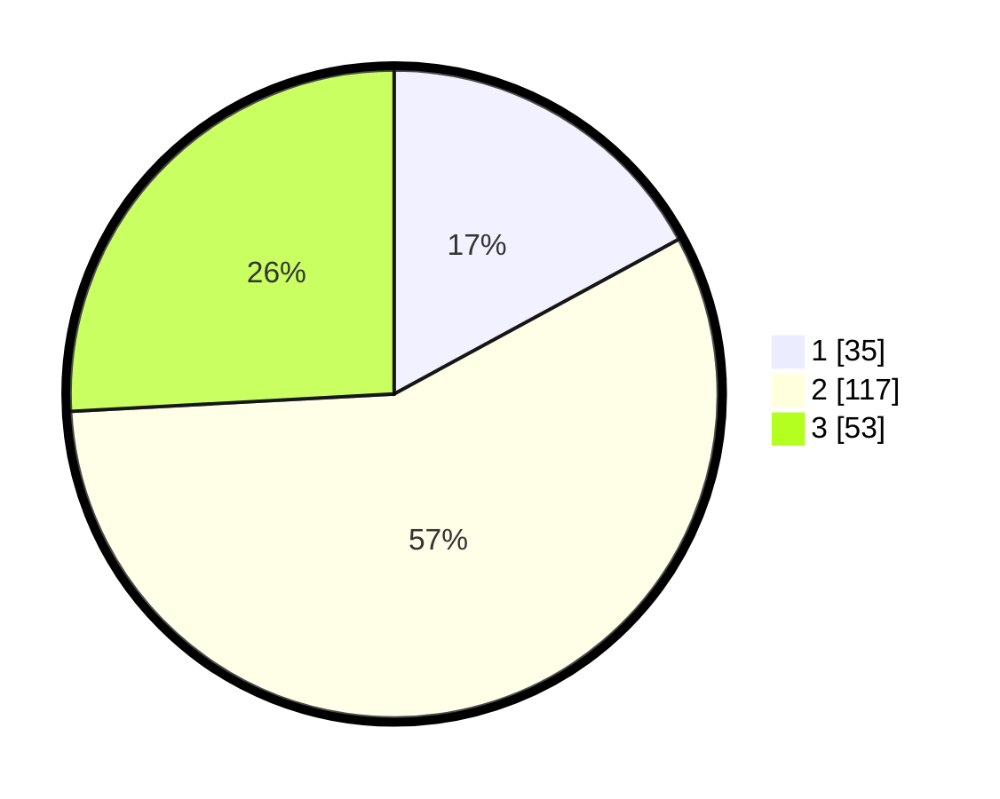

# Hasil

## Grafik

## Tabel

| No. | Nama Paslon    | Suara | Suara (raw) | Persentase |
|:--- |:-------------- | -----:| -----------:| ----------:|
| 1   | ANIES MUHAIMIN | 35    | [35][p-1]   | 17,07      |
| 2   | PRABOWO GIBRAN | 117   | [117][p-2]  | 57,07      |
| 3   | GANJAR MAHFUD  | 53    | [53][p-3]   | 25,85      |

[p-1]: https://github.com/gigit-pemilu/pemilu-2024-34-di-yogyakarta/blob/main/pilpres/hitung-suara/sub/34-di-yogyakarta/sub/02-bantul/sub/12-banguntapan/sub/2006-potorono/sub/017-tps/sub/paslon-1.txt
[p-2]: https://github.com/gigit-pemilu/pemilu-2024-34-di-yogyakarta/blob/main/pilpres/hitung-suara/sub/34-di-yogyakarta/sub/02-bantul/sub/12-banguntapan/sub/2006-potorono/sub/017-tps/sub/paslon-2.txt
[p-3]: https://github.com/gigit-pemilu/pemilu-2024-34-di-yogyakarta/blob/main/pilpres/hitung-suara/sub/34-di-yogyakarta/sub/02-bantul/sub/12-banguntapan/sub/2006-potorono/sub/017-tps/sub/paslon-3.txt

## Foto C Plano

https://sirekap-obj-formc.kpu.go.id/85b2/pemilu/ppwp/34/02/12/20/06/3402122006017-20240214-212959--35054157-ddce-4970-b2cf-1fb2c6eceb61.jpg

https://sirekap-obj-formc.kpu.go.id/85b2/pemilu/ppwp/34/02/12/20/06/3402122006017-20240214-211654--e2a67b9f-7832-456c-9c2b-a4a6f8593f56.jpg

https://sirekap-obj-formc.kpu.go.id/85b2/pemilu/ppwp/34/02/12/20/06/3402122006017-20240214-211731--ed1b7451-8788-4006-a357-b2640b0e6616.jpg

## Metadata

| Key        | Value               |
| ---------- | ------------------- |
| Time Stamp | 2024-02-25 15:00:00 |

