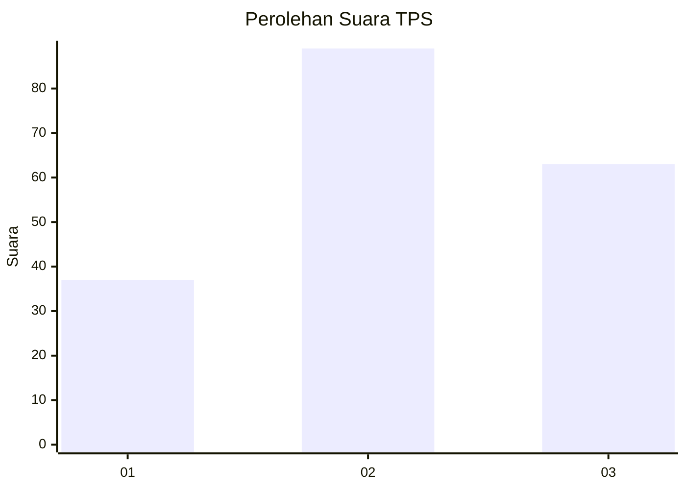
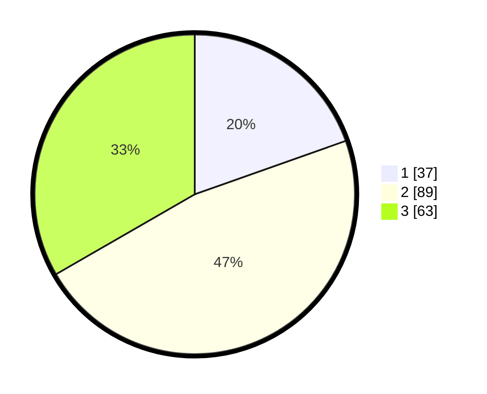

# Hasil

## Grafik

## Tabel

| No. | Nama Paslon    | Suara | Suara (raw) | Persentase |
|:--- |:-------------- | -----:| -----------:| ----------:|
| 1   | ANIES MUHAIMIN | 37    | [37][p-1]   | 19,58      |
| 2   | PRABOWO GIBRAN | 89    | [89][p-2]   | 47,09      |
| 3   | GANJAR MAHFUD  | 63    | [63][p-3]   | 33,33      |

[p-1]: https://github.com/gigit-pemilu/pemilu-2024-34-di-yogyakarta/blob/main/pilpres/hitung-suara/sub/34-di-yogyakarta/sub/02-bantul/sub/12-banguntapan/sub/2006-potorono/sub/023-tps/sub/paslon-1.txt
[p-2]: https://github.com/gigit-pemilu/pemilu-2024-34-di-yogyakarta/blob/main/pilpres/hitung-suara/sub/34-di-yogyakarta/sub/02-bantul/sub/12-banguntapan/sub/2006-potorono/sub/023-tps/sub/paslon-2.txt
[p-3]: https://github.com/gigit-pemilu/pemilu-2024-34-di-yogyakarta/blob/main/pilpres/hitung-suara/sub/34-di-yogyakarta/sub/02-bantul/sub/12-banguntapan/sub/2006-potorono/sub/023-tps/sub/paslon-3.txt

## Foto C Plano

https://sirekap-obj-formc.kpu.go.id/b7ec/pemilu/ppwp/34/02/12/20/06/3402122006023-20240214-193032--f4a7cb34-d76f-472f-8d5b-5174cd853d2d.jpg

https://sirekap-obj-formc.kpu.go.id/b7ec/pemilu/ppwp/34/02/12/20/06/3402122006023-20240214-184712--25cbb636-b682-4f8e-9023-96888058dd87.jpg

https://sirekap-obj-formc.kpu.go.id/b7ec/pemilu/ppwp/34/02/12/20/06/3402122006023-20240214-184751--96a1cbeb-477d-4b24-9c3f-74b90c21304c.jpg

## Metadata

| Key        | Value               |
| ---------- | ------------------- |
| Time Stamp | 2024-02-14 21:46:01 |

