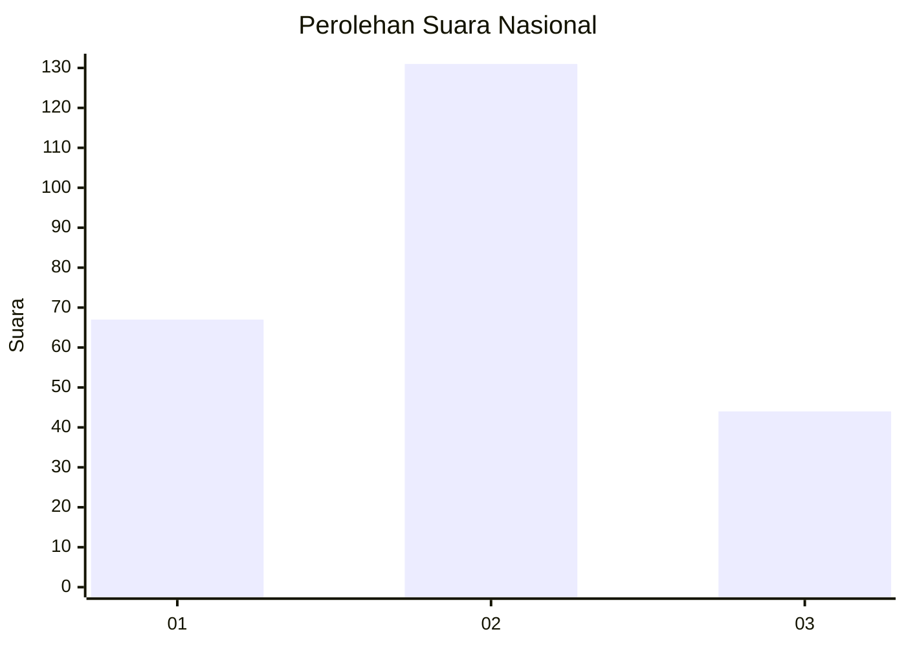
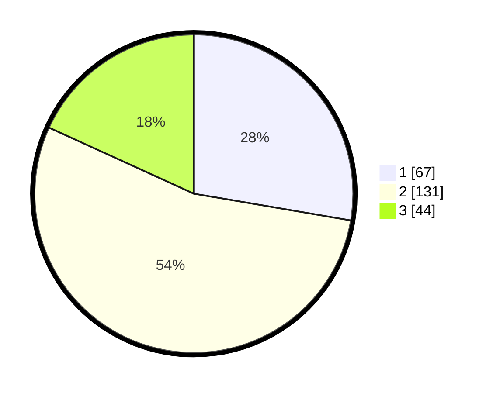

# Hasil

## Grafik

## Tabel

| No. | Nama Paslon    | Suara | Suara (raw) | Persentase |
|:--- |:-------------- | -----:| -----------:| ----------:|
| 1   | ANIES MUHAIMIN | 67    | [67][p-1]   | 27,69      |
| 2   | PRABOWO GIBRAN | 131   | [131][p-2]  | 54,13      |
| 3   | GANJAR MAHFUD  | 44    | [44][p-3]   | 18,18      |

[p-1]: https://github.com/gigit-pemilu/pemilu-2024/blob/main/pilpres/hitung-suara/sub/34-di-yogyakarta/sub/02-bantul/sub/12-banguntapan/sub/2006-potorono/sub/024-tps/sub/paslon-1.txt
[p-2]: https://github.com/gigit-pemilu/pemilu-2024/blob/main/pilpres/hitung-suara/sub/34-di-yogyakarta/sub/02-bantul/sub/12-banguntapan/sub/2006-potorono/sub/024-tps/sub/paslon-2.txt
[p-3]: https://github.com/gigit-pemilu/pemilu-2024/blob/main/pilpres/hitung-suara/sub/34-di-yogyakarta/sub/02-bantul/sub/12-banguntapan/sub/2006-potorono/sub/024-tps/sub/paslon-3.txt

## Foto C Plano

https://sirekap-obj-formc.kpu.go.id/8a84/pemilu/ppwp/34/02/12/20/06/3402122006024-20240216-204152--1eb70644-b3e9-4158-ae99-644dba03adbc.jpg

https://sirekap-obj-formc.kpu.go.id/8a84/pemilu/ppwp/34/02/12/20/06/3402122006024-20240214-234846--7bd1ea8a-e085-4643-a8f0-a2aef41f5542.jpg

https://sirekap-obj-formc.kpu.go.id/8a84/pemilu/ppwp/34/02/12/20/06/3402122006024-20240215-002649--8476ab8e-9259-428f-a105-71cc0667d57c.jpg

## Metadata

| Key        | Value               |
| ---------- | ------------------- |
| Time Stamp | 2024-02-25 12:00:00 |

