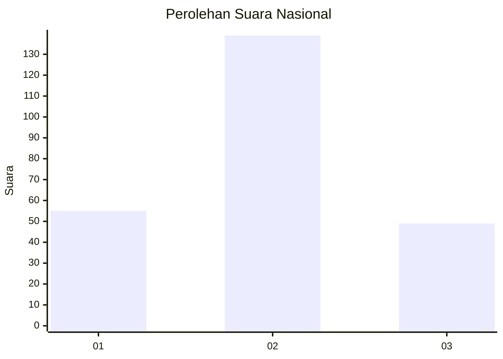
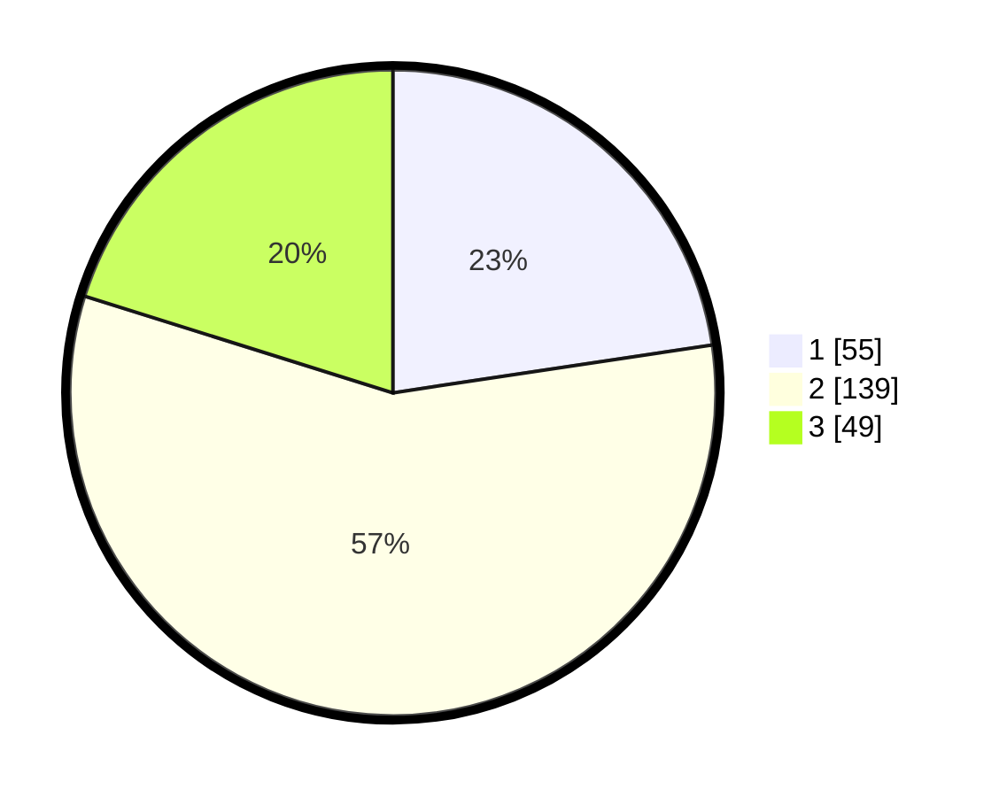

# Hasil

## Grafik

## Tabel

| No. | Nama Paslon    | Suara | Suara (raw) | Persentase |
|:--- |:-------------- | -----:| -----------:| ----------:|
| 1   | ANIES MUHAIMIN | 55    | [55][p-1]   | 22,63      |
| 2   | PRABOWO GIBRAN | 139   | [139][p-2]  | 57,20      |
| 3   | GANJAR MAHFUD  | 49    | [49][p-3]   | 20,16      |

[p-1]: https://github.com/gigit-pemilu/pemilu-2024/blob/main/pilpres/hitung-suara/sub/34-di-yogyakarta/sub/02-bantul/sub/12-banguntapan/sub/2006-potorono/sub/027-tps/sub/paslon-1.txt
[p-2]: https://github.com/gigit-pemilu/pemilu-2024/blob/main/pilpres/hitung-suara/sub/34-di-yogyakarta/sub/02-bantul/sub/12-banguntapan/sub/2006-potorono/sub/027-tps/sub/paslon-2.txt
[p-3]: https://github.com/gigit-pemilu/pemilu-2024/blob/main/pilpres/hitung-suara/sub/34-di-yogyakarta/sub/02-bantul/sub/12-banguntapan/sub/2006-potorono/sub/027-tps/sub/paslon-3.txt

## Foto C Plano

https://sirekap-obj-formc.kpu.go.id/cab0/pemilu/ppwp/34/02/12/20/06/3402122006027-20240214-205554--802fdcfc-6b96-487c-b6df-65e67c056e8c.jpg

https://sirekap-obj-formc.kpu.go.id/cab0/pemilu/ppwp/34/02/12/20/06/3402122006027-20240214-205616--b5a04574-7057-4079-9755-c03703f8b14a.jpg

https://sirekap-obj-formc.kpu.go.id/cab0/pemilu/ppwp/34/02/12/20/06/3402122006027-20240214-220036--887e5135-cf32-47f3-9922-2c139508e5f6.jpg

## Metadata

| Key        | Value               |
| ---------- | ------------------- |
| Time Stamp | 2024-02-24 22:31:28 |

