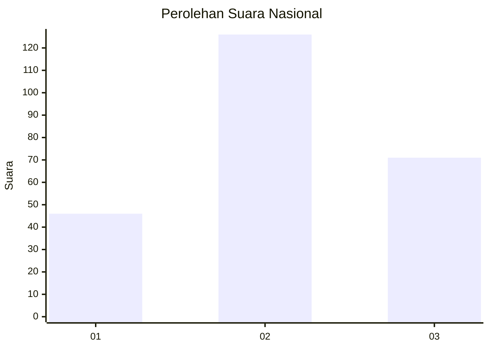
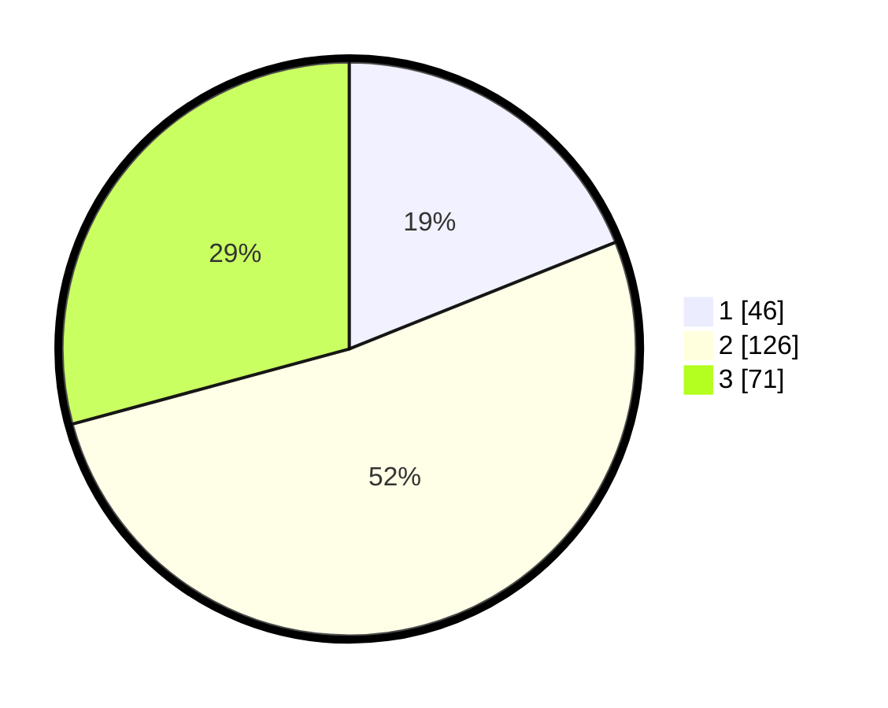

# Hasil

## Grafik

## Tabel

| No. | Nama Paslon    | Suara | Suara (raw) | Persentase |
|:--- |:-------------- | -----:| -----------:| ----------:|
| 1   | ANIES MUHAIMIN | 46    | [46][p-1]   | 18,93      |
| 2   | PRABOWO GIBRAN | 126   | [126][p-2]  | 51,85      |
| 3   | GANJAR MAHFUD  | 71    | [71][p-3]   | 29,22      |

[p-1]: https://github.com/gigit-pemilu/pemilu-2024/blob/main/pilpres/hitung-suara/sub/34-di-yogyakarta/sub/02-bantul/sub/12-banguntapan/sub/2006-potorono/sub/036-tps/sub/paslon-1.txt
[p-2]: https://github.com/gigit-pemilu/pemilu-2024/blob/main/pilpres/hitung-suara/sub/34-di-yogyakarta/sub/02-bantul/sub/12-banguntapan/sub/2006-potorono/sub/036-tps/sub/paslon-2.txt
[p-3]: https://github.com/gigit-pemilu/pemilu-2024/blob/main/pilpres/hitung-suara/sub/34-di-yogyakarta/sub/02-bantul/sub/12-banguntapan/sub/2006-potorono/sub/036-tps/sub/paslon-3.txt

## Foto C Plano

https://sirekap-obj-formc.kpu.go.id/afe6/pemilu/ppwp/34/02/12/20/06/3402122006036-20240215-070732--da0e057c-655d-4968-bab4-09b56c18903f.jpg

https://sirekap-obj-formc.kpu.go.id/afe6/pemilu/ppwp/34/02/12/20/06/3402122006036-20240215-070742--25bd3906-36cf-4baa-aa49-8bae93dcaf63.jpg

https://sirekap-obj-formc.kpu.go.id/afe6/pemilu/ppwp/34/02/12/20/06/3402122006036-20240215-070750--ffa7a2cc-d7ff-44df-a330-3bb1ed8277b3.jpg

## Metadata

| Key        | Value               |
| ---------- | ------------------- |
| Time Stamp | 2024-02-21 12:00:00 |

