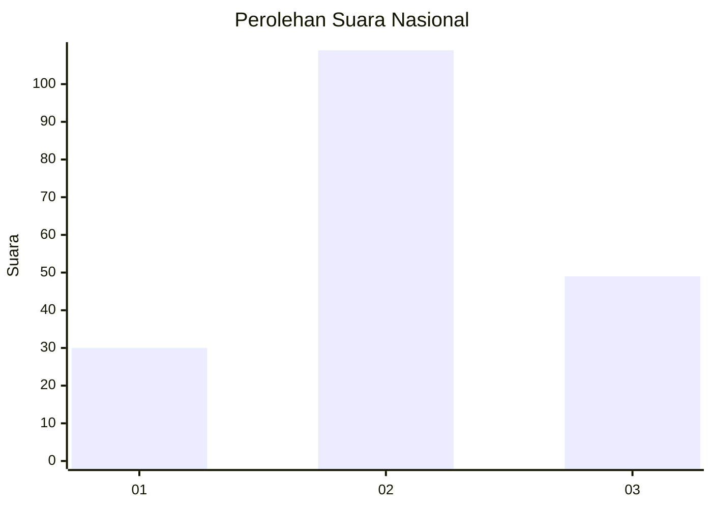
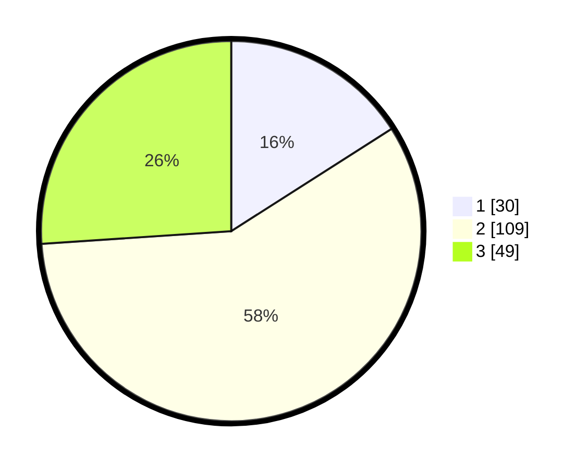

# Hasil

## Grafik

## Tabel

| No. | Nama Paslon    | Suara | Suara (raw) | Persentase |
|:--- |:-------------- | -----:| -----------:| ----------:|
| 1   | ANIES MUHAIMIN | 30    | [30][p-1]   | 15,96      |
| 2   | PRABOWO GIBRAN | 109   | [109][p-2]  | 57,98      |
| 3   | GANJAR MAHFUD  | 49    | [49][p-3]   | 26,06      |

[p-1]: https://github.com/gigit-pemilu/pemilu-2024/blob/main/pilpres/hitung-suara/sub/34-di-yogyakarta/sub/02-bantul/sub/12-banguntapan/sub/2006-potorono/sub/038-tps/sub/paslon-1.txt
[p-2]: https://github.com/gigit-pemilu/pemilu-2024/blob/main/pilpres/hitung-suara/sub/34-di-yogyakarta/sub/02-bantul/sub/12-banguntapan/sub/2006-potorono/sub/038-tps/sub/paslon-2.txt
[p-3]: https://github.com/gigit-pemilu/pemilu-2024/blob/main/pilpres/hitung-suara/sub/34-di-yogyakarta/sub/02-bantul/sub/12-banguntapan/sub/2006-potorono/sub/038-tps/sub/paslon-3.txt

## Foto C Plano

https://sirekap-obj-formc.kpu.go.id/736f/pemilu/ppwp/34/02/12/20/06/3402122006038-20240214-233949--b8168e82-80c4-417e-b127-381c541f16dc.jpg

https://sirekap-obj-formc.kpu.go.id/736f/pemilu/ppwp/34/02/12/20/06/3402122006038-20240214-210734--091ccd39-fe7c-4fdf-b83b-7be4deec8ebe.jpg

https://sirekap-obj-formc.kpu.go.id/736f/pemilu/ppwp/34/02/12/20/06/3402122006038-20240214-210738--d850262f-b16d-4af7-8266-c023933b8c71.jpg

## Metadata

| Key        | Value               |
| ---------- | ------------------- |
| Time Stamp | 2024-02-15 12:00:28 |

## DATA PEMILIH TETAP

Jumlah pemilih dalam DPT: **212**.
 * L: **110**.
 * P: **102**.

## DATA PENGGUNA HAK PILIH

Jumlah pengguna hak pilih dalam DPT: **178**.
 * L: **90**.
 * P: **88**.

Jumlah pengguna hak pilih dalam DPTb: **6**.
 * L: **2**.
 * P: **4**.

Jumlah pengguna hak pilih dalam DPK: **10**.
 * L: **3**.
 * P: **7**.

Jumlah pengguna hak pilih: **194**.
 * L: **95**.
 * P: **99**.

## JUMLAH SUARA SAH DAN TIDAK SAH

JUMLAH SELURUH SUARA SAH: **188**.

JUMLAH SUARA TIDAK SAH: **6**.

JUMLAH SELURUH SUARA SAH DAN SUARA TIDAK SAH: **194**.

