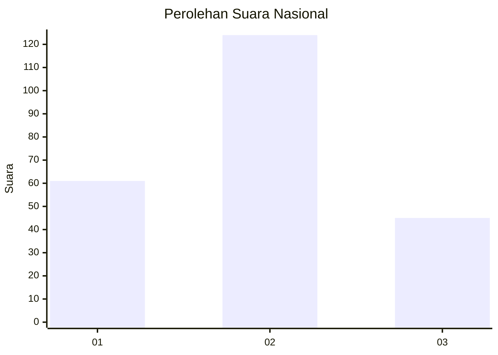
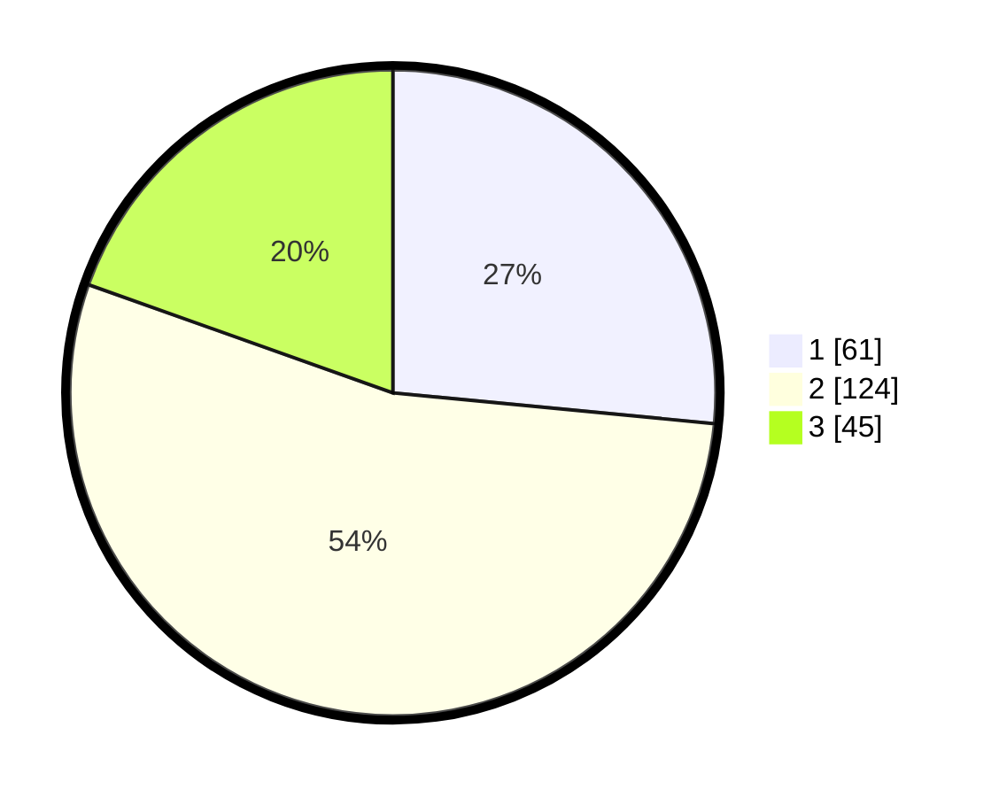

# Hasil

## Grafik

## Tabel

| No. | Nama Paslon    | Suara | Suara (raw) | Persentase |
|:--- |:-------------- | -----:| -----------:| ----------:|
| 1   | ANIES MUHAIMIN | 61    | [61][p-1]   | 26,52      |
| 2   | PRABOWO GIBRAN | 124   | [124][p-2]  | 53,91      |
| 3   | GANJAR MAHFUD  | 45    | [45][p-3]   | 19,57      |

[p-1]: https://github.com/gigit-pemilu/pemilu-2024/blob/main/pilpres/hitung-suara/sub/34-di-yogyakarta/sub/02-bantul/sub/12-banguntapan/sub/2006-potorono/sub/041-tps/sub/paslon-1.txt
[p-2]: https://github.com/gigit-pemilu/pemilu-2024/blob/main/pilpres/hitung-suara/sub/34-di-yogyakarta/sub/02-bantul/sub/12-banguntapan/sub/2006-potorono/sub/041-tps/sub/paslon-2.txt
[p-3]: https://github.com/gigit-pemilu/pemilu-2024/blob/main/pilpres/hitung-suara/sub/34-di-yogyakarta/sub/02-bantul/sub/12-banguntapan/sub/2006-potorono/sub/041-tps/sub/paslon-3.txt

## Foto C Plano

https://sirekap-obj-formc.kpu.go.id/9ee8/pemilu/ppwp/34/02/12/20/06/3402122006041-20240214-203008--504b70be-1d5b-4320-9e6a-4bd2273b0b8f.jpg

https://sirekap-obj-formc.kpu.go.id/9ee8/pemilu/ppwp/34/02/12/20/06/3402122006041-20240214-213141--02ff152f-bb33-4846-a2fa-fe68da7e628b.jpg

## Metadata

| Key        | Value               |
| ---------- | ------------------- |
| Time Stamp | 2024-02-24 22:31:28 |

