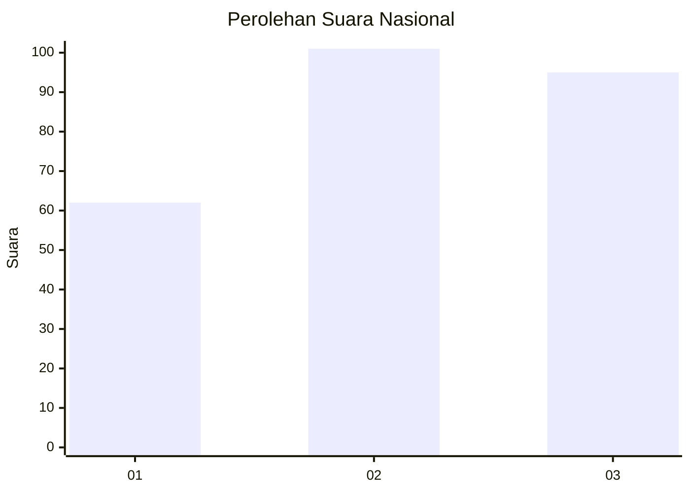
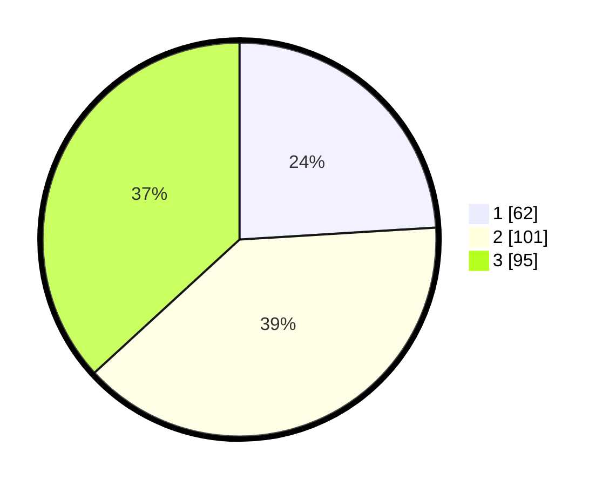

# Hasil

## Grafik

## Tabel

| No. | Nama Paslon    | Suara | Suara (raw) | Persentase |
|:--- |:-------------- | -----:| -----------:| ----------:|
| 1   | ANIES MUHAIMIN | 62    | [62][p-1]   | 24,03      |
| 2   | PRABOWO GIBRAN | 101   | [101][p-2]  | 39,15      |
| 3   | GANJAR MAHFUD  | 95    | [95][p-3]   | 36,82      |

[p-1]: https://github.com/gigit-pemilu/pemilu-2024/blob/main/pilpres/hitung-suara/sub/34-di-yogyakarta/sub/02-bantul/sub/12-banguntapan/sub/2007-tamanan/sub/003-tps/sub/paslon-1.txt
[p-2]: https://github.com/gigit-pemilu/pemilu-2024/blob/main/pilpres/hitung-suara/sub/34-di-yogyakarta/sub/02-bantul/sub/12-banguntapan/sub/2007-tamanan/sub/003-tps/sub/paslon-2.txt
[p-3]: https://github.com/gigit-pemilu/pemilu-2024/blob/main/pilpres/hitung-suara/sub/34-di-yogyakarta/sub/02-bantul/sub/12-banguntapan/sub/2007-tamanan/sub/003-tps/sub/paslon-3.txt

## Foto C Plano

https://sirekap-obj-formc.kpu.go.id/42fa/pemilu/ppwp/34/02/12/20/07/3402122007003-20240215-023741--e10e9bd3-ca6f-4582-9982-23e67376a3f0.jpg

https://sirekap-obj-formc.kpu.go.id/42fa/pemilu/ppwp/34/02/12/20/07/3402122007003-20240214-192738--b523b1ef-ab06-423d-8472-e4b5e4cb4a5b.jpg

https://sirekap-obj-formc.kpu.go.id/42fa/pemilu/ppwp/34/02/12/20/07/3402122007003-20240214-193239--ddbe23df-aca1-45a2-b375-87cc6ac3ee7e.jpg

## Metadata

| Key        | Value               |
| ---------- | ------------------- |
| Time Stamp | 2024-02-15 03:06:03 |

