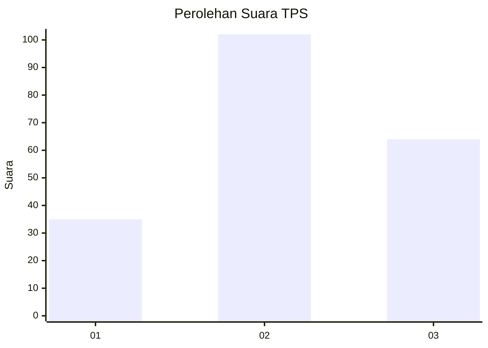
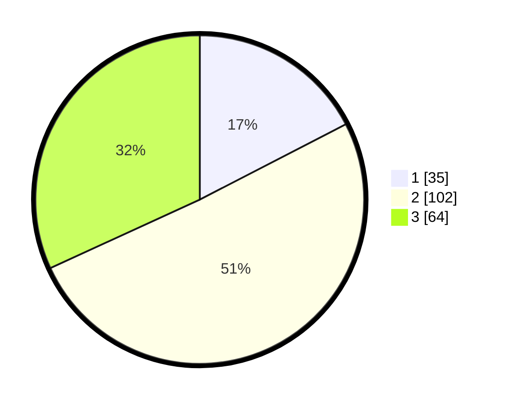

# Hasil

## Grafik

## Tabel

| No. | Nama Paslon    | Suara | Suara (raw) | Persentase |
|:--- |:-------------- | -----:| -----------:| ----------:|
| 1   | ANIES MUHAIMIN | 35    | [35][p-1]   | 17,41      |
| 2   | PRABOWO GIBRAN | 102   | [102][p-2]  | 50,75      |
| 3   | GANJAR MAHFUD  | 64    | [64][p-3]   | 31,84      |

[p-1]: https://github.com/gigit-pemilu/pemilu-2024-34-di-yogyakarta/blob/main/pilpres/hitung-suara/sub/34-di-yogyakarta/sub/02-bantul/sub/12-banguntapan/sub/2007-tamanan/sub/005-tps/sub/paslon-1.txt
[p-2]: https://github.com/gigit-pemilu/pemilu-2024-34-di-yogyakarta/blob/main/pilpres/hitung-suara/sub/34-di-yogyakarta/sub/02-bantul/sub/12-banguntapan/sub/2007-tamanan/sub/005-tps/sub/paslon-2.txt
[p-3]: https://github.com/gigit-pemilu/pemilu-2024-34-di-yogyakarta/blob/main/pilpres/hitung-suara/sub/34-di-yogyakarta/sub/02-bantul/sub/12-banguntapan/sub/2007-tamanan/sub/005-tps/sub/paslon-3.txt

## Foto C Plano

https://sirekap-obj-formc.kpu.go.id/a5b2/pemilu/ppwp/34/02/12/20/07/3402122007005-20240214-231031--af5eb107-d64a-4025-89d2-0ddc707a8866.jpg

https://sirekap-obj-formc.kpu.go.id/a5b2/pemilu/ppwp/34/02/12/20/07/3402122007005-20240214-230840--67f5494f-81d1-43b5-ba30-4bb13a80a685.jpg

https://sirekap-obj-formc.kpu.go.id/a5b2/pemilu/ppwp/34/02/12/20/07/3402122007005-20240214-231201--7ab5ab1f-a45b-474f-9acf-2916cf27b52d.jpg

## Metadata

| Key        | Value               |
| ---------- | ------------------- |
| Time Stamp | 2024-02-24 22:31:28 |

