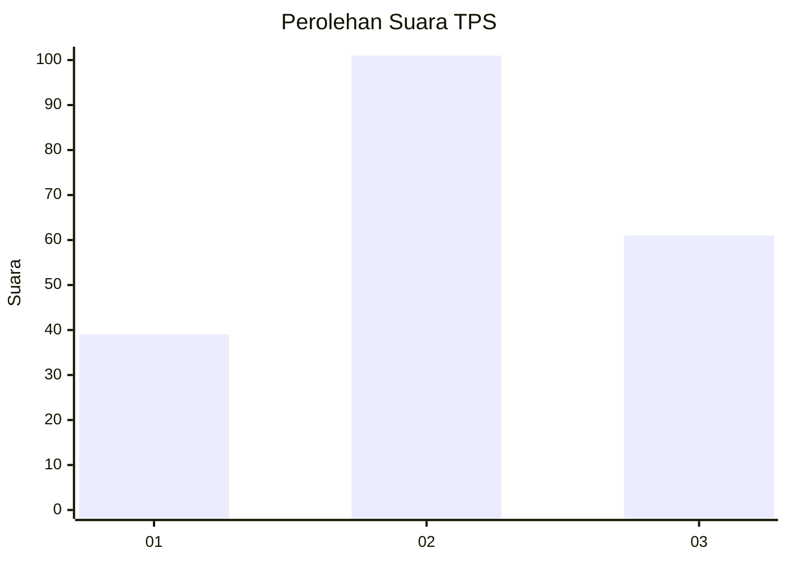
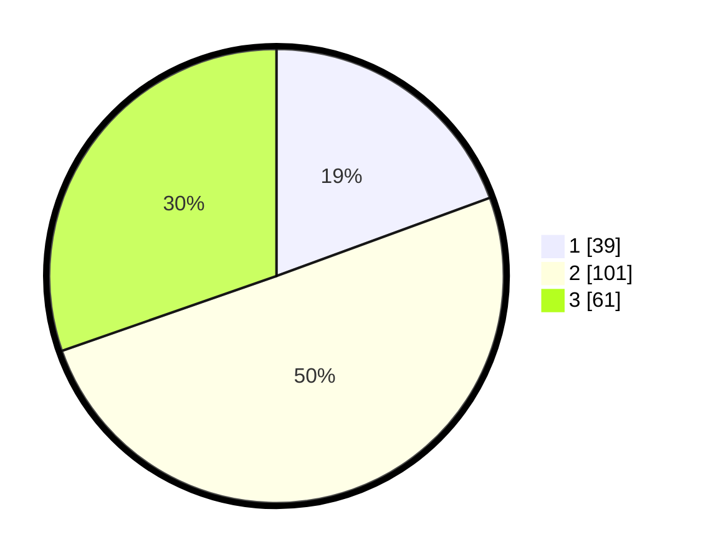

# Hasil

## Grafik

## Tabel

| No. | Nama Paslon    | Suara | Suara (raw) | Persentase |
|:--- |:-------------- | -----:| -----------:| ----------:|
| 1   | ANIES MUHAIMIN | 39    | [39][p-1]   | 19,40      |
| 2   | PRABOWO GIBRAN | 101   | [101][p-2]  | 50,25      |
| 3   | GANJAR MAHFUD  | 61    | [61][p-3]   | 30,35      |

[p-1]: https://github.com/gigit-pemilu/pemilu-2024-34-di-yogyakarta/blob/main/pilpres/hitung-suara/sub/34-di-yogyakarta/sub/02-bantul/sub/12-banguntapan/sub/2007-tamanan/sub/017-tps/sub/paslon-1.txt
[p-2]: https://github.com/gigit-pemilu/pemilu-2024-34-di-yogyakarta/blob/main/pilpres/hitung-suara/sub/34-di-yogyakarta/sub/02-bantul/sub/12-banguntapan/sub/2007-tamanan/sub/017-tps/sub/paslon-2.txt
[p-3]: https://github.com/gigit-pemilu/pemilu-2024-34-di-yogyakarta/blob/main/pilpres/hitung-suara/sub/34-di-yogyakarta/sub/02-bantul/sub/12-banguntapan/sub/2007-tamanan/sub/017-tps/sub/paslon-3.txt

## Foto C Plano

https://sirekap-obj-formc.kpu.go.id/b59b/pemilu/ppwp/34/02/12/20/07/3402122007017-20240214-193938--7cc39534-b704-4c29-8646-d652c0c2d29b.jpg

https://sirekap-obj-formc.kpu.go.id/b59b/pemilu/ppwp/34/02/12/20/07/3402122007017-20240214-212255--4cc18436-eeea-45c9-a5ad-c954dc7af98f.jpg

https://sirekap-obj-formc.kpu.go.id/b59b/pemilu/ppwp/34/02/12/20/07/3402122007017-20240215-030838--40835f78-b432-4403-9bbb-0f7265368c4b.jpg

## Metadata

| Key        | Value               |
| ---------- | ------------------- |
| Time Stamp | 2024-02-15 04:00:24 |

