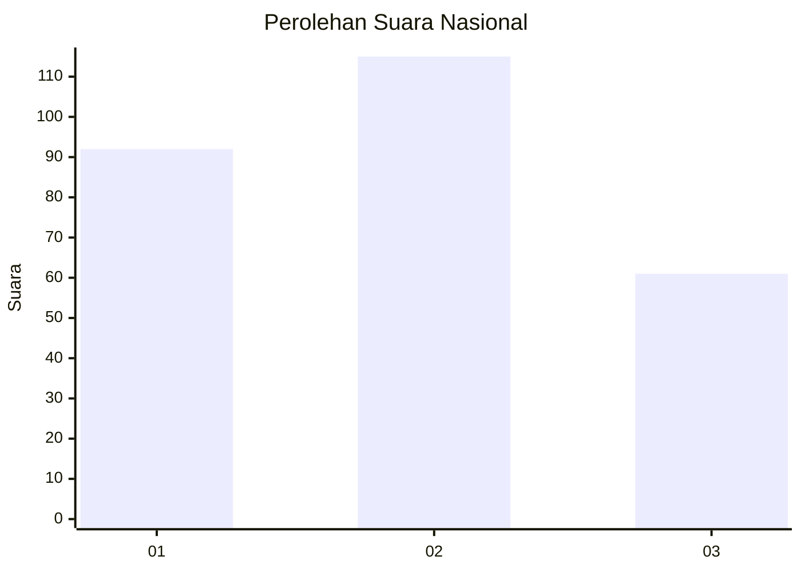
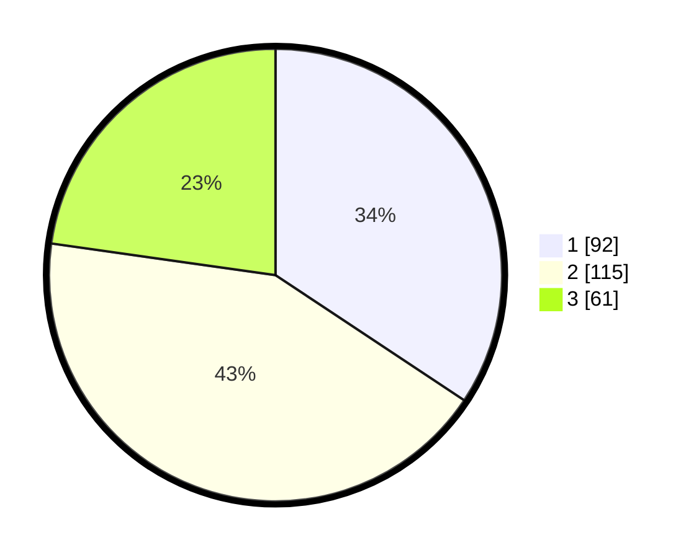

# Hasil

## Grafik

## Tabel

| No. | Nama Paslon    | Suara | Suara (raw) | Persentase |
|:--- |:-------------- | -----:| -----------:| ----------:|
| 1   | ANIES MUHAIMIN | 92    | [92][p-1]   | 34,33      |
| 2   | PRABOWO GIBRAN | 115   | [115][p-2]  | 42,91      |
| 3   | GANJAR MAHFUD  | 61    | [61][p-3]   | 22,76      |

[p-1]: https://github.com/gigit-pemilu/pemilu-2024/blob/main/pilpres/hitung-suara/sub/34-di-yogyakarta/sub/02-bantul/sub/12-banguntapan/sub/2007-tamanan/sub/023-tps/sub/paslon-1.txt
[p-2]: https://github.com/gigit-pemilu/pemilu-2024/blob/main/pilpres/hitung-suara/sub/34-di-yogyakarta/sub/02-bantul/sub/12-banguntapan/sub/2007-tamanan/sub/023-tps/sub/paslon-2.txt
[p-3]: https://github.com/gigit-pemilu/pemilu-2024/blob/main/pilpres/hitung-suara/sub/34-di-yogyakarta/sub/02-bantul/sub/12-banguntapan/sub/2007-tamanan/sub/023-tps/sub/paslon-3.txt

## Foto C Plano

https://sirekap-obj-formc.kpu.go.id/3e8d/pemilu/ppwp/34/02/12/20/07/3402122007023-20240215-030024--0463824f-29e2-48dd-babe-09effb55b169.jpg

https://sirekap-obj-formc.kpu.go.id/3e8d/pemilu/ppwp/34/02/12/20/07/3402122007023-20240214-232722--09355dcd-9aec-47f3-940f-687442705b52.jpg

https://sirekap-obj-formc.kpu.go.id/3e8d/pemilu/ppwp/34/02/12/20/07/3402122007023-20240214-232833--c8fe3fb6-21d1-4f9b-92f3-345322534abd.jpg

## Metadata

| Key        | Value               |
| ---------- | ------------------- |
| Time Stamp | 2024-02-24 22:31:28 |

