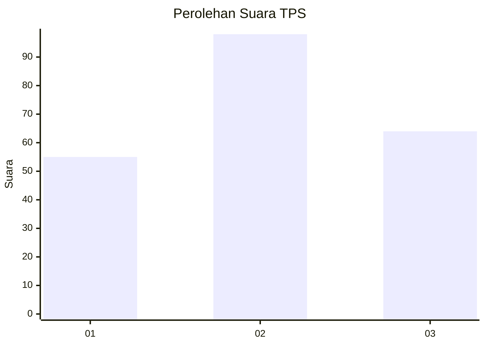
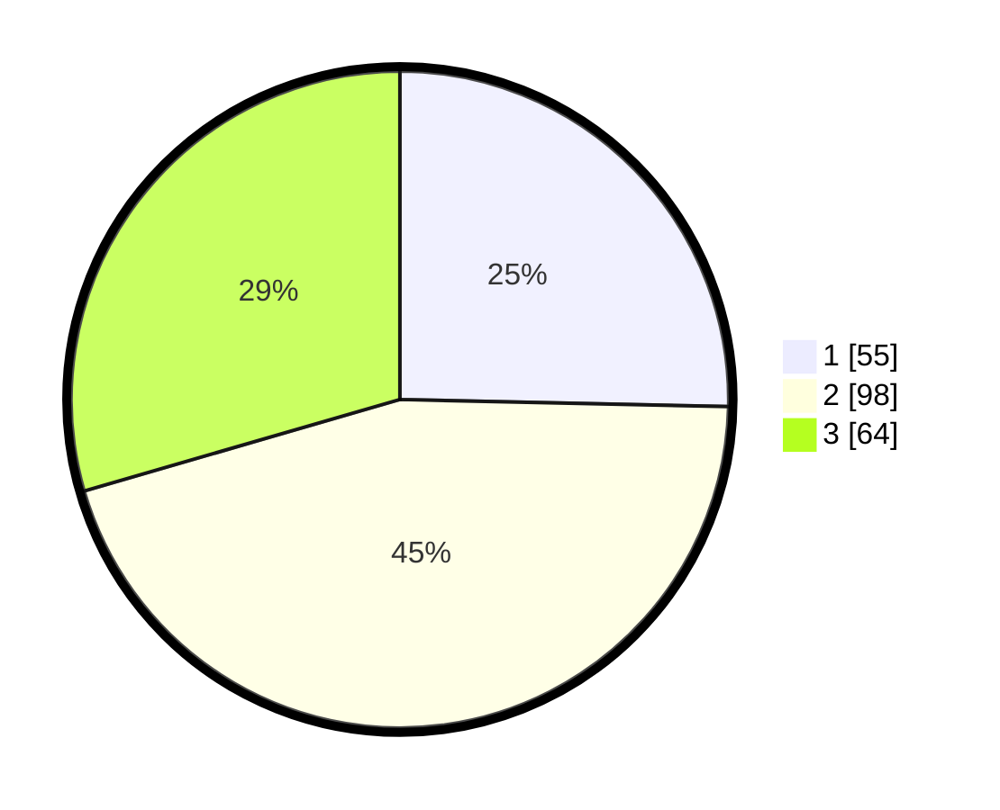

# Hasil

## Grafik

## Tabel

| No. | Nama Paslon    | Suara | Suara (raw) | Persentase |
|:--- |:-------------- | -----:| -----------:| ----------:|
| 1   | ANIES MUHAIMIN | 55    | [55][p-1]   | 25,35      |
| 2   | PRABOWO GIBRAN | 98    | [98][p-2]   | 45,16      |
| 3   | GANJAR MAHFUD  | 64    | [64][p-3]   | 29,49      |

[p-1]: https://github.com/gigit-pemilu/pemilu-2024-34-di-yogyakarta/blob/main/pilpres/hitung-suara/sub/34-di-yogyakarta/sub/02-bantul/sub/12-banguntapan/sub/2007-tamanan/sub/026-tps/sub/paslon-1.txt
[p-2]: https://github.com/gigit-pemilu/pemilu-2024-34-di-yogyakarta/blob/main/pilpres/hitung-suara/sub/34-di-yogyakarta/sub/02-bantul/sub/12-banguntapan/sub/2007-tamanan/sub/026-tps/sub/paslon-2.txt
[p-3]: https://github.com/gigit-pemilu/pemilu-2024-34-di-yogyakarta/blob/main/pilpres/hitung-suara/sub/34-di-yogyakarta/sub/02-bantul/sub/12-banguntapan/sub/2007-tamanan/sub/026-tps/sub/paslon-3.txt

## Foto C Plano

https://sirekap-obj-formc.kpu.go.id/4bab/pemilu/ppwp/34/02/12/20/07/3402122007026-20240215-004522--22d4958b-f613-4192-a29d-b6d7c3f970fb.jpg

https://sirekap-obj-formc.kpu.go.id/4bab/pemilu/ppwp/34/02/12/20/07/3402122007026-20240215-004627--add875d0-a96a-4c29-8c4c-425fd688479f.jpg

https://sirekap-obj-formc.kpu.go.id/4bab/pemilu/ppwp/34/02/12/20/07/3402122007026-20240214-211835--3a1f1d6e-4faa-4dd8-880c-16526867337f.jpg

## Metadata

| Key        | Value               |
| ---------- | ------------------- |
| Time Stamp | 2024-02-25 12:00:00 |

