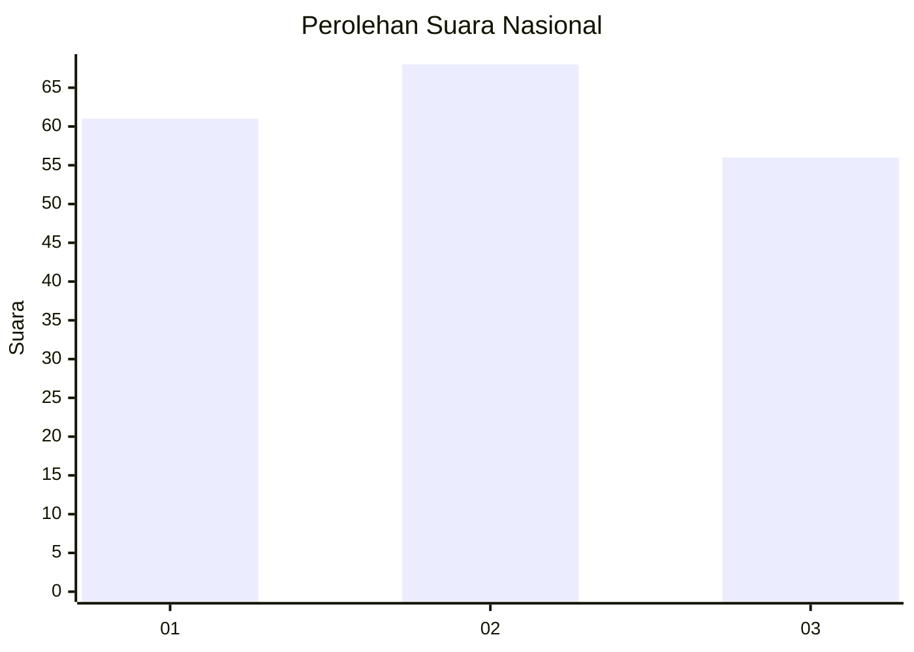
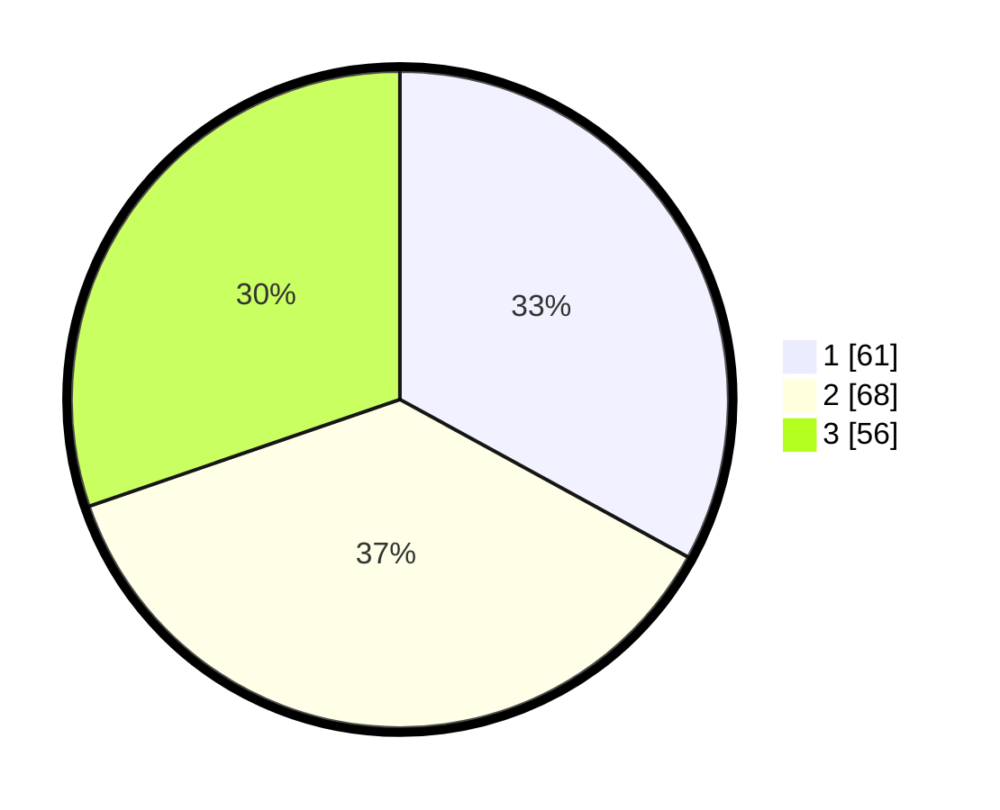

# Hasil

## Grafik

## Tabel

| No. | Nama Paslon    | Suara | Suara (raw) | Persentase |
|:--- |:-------------- | -----:| -----------:| ----------:|
| 1   | ANIES MUHAIMIN | 61    | [61][p-1]   | 32,97      |
| 2   | PRABOWO GIBRAN | 68    | [68][p-2]   | 36,76      |
| 3   | GANJAR MAHFUD  | 56    | [56][p-3]   | 30,27      |

[p-1]: https://github.com/gigit-pemilu/pemilu-2024/blob/main/pilpres/hitung-suara/sub/34-di-yogyakarta/sub/02-bantul/sub/12-banguntapan/sub/2007-tamanan/sub/030-tps/sub/paslon-1.txt
[p-2]: https://github.com/gigit-pemilu/pemilu-2024/blob/main/pilpres/hitung-suara/sub/34-di-yogyakarta/sub/02-bantul/sub/12-banguntapan/sub/2007-tamanan/sub/030-tps/sub/paslon-2.txt
[p-3]: https://github.com/gigit-pemilu/pemilu-2024/blob/main/pilpres/hitung-suara/sub/34-di-yogyakarta/sub/02-bantul/sub/12-banguntapan/sub/2007-tamanan/sub/030-tps/sub/paslon-3.txt

## Foto C Plano

https://sirekap-obj-formc.kpu.go.id/c98a/pemilu/ppwp/34/02/12/20/07/3402122007030-20240215-084752--4cf7509c-e844-4ab1-b448-391b7c2da62a.jpg

https://sirekap-obj-formc.kpu.go.id/c98a/pemilu/ppwp/34/02/12/20/07/3402122007030-20240215-084800--8e28da62-f380-4f98-a9e7-e7f8c5d787ca.jpg

https://sirekap-obj-formc.kpu.go.id/c98a/pemilu/ppwp/34/02/12/20/07/3402122007030-20240215-084807--ee7fe24e-1fff-4238-9c26-b7e9253b06e0.jpg

## Metadata

| Key        | Value               |
| ---------- | ------------------- |
| Time Stamp | 2024-02-24 22:31:28 |

