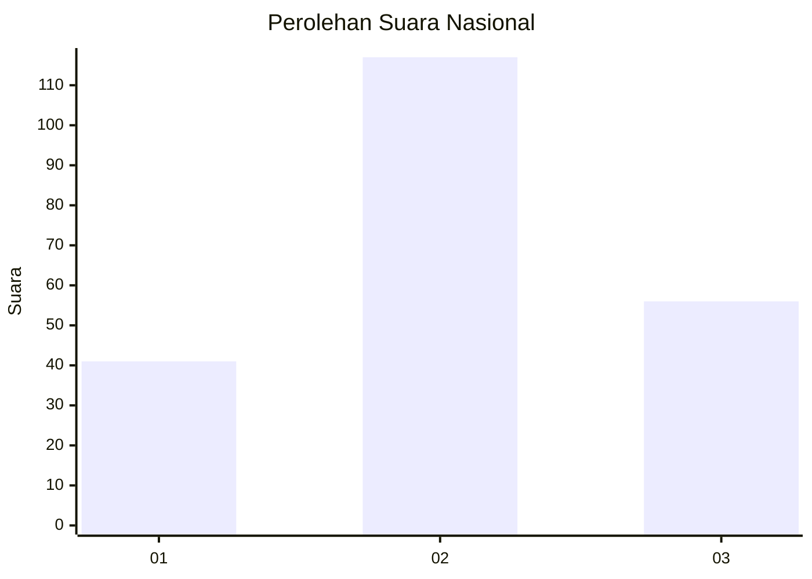
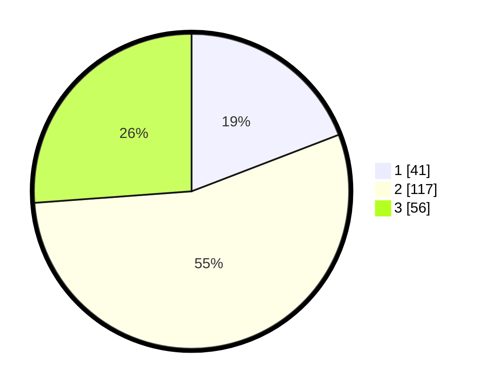

# Hasil

## Grafik

## Tabel

| No. | Nama Paslon    | Suara | Suara (raw) | Persentase |
|:--- |:-------------- | -----:| -----------:| ----------:|
| 1   | ANIES MUHAIMIN | 41    | [41][p-1]   | 19,16      |
| 2   | PRABOWO GIBRAN | 117   | [117][p-2]  | 54,67      |
| 3   | GANJAR MAHFUD  | 56    | [56][p-3]   | 26,17      |

[p-1]: https://github.com/gigit-pemilu/pemilu-2024/blob/main/pilpres/hitung-suara/sub/34-di-yogyakarta/sub/02-bantul/sub/12-banguntapan/sub/2007-tamanan/sub/031-tps/sub/paslon-1.txt
[p-2]: https://github.com/gigit-pemilu/pemilu-2024/blob/main/pilpres/hitung-suara/sub/34-di-yogyakarta/sub/02-bantul/sub/12-banguntapan/sub/2007-tamanan/sub/031-tps/sub/paslon-2.txt
[p-3]: https://github.com/gigit-pemilu/pemilu-2024/blob/main/pilpres/hitung-suara/sub/34-di-yogyakarta/sub/02-bantul/sub/12-banguntapan/sub/2007-tamanan/sub/031-tps/sub/paslon-3.txt

## Foto C Plano

https://sirekap-obj-formc.kpu.go.id/cfb1/pemilu/ppwp/34/02/12/20/07/3402122007031-20240214-192019--a0de1acf-b692-4159-910b-33c0eef146a3.jpg

https://sirekap-obj-formc.kpu.go.id/cfb1/pemilu/ppwp/34/02/12/20/07/3402122007031-20240214-191405--953481d9-bc13-4849-b948-092b1957e922.jpg

https://sirekap-obj-formc.kpu.go.id/cfb1/pemilu/ppwp/34/02/12/20/07/3402122007031-20240214-192145--6220d3f1-f686-4fa8-8dd7-ff0a9d354bd3.jpg

## Metadata

| Key        | Value               |
| ---------- | ------------------- |
| Time Stamp | 2024-02-15 20:30:46 |

