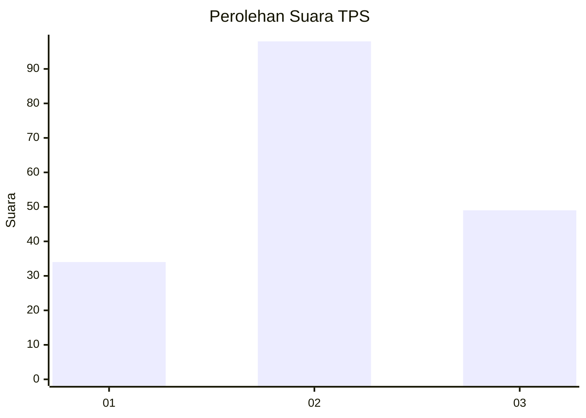
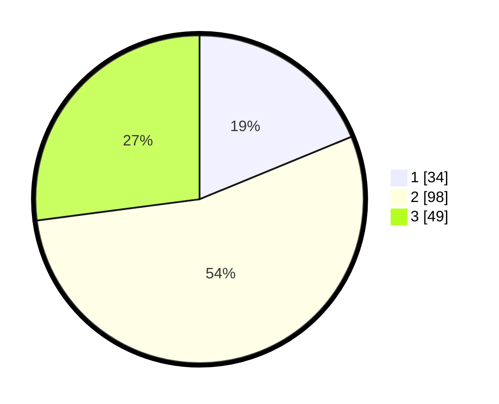

# Hasil

## Grafik

## Tabel

| No. | Nama Paslon    | Suara | Suara (raw) | Persentase |
|:--- |:-------------- | -----:| -----------:| ----------:|
| 1   | ANIES MUHAIMIN | 34    | [34][p-1]   | 18,78      |
| 2   | PRABOWO GIBRAN | 98    | [98][p-2]   | 54,14      |
| 3   | GANJAR MAHFUD  | 49    | [49][p-3]   | 27,07      |

[p-1]: https://github.com/gigit-pemilu/pemilu-2024-34-di-yogyakarta/blob/main/pilpres/hitung-suara/sub/34-di-yogyakarta/sub/02-bantul/sub/12-banguntapan/sub/2007-tamanan/sub/034-tps/sub/paslon-1.txt
[p-2]: https://github.com/gigit-pemilu/pemilu-2024-34-di-yogyakarta/blob/main/pilpres/hitung-suara/sub/34-di-yogyakarta/sub/02-bantul/sub/12-banguntapan/sub/2007-tamanan/sub/034-tps/sub/paslon-2.txt
[p-3]: https://github.com/gigit-pemilu/pemilu-2024-34-di-yogyakarta/blob/main/pilpres/hitung-suara/sub/34-di-yogyakarta/sub/02-bantul/sub/12-banguntapan/sub/2007-tamanan/sub/034-tps/sub/paslon-3.txt

## Foto C Plano

https://sirekap-obj-formc.kpu.go.id/6810/pemilu/ppwp/34/02/12/20/07/3402122007034-20240224-135819--8836b8db-5b48-4640-b3b7-dcb2ba43dca2.jpg

https://sirekap-obj-formc.kpu.go.id/6810/pemilu/ppwp/34/02/12/20/07/3402122007034-20240224-135936--b6b3c5bb-2862-4852-94b6-08c72467d8bd.jpg

https://sirekap-obj-formc.kpu.go.id/6810/pemilu/ppwp/34/02/12/20/07/3402122007034-20240224-140041--6d48901b-6773-4fa9-ba81-331017dabff1.jpg

## Metadata

| Key        | Value               |
| ---------- | ------------------- |
| Time Stamp | 2024-02-29 11:00:00 |

