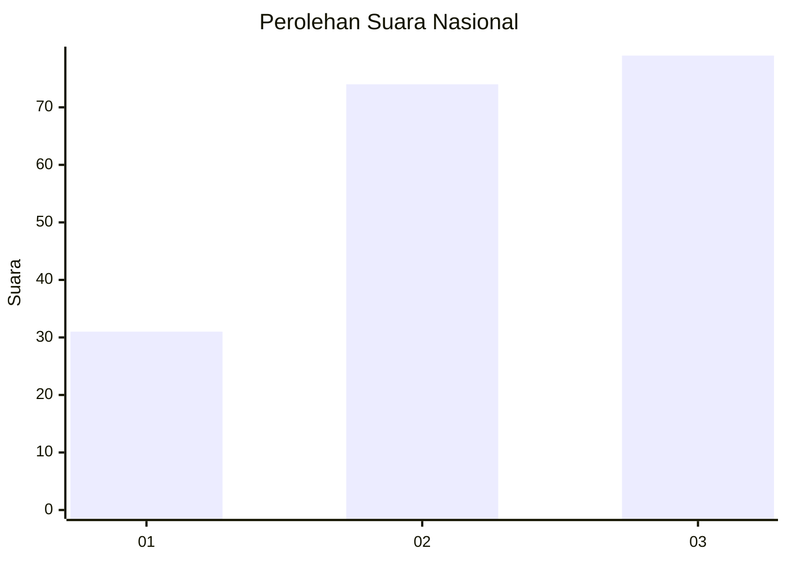
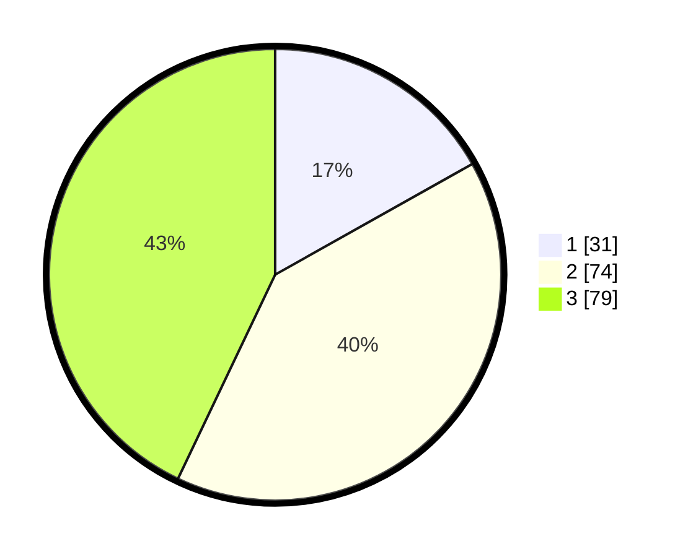

# Hasil

## Grafik

## Tabel

| No. | Nama Paslon    | Suara | Suara (raw) | Persentase |
|:--- |:-------------- | -----:| -----------:| ----------:|
| 1   | ANIES MUHAIMIN | 31    | [31][p-1]   | 16,85      |
| 2   | PRABOWO GIBRAN | 74    | [74][p-2]   | 40,22      |
| 3   | GANJAR MAHFUD  | 79    | [79][p-3]   | 42,93      |

[p-1]: https://github.com/gigit-pemilu/pemilu-2024/blob/main/pilpres/hitung-suara/sub/34-di-yogyakarta/sub/02-bantul/sub/12-banguntapan/sub/2007-tamanan/sub/036-tps/sub/paslon-1.txt
[p-2]: https://github.com/gigit-pemilu/pemilu-2024/blob/main/pilpres/hitung-suara/sub/34-di-yogyakarta/sub/02-bantul/sub/12-banguntapan/sub/2007-tamanan/sub/036-tps/sub/paslon-2.txt
[p-3]: https://github.com/gigit-pemilu/pemilu-2024/blob/main/pilpres/hitung-suara/sub/34-di-yogyakarta/sub/02-bantul/sub/12-banguntapan/sub/2007-tamanan/sub/036-tps/sub/paslon-3.txt

## Foto C Plano

https://sirekap-obj-formc.kpu.go.id/cb45/pemilu/ppwp/34/02/12/20/07/3402122007036-20240215-001818--dadba19d-b7cb-4e64-b66b-fcaa444037ee.jpg

https://sirekap-obj-formc.kpu.go.id/cb45/pemilu/ppwp/34/02/12/20/07/3402122007036-20240215-001626--a27e133c-5ab5-4551-8229-3da227f489da.jpg

https://sirekap-obj-formc.kpu.go.id/cb45/pemilu/ppwp/34/02/12/20/07/3402122007036-20240215-002630--b77580cc-5d67-4721-8fda-5a700f63185f.jpg

## Metadata

| Key        | Value               |
| ---------- | ------------------- |
| Time Stamp | 2024-02-15 19:30:26 |

