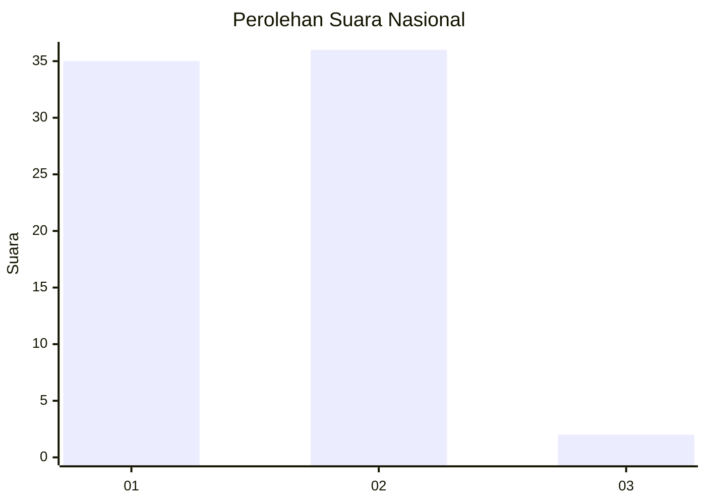
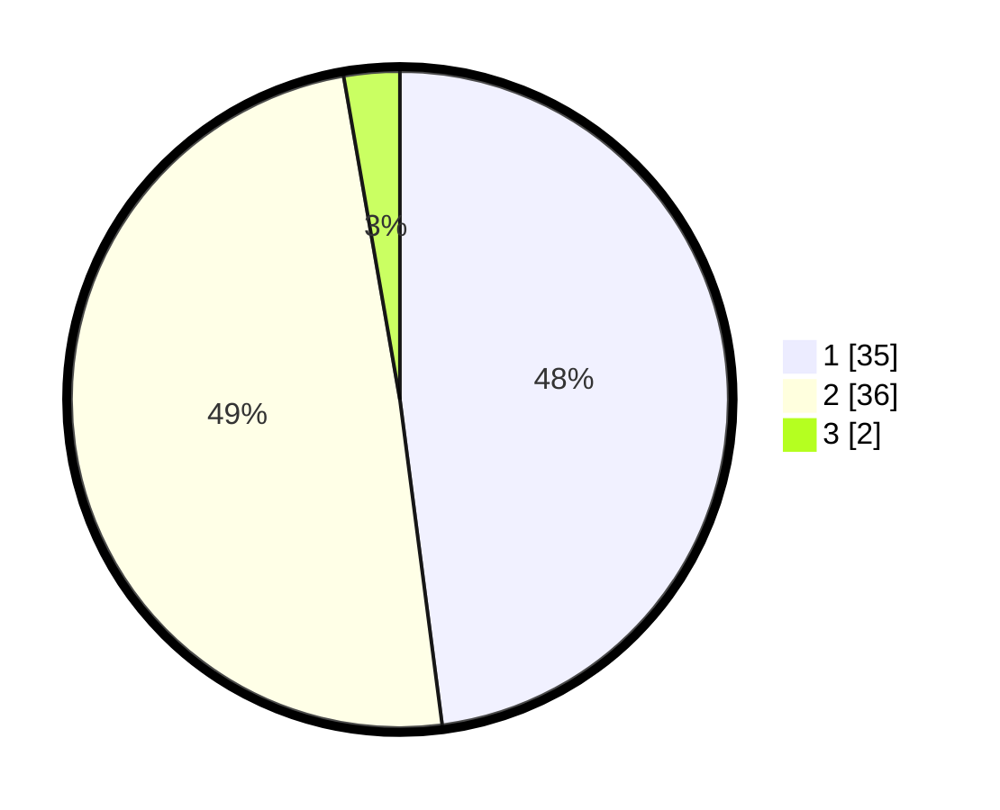

# Hasil

## Grafik

## Tabel

| No. | Nama Paslon    | Suara | Suara (raw) | Persentase |
|:--- |:-------------- | -----:| -----------:| ----------:|
| 1   | ANIES MUHAIMIN | 35    | [35][p-1]   | 47,95      |
| 2   | PRABOWO GIBRAN | 36    | [36][p-2]   | 49,32      |
| 3   | GANJAR MAHFUD  | 2     | [2][p-3]    | 2,74       |

[p-1]: https://github.com/gigit-pemilu/pemilu-2024/blob/main/pilpres/hitung-suara/sub/34-di-yogyakarta/sub/02-bantul/sub/12-banguntapan/sub/2007-tamanan/sub/901-tps/sub/paslon-1.txt
[p-2]: https://github.com/gigit-pemilu/pemilu-2024/blob/main/pilpres/hitung-suara/sub/34-di-yogyakarta/sub/02-bantul/sub/12-banguntapan/sub/2007-tamanan/sub/901-tps/sub/paslon-2.txt
[p-3]: https://github.com/gigit-pemilu/pemilu-2024/blob/main/pilpres/hitung-suara/sub/34-di-yogyakarta/sub/02-bantul/sub/12-banguntapan/sub/2007-tamanan/sub/901-tps/sub/paslon-3.txt

## Foto C Plano

https://sirekap-obj-formc.kpu.go.id/dc01/pemilu/ppwp/34/02/12/20/07/3402122007901-20240216-074734--1da9fec5-940a-4061-8375-b50ffbc82085.jpg

https://sirekap-obj-formc.kpu.go.id/dc01/pemilu/ppwp/34/02/12/20/07/3402122007901-20240216-074752--9670e7c9-7f1a-436a-8314-fd90433f2dc7.jpg

https://sirekap-obj-formc.kpu.go.id/dc01/pemilu/ppwp/34/02/12/20/07/3402122007901-20240216-074743--0a5ba797-1727-4501-a4b2-18a3134d50a1.jpg

## Metadata

| Key        | Value               |
| ---------- | ------------------- |
| Time Stamp | 2024-02-22 09:00:00 |

## DATA PEMILIH TETAP

Jumlah pemilih dalam DPT: **118**.
 * L: **30**.
 * P: **88**.

## DATA PENGGUNA HAK PILIH

Jumlah pengguna hak pilih dalam DPT: **0**.
 * L: **0**.
 * P: **0**.

Jumlah pengguna hak pilih dalam DPTb: **73**.
 * L: **22**.
 * P: **51**.

Jumlah pengguna hak pilih dalam DPK: **0**.
 * L: **0**.
 * P: **0**.

Jumlah pengguna hak pilih: **73**.
 * L: **22**.
 * P: **51**.

## JUMLAH SUARA SAH DAN TIDAK SAH

JUMLAH SELURUH SUARA SAH: **73**.

JUMLAH SUARA TIDAK SAH: **0**.

JUMLAH SELURUH SUARA SAH DAN SUARA TIDAK SAH: **73**.

