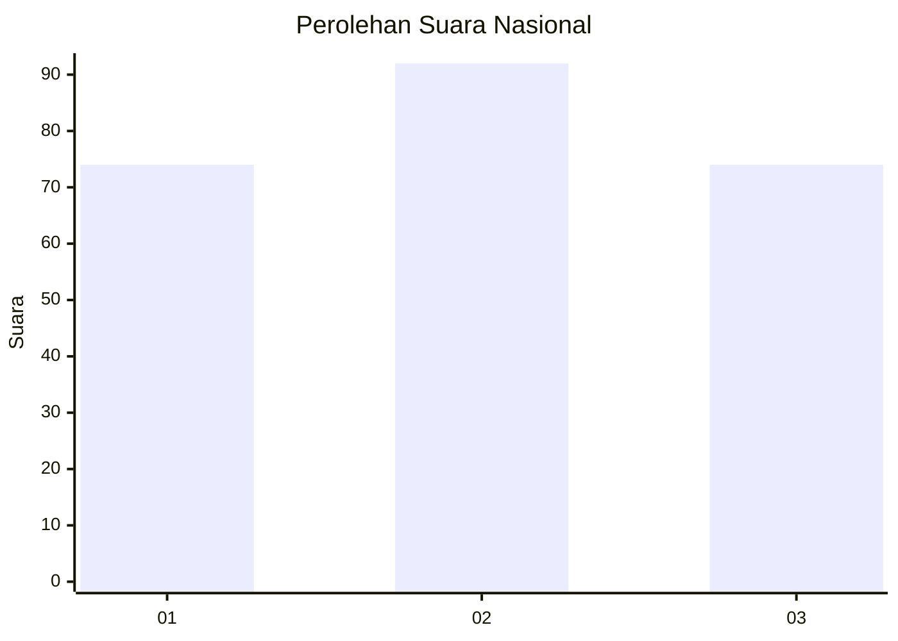
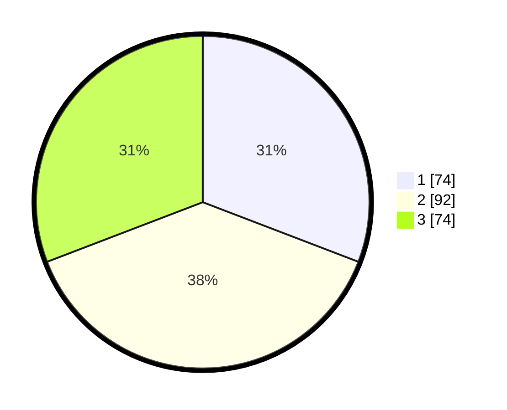

# Hasil

## Grafik

## Tabel

| No. | Nama Paslon    | Suara | Suara (raw) | Persentase |
|:--- |:-------------- | -----:| -----------:| ----------:|
| 1   | ANIES MUHAIMIN | 74    | [74][p-1]   | 30,83      |
| 2   | PRABOWO GIBRAN | 92    | [92][p-2]   | 38,33      |
| 3   | GANJAR MAHFUD  | 74    | [74][p-3]   | 30,83      |

[p-1]: https://github.com/gigit-pemilu/pemilu-2024/blob/main/pilpres/hitung-suara/sub/34-di-yogyakarta/sub/02-bantul/sub/12-banguntapan/sub/2008-wirokerten/sub/003-tps/sub/paslon-1.txt
[p-2]: https://github.com/gigit-pemilu/pemilu-2024/blob/main/pilpres/hitung-suara/sub/34-di-yogyakarta/sub/02-bantul/sub/12-banguntapan/sub/2008-wirokerten/sub/003-tps/sub/paslon-2.txt
[p-3]: https://github.com/gigit-pemilu/pemilu-2024/blob/main/pilpres/hitung-suara/sub/34-di-yogyakarta/sub/02-bantul/sub/12-banguntapan/sub/2008-wirokerten/sub/003-tps/sub/paslon-3.txt

## Foto C Plano

https://sirekap-obj-formc.kpu.go.id/4e4c/pemilu/ppwp/34/02/12/20/08/3402122008003-20240216-155705--16689c51-d4e2-4b9b-8369-0e2819400a48.jpg

https://sirekap-obj-formc.kpu.go.id/4e4c/pemilu/ppwp/34/02/12/20/08/3402122008003-20240216-155707--31c6ba41-9c53-4780-b167-eb8ab0ffb9f2.jpg

https://sirekap-obj-formc.kpu.go.id/4e4c/pemilu/ppwp/34/02/12/20/08/3402122008003-20240216-155706--4aa804db-45a5-4cda-9c70-a6db65c97f9e.jpg

## Metadata

| Key        | Value               |
| ---------- | ------------------- |
| Time Stamp | 2024-02-22 09:00:00 |

## DATA PEMILIH TETAP

Jumlah pemilih dalam DPT: **233**.
 * L: **104**.
 * P: **129**.

## DATA PENGGUNA HAK PILIH

Jumlah pengguna hak pilih dalam DPT: **212**.
 * L: **96**.
 * P: **116**.

Jumlah pengguna hak pilih dalam DPTb: **16**.
 * L: **1**.
 * P: **15**.

Jumlah pengguna hak pilih dalam DPK: **16**.
 * L: **6**.
 * P: **10**.

Jumlah pengguna hak pilih: **244**.
 * L: **103**.
 * P: **141**.

## JUMLAH SUARA SAH DAN TIDAK SAH

JUMLAH SELURUH SUARA SAH: **240**.

JUMLAH SUARA TIDAK SAH: **4**.

JUMLAH SELURUH SUARA SAH DAN SUARA TIDAK SAH: **244**.

