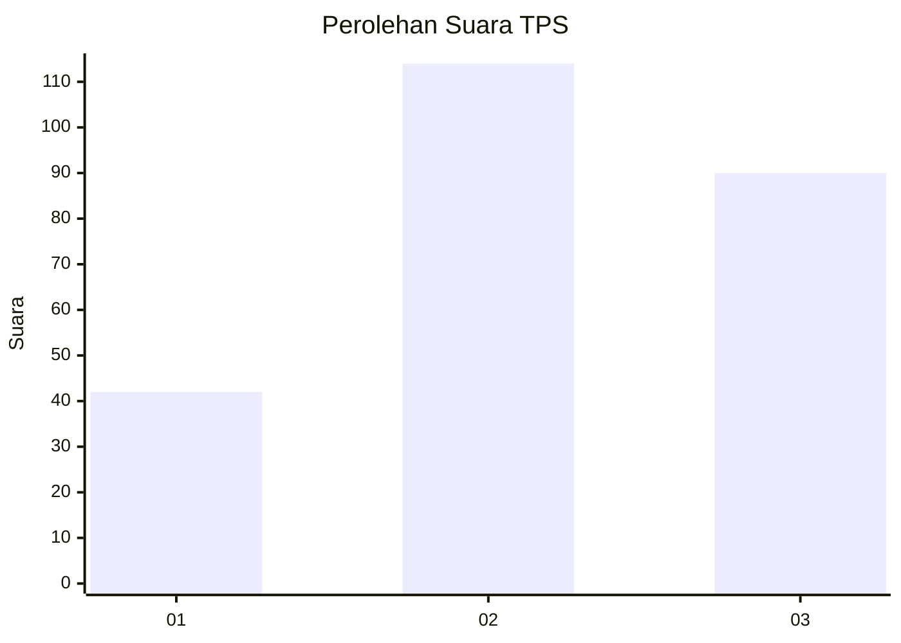
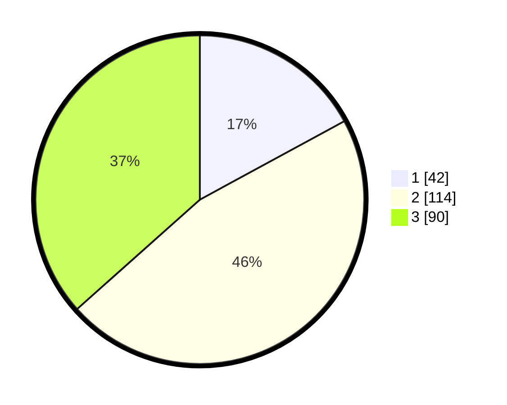

# Hasil

## Grafik

## Tabel

| No. | Nama Paslon    | Suara | Suara (raw) | Persentase |
|:--- |:-------------- | -----:| -----------:| ----------:|
| 1   | ANIES MUHAIMIN | 42    | [42][p-1]   | 17,07      |
| 2   | PRABOWO GIBRAN | 114   | [114][p-2]  | 46,34      |
| 3   | GANJAR MAHFUD  | 90    | [90][p-3]   | 36,59      |

[p-1]: https://github.com/gigit-pemilu/pemilu-2024-34-di-yogyakarta/blob/main/pilpres/hitung-suara/sub/34-di-yogyakarta/sub/02-bantul/sub/12-banguntapan/sub/2008-wirokerten/sub/005-tps/sub/paslon-1.txt
[p-2]: https://github.com/gigit-pemilu/pemilu-2024-34-di-yogyakarta/blob/main/pilpres/hitung-suara/sub/34-di-yogyakarta/sub/02-bantul/sub/12-banguntapan/sub/2008-wirokerten/sub/005-tps/sub/paslon-2.txt
[p-3]: https://github.com/gigit-pemilu/pemilu-2024-34-di-yogyakarta/blob/main/pilpres/hitung-suara/sub/34-di-yogyakarta/sub/02-bantul/sub/12-banguntapan/sub/2008-wirokerten/sub/005-tps/sub/paslon-3.txt

## Foto C Plano

https://sirekap-obj-formc.kpu.go.id/d56f/pemilu/ppwp/34/02/12/20/08/3402122008005-20240215-042334--abe72e3f-0b2b-4497-bffe-c6ba9f2f6821.jpg

https://sirekap-obj-formc.kpu.go.id/d56f/pemilu/ppwp/34/02/12/20/08/3402122008005-20240215-042420--3ac13815-c8e8-4739-88d7-b68ff4e1a195.jpg

https://sirekap-obj-formc.kpu.go.id/d56f/pemilu/ppwp/34/02/12/20/08/3402122008005-20240215-042542--ce15f425-77a6-4222-bac5-3d5b4b51b20f.jpg

## Metadata

| Key        | Value               |
| ---------- | ------------------- |
| Time Stamp | 2024-02-25 12:00:00 |

