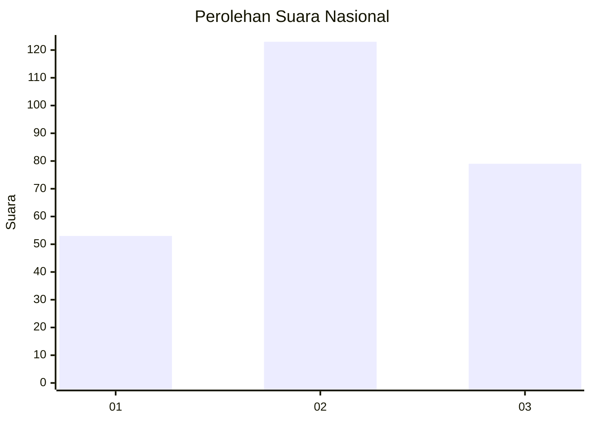
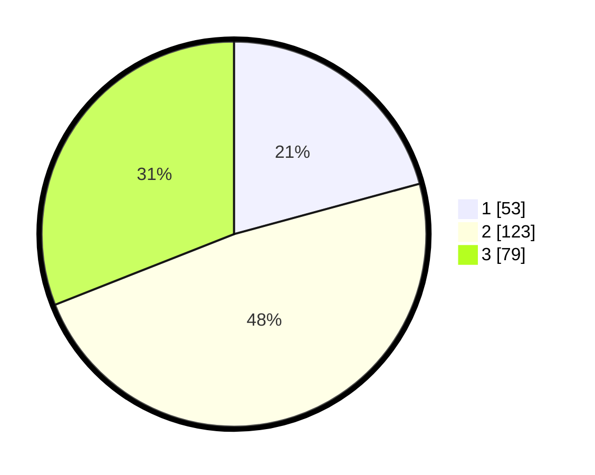

# Hasil

## Grafik

## Tabel

| No. | Nama Paslon    | Suara | Suara (raw) | Persentase |
|:--- |:-------------- | -----:| -----------:| ----------:|
| 1   | ANIES MUHAIMIN | 53    | [53][p-1]   | 20,78      |
| 2   | PRABOWO GIBRAN | 123   | [123][p-2]  | 48,24      |
| 3   | GANJAR MAHFUD  | 79    | [79][p-3]   | 30,98      |

[p-1]: https://github.com/gigit-pemilu/pemilu-2024/blob/main/pilpres/hitung-suara/sub/34-di-yogyakarta/sub/02-bantul/sub/12-banguntapan/sub/2008-wirokerten/sub/007-tps/sub/paslon-1.txt
[p-2]: https://github.com/gigit-pemilu/pemilu-2024/blob/main/pilpres/hitung-suara/sub/34-di-yogyakarta/sub/02-bantul/sub/12-banguntapan/sub/2008-wirokerten/sub/007-tps/sub/paslon-2.txt
[p-3]: https://github.com/gigit-pemilu/pemilu-2024/blob/main/pilpres/hitung-suara/sub/34-di-yogyakarta/sub/02-bantul/sub/12-banguntapan/sub/2008-wirokerten/sub/007-tps/sub/paslon-3.txt

## Foto C Plano

https://sirekap-obj-formc.kpu.go.id/c864/pemilu/ppwp/34/02/12/20/08/3402122008007-20240215-015648--d46744c4-4a01-4413-abc0-d31fe2eac6c4.jpg

https://sirekap-obj-formc.kpu.go.id/c864/pemilu/ppwp/34/02/12/20/08/3402122008007-20240215-015746--dda484a1-6658-4026-ba58-87e8181f4a9e.jpg

https://sirekap-obj-formc.kpu.go.id/c864/pemilu/ppwp/34/02/12/20/08/3402122008007-20240215-015905--fa2687f7-a627-4b2f-8b8f-812cf97643db.jpg

## Metadata

| Key        | Value               |
| ---------- | ------------------- |
| Time Stamp | 2024-02-15 12:00:28 |

