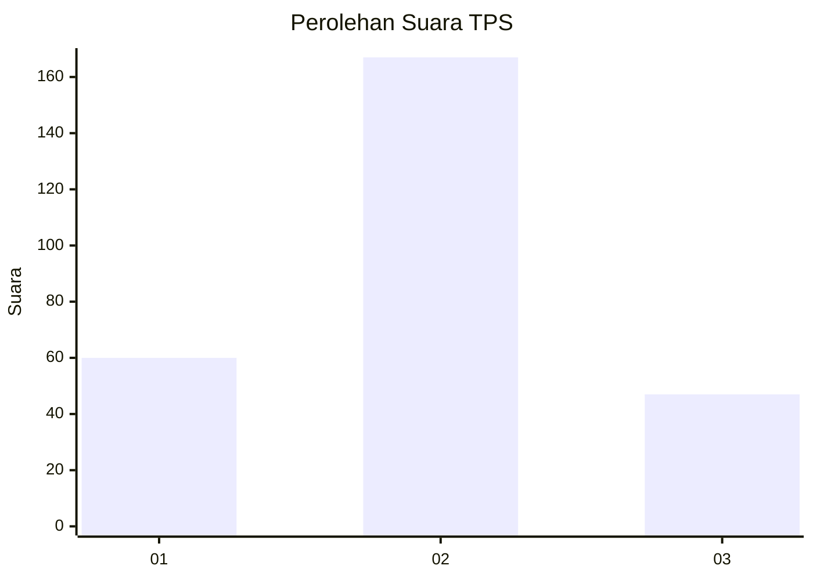

# Hasil

## Grafik

## Tabel

| No. | Nama Paslon    | Suara | Suara (raw) | Persentase |
|:--- |:-------------- | -----:| -----------:| ----------:|
| 1   | ANIES MUHAIMIN | 60    | [60][p-1]   | 21,90      |
| 2   | PRABOWO GIBRAN | 167   | [167][p-2]  | 60,95      |
| 3   | GANJAR MAHFUD  | 47    | [47][p-3]   | 17,15      |

[p-1]: https://github.com/gigit-pemilu/pemilu-2024-34-di-yogyakarta/blob/main/pilpres/hitung-suara/sub/34-di-yogyakarta/sub/02-bantul/sub/12-banguntapan/sub/2008-wirokerten/sub/017-tps/sub/paslon-1.txt
[p-2]: https://github.com/gigit-pemilu/pemilu-2024-34-di-yogyakarta/blob/main/pilpres/hitung-suara/sub/34-di-yogyakarta/sub/02-bantul/sub/12-banguntapan/sub/2008-wirokerten/sub/017-tps/sub/paslon-2.txt
[p-3]: https://github.com/gigit-pemilu/pemilu-2024-34-di-yogyakarta/blob/main/pilpres/hitung-suara/sub/34-di-yogyakarta/sub/02-bantul/sub/12-banguntapan/sub/2008-wirokerten/sub/017-tps/sub/paslon-3.txt

## Foto C Plano

https://sirekap-obj-formc.kpu.go.id/a28d/pemilu/ppwp/34/02/12/20/08/3402122008017-20240215-131439--03406999-8f45-4410-87bb-7fcf911077cf.jpg

https://sirekap-obj-formc.kpu.go.id/a28d/pemilu/ppwp/34/02/12/20/08/3402122008017-20240215-131445--fc899868-6e8f-45d0-90ef-1917dbf36ed9.jpg

https://sirekap-obj-formc.kpu.go.id/a28d/pemilu/ppwp/34/02/12/20/08/3402122008017-20240215-131448--90c67993-a924-4064-a68c-584a12fc32b7.jpg

## Metadata

| Key        | Value               |
| ---------- | ------------------- |
| Time Stamp | 2024-02-16 09:00:28 |

