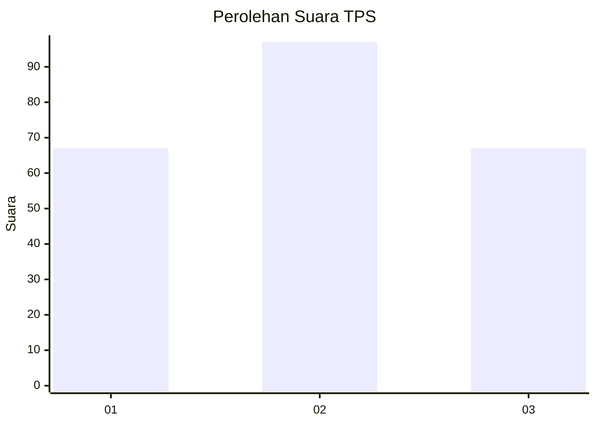
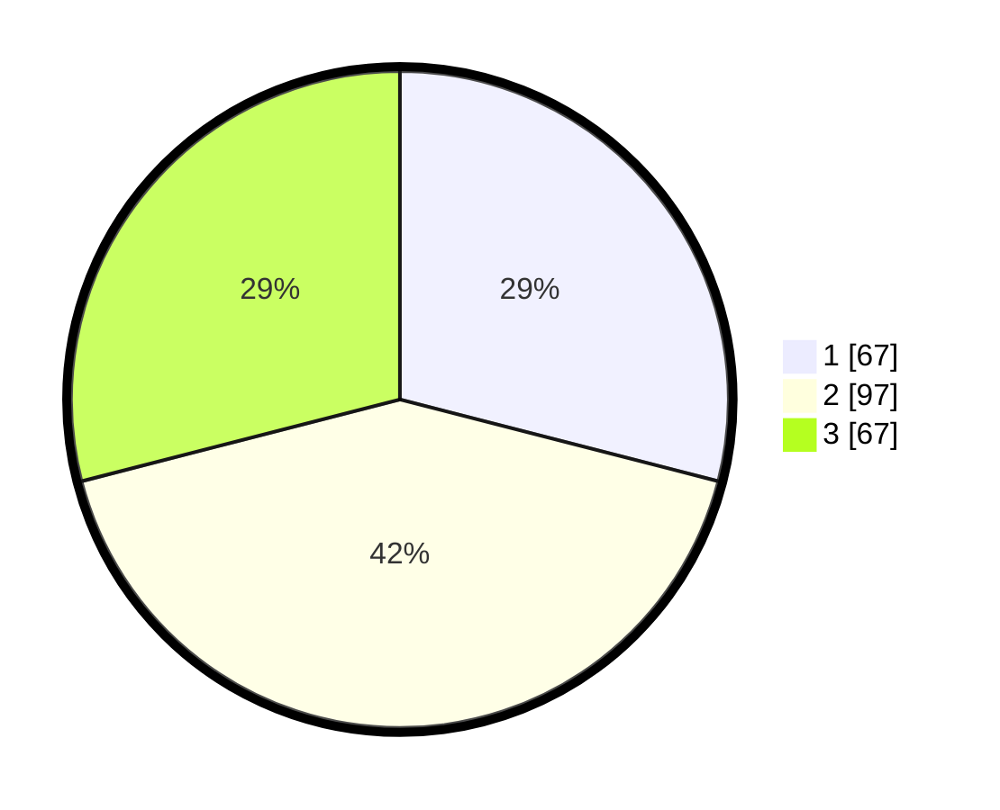

# Hasil

## Grafik

## Tabel

| No. | Nama Paslon    | Suara | Suara (raw) | Persentase |
|:--- |:-------------- | -----:| -----------:| ----------:|
| 1   | ANIES MUHAIMIN | 67    | [67][p-1]   | 29,00      |
| 2   | PRABOWO GIBRAN | 97    | [97][p-2]   | 41,99      |
| 3   | GANJAR MAHFUD  | 67    | [67][p-3]   | 29,00      |

[p-1]: https://github.com/gigit-pemilu/pemilu-2024-34-di-yogyakarta/blob/main/pilpres/hitung-suara/sub/34-di-yogyakarta/sub/02-bantul/sub/12-banguntapan/sub/2008-wirokerten/sub/031-tps/sub/paslon-1.txt
[p-2]: https://github.com/gigit-pemilu/pemilu-2024-34-di-yogyakarta/blob/main/pilpres/hitung-suara/sub/34-di-yogyakarta/sub/02-bantul/sub/12-banguntapan/sub/2008-wirokerten/sub/031-tps/sub/paslon-2.txt
[p-3]: https://github.com/gigit-pemilu/pemilu-2024-34-di-yogyakarta/blob/main/pilpres/hitung-suara/sub/34-di-yogyakarta/sub/02-bantul/sub/12-banguntapan/sub/2008-wirokerten/sub/031-tps/sub/paslon-3.txt

## Foto C Plano

https://sirekap-obj-formc.kpu.go.id/8722/pemilu/ppwp/34/02/12/20/08/3402122008031-20240214-155308--888e8335-e561-47e0-a98b-9a9c46ef4077.jpg

https://sirekap-obj-formc.kpu.go.id/8722/pemilu/ppwp/34/02/12/20/08/3402122008031-20240214-155314--14bdcfb7-4415-4927-97cc-b350e34779e9.jpg

https://sirekap-obj-formc.kpu.go.id/8722/pemilu/ppwp/34/02/12/20/08/3402122008031-20240214-155318--5cb6c151-466e-461b-83b8-9a21d7dddb2e.jpg

## Metadata

| Key        | Value               |
| ---------- | ------------------- |
| Time Stamp | 2024-02-24 22:31:28 |

