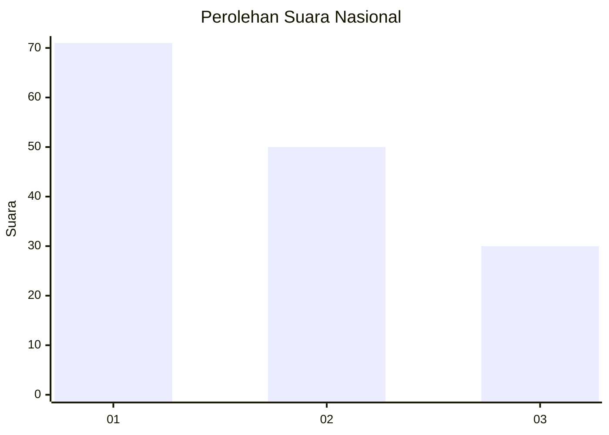
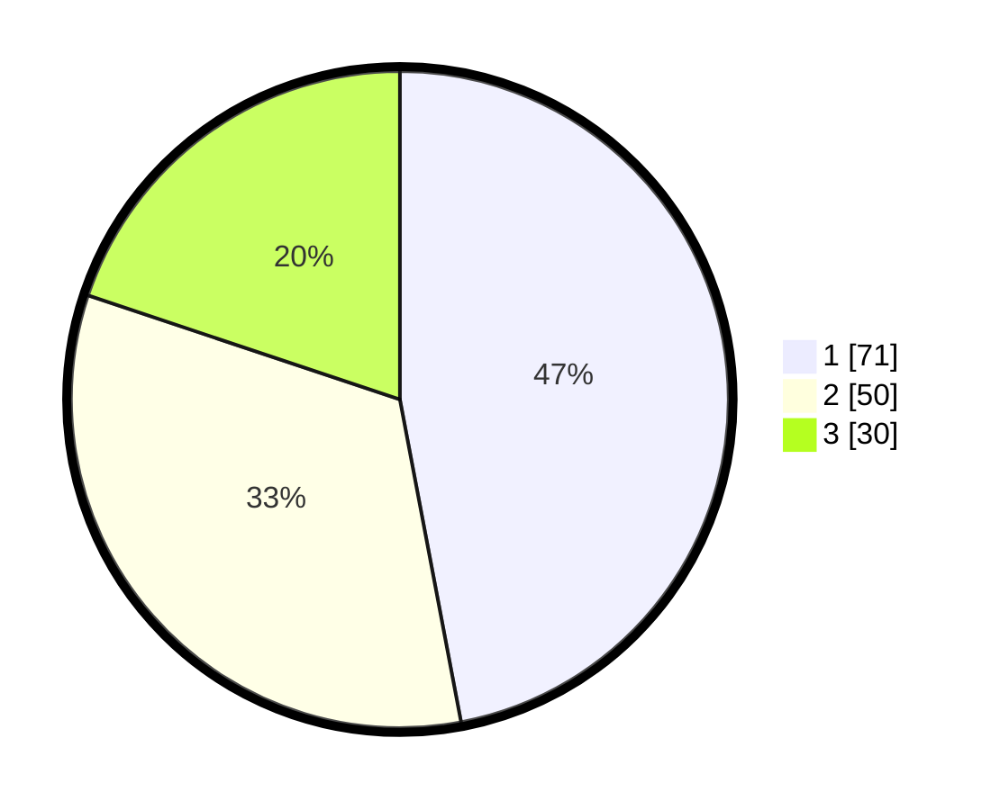

# Hasil

## Grafik

## Tabel

| No. | Nama Paslon    | Suara | Suara (raw) | Persentase |
|:--- |:-------------- | -----:| -----------:| ----------:|
| 1   | ANIES MUHAIMIN | 71    | [71][p-1]   | 47,02      |
| 2   | PRABOWO GIBRAN | 50    | [50][p-2]   | 33,11      |
| 3   | GANJAR MAHFUD  | 30    | [30][p-3]   | 19,87      |

[p-1]: https://github.com/gigit-pemilu/pemilu-2024/blob/main/pilpres/hitung-suara/sub/34-di-yogyakarta/sub/02-bantul/sub/12-banguntapan/sub/2008-wirokerten/sub/041-tps/sub/paslon-1.txt
[p-2]: https://github.com/gigit-pemilu/pemilu-2024/blob/main/pilpres/hitung-suara/sub/34-di-yogyakarta/sub/02-bantul/sub/12-banguntapan/sub/2008-wirokerten/sub/041-tps/sub/paslon-2.txt
[p-3]: https://github.com/gigit-pemilu/pemilu-2024/blob/main/pilpres/hitung-suara/sub/34-di-yogyakarta/sub/02-bantul/sub/12-banguntapan/sub/2008-wirokerten/sub/041-tps/sub/paslon-3.txt

## Foto C Plano

https://sirekap-obj-formc.kpu.go.id/0dda/pemilu/ppwp/34/02/12/20/08/3402122008041-20240215-004159--910d1552-5b86-4dbb-967d-eebf8f262a28.jpg

https://sirekap-obj-formc.kpu.go.id/0dda/pemilu/ppwp/34/02/12/20/08/3402122008041-20240215-004212--152ed889-be55-42d7-b86e-f3fb48f51dc7.jpg

https://sirekap-obj-formc.kpu.go.id/0dda/pemilu/ppwp/34/02/12/20/08/3402122008041-20240215-004225--a9cf6f91-8add-42c0-b186-ed85900ea181.jpg

## Metadata

| Key        | Value               |
| ---------- | ------------------- |
| Time Stamp | 2024-02-15 12:00:28 |

