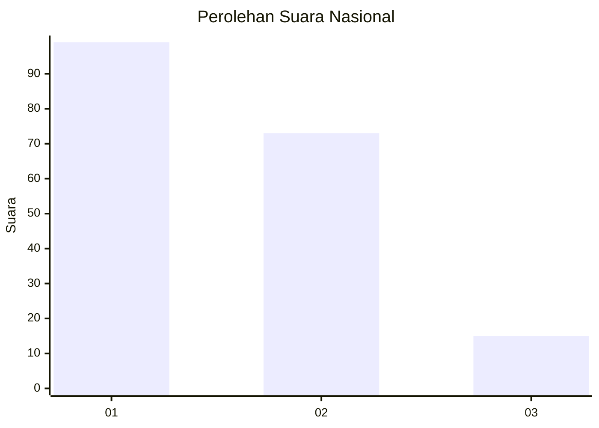
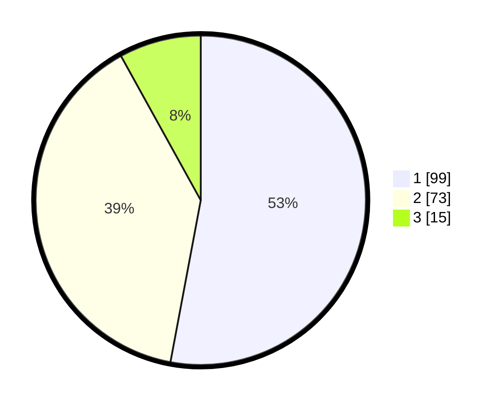

# Hasil

## Grafik

## Tabel

| No. | Nama Paslon    | Suara | Suara (raw) | Persentase |
|:--- |:-------------- | -----:| -----------:| ----------:|
| 1   | ANIES MUHAIMIN | 99    | [99][p-1]   | 52,94      |
| 2   | PRABOWO GIBRAN | 73    | [73][p-2]   | 39,04      |
| 3   | GANJAR MAHFUD  | 15    | [15][p-3]   | 8,02       |

[p-1]: https://github.com/gigit-pemilu/pemilu-2024/blob/main/pilpres/hitung-suara/sub/34-di-yogyakarta/sub/02-bantul/sub/13-pleret/sub/2001-wonokromo/sub/001-tps/sub/paslon-1.txt
[p-2]: https://github.com/gigit-pemilu/pemilu-2024/blob/main/pilpres/hitung-suara/sub/34-di-yogyakarta/sub/02-bantul/sub/13-pleret/sub/2001-wonokromo/sub/001-tps/sub/paslon-2.txt
[p-3]: https://github.com/gigit-pemilu/pemilu-2024/blob/main/pilpres/hitung-suara/sub/34-di-yogyakarta/sub/02-bantul/sub/13-pleret/sub/2001-wonokromo/sub/001-tps/sub/paslon-3.txt

## Foto C Plano

https://sirekap-obj-formc.kpu.go.id/0aff/pemilu/ppwp/34/02/13/20/01/3402132001001-20240218-174708--0562823b-5a63-4dee-a4d4-5208653a3fe2.jpg

https://sirekap-obj-formc.kpu.go.id/0aff/pemilu/ppwp/34/02/13/20/01/3402132001001-20240218-174709--cc4cbb1e-290b-4229-a825-e043adde3dd8.jpg

https://sirekap-obj-formc.kpu.go.id/0aff/pemilu/ppwp/34/02/13/20/01/3402132001001-20240218-174709--7191e451-9dfd-42db-8eea-954a37d1af73.jpg

## Metadata

| Key        | Value               |
| ---------- | ------------------- |
| Time Stamp | 2024-02-21 12:00:00 |

## DATA PEMILIH TETAP

Jumlah pemilih dalam DPT: **200**.
 * L: **93**.
 * P: **107**.

## DATA PENGGUNA HAK PILIH

Jumlah pengguna hak pilih dalam DPT: **182**.
 * L: **83**.
 * P: **99**.

Jumlah pengguna hak pilih dalam DPTb: **5**.
 * L: **5**.
 * P: **0**.

Jumlah pengguna hak pilih dalam DPK: **4**.
 * L: **0**.
 * P: **4**.

Jumlah pengguna hak pilih: **191**.
 * L: **88**.
 * P: **103**.

## JUMLAH SUARA SAH DAN TIDAK SAH

JUMLAH SELURUH SUARA SAH: **187**.

JUMLAH SUARA TIDAK SAH: **4**.

JUMLAH SELURUH SUARA SAH DAN SUARA TIDAK SAH: **191**.

