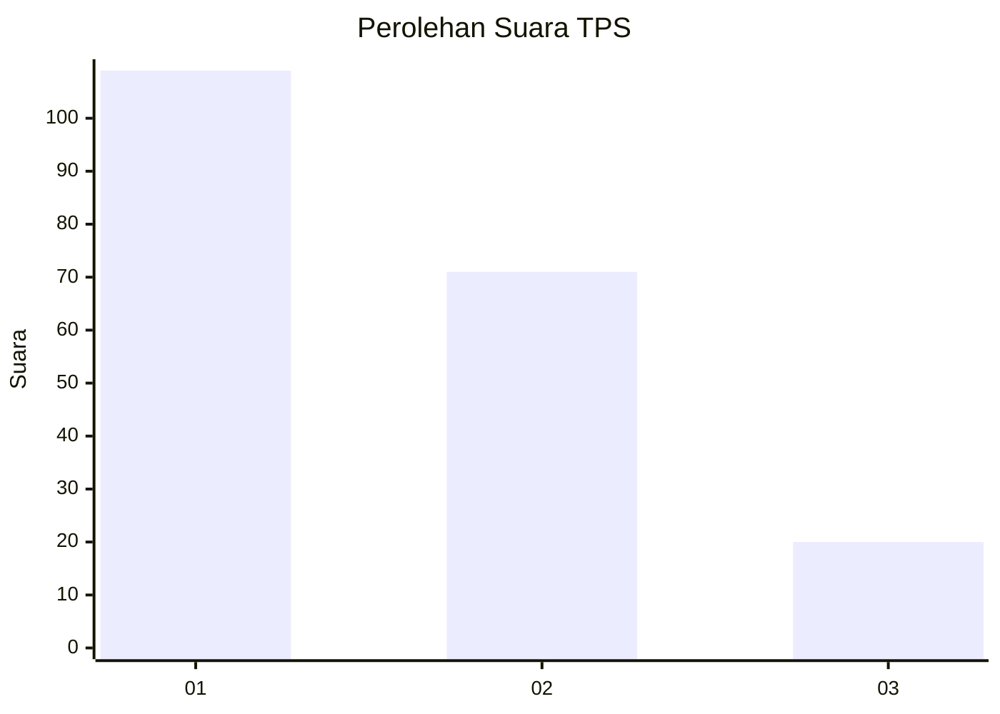
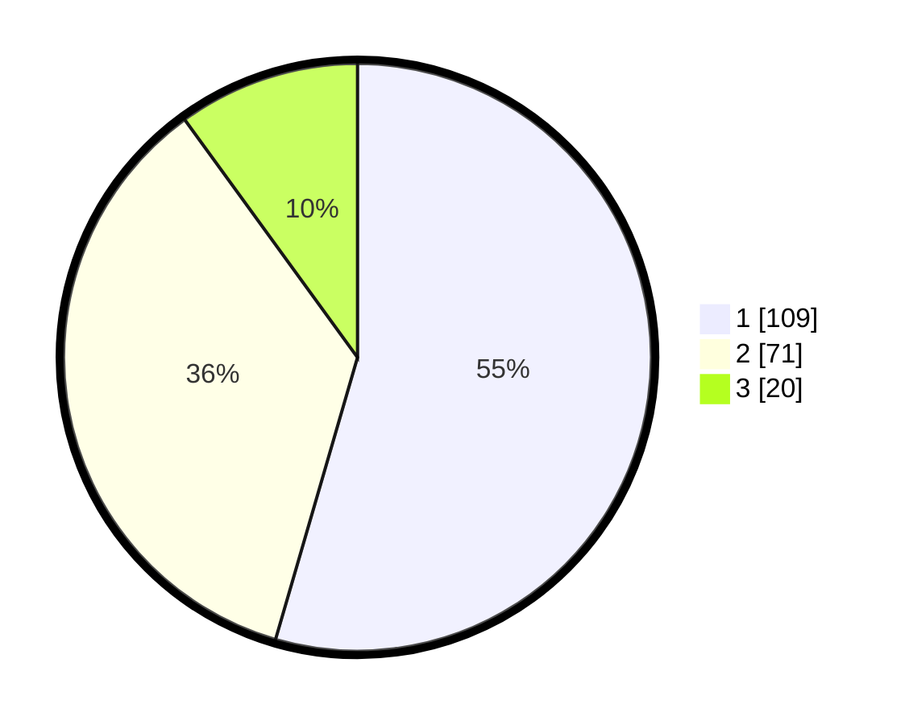

# Hasil

## Grafik

## Tabel

| No. | Nama Paslon    | Suara | Suara (raw) | Persentase |
|:--- |:-------------- | -----:| -----------:| ----------:|
| 1   | ANIES MUHAIMIN | 109   | [109][p-1]  | 54,50      |
| 2   | PRABOWO GIBRAN | 71    | [71][p-2]   | 35,50      |
| 3   | GANJAR MAHFUD  | 20    | [20][p-3]   | 10,00      |

[p-1]: https://github.com/gigit-pemilu/pemilu-2024-34-di-yogyakarta/blob/main/pilpres/hitung-suara/sub/34-di-yogyakarta/sub/02-bantul/sub/13-pleret/sub/2001-wonokromo/sub/002-tps/sub/paslon-1.txt
[p-2]: https://github.com/gigit-pemilu/pemilu-2024-34-di-yogyakarta/blob/main/pilpres/hitung-suara/sub/34-di-yogyakarta/sub/02-bantul/sub/13-pleret/sub/2001-wonokromo/sub/002-tps/sub/paslon-2.txt
[p-3]: https://github.com/gigit-pemilu/pemilu-2024-34-di-yogyakarta/blob/main/pilpres/hitung-suara/sub/34-di-yogyakarta/sub/02-bantul/sub/13-pleret/sub/2001-wonokromo/sub/002-tps/sub/paslon-3.txt

## Foto C Plano

https://sirekap-obj-formc.kpu.go.id/45b4/pemilu/ppwp/34/02/13/20/01/3402132001002-20240218-114416--d7d0dd75-5b4d-4799-b537-0b017d6dc276.jpg

https://sirekap-obj-formc.kpu.go.id/45b4/pemilu/ppwp/34/02/13/20/01/3402132001002-20240218-114417--6bf0cb87-c098-4a11-92d6-b44ed8322db7.jpg

https://sirekap-obj-formc.kpu.go.id/45b4/pemilu/ppwp/34/02/13/20/01/3402132001002-20240218-114416--2406cedf-2a54-4fff-9d45-ea81984adf56.jpg

## Metadata

| Key        | Value               |
| ---------- | ------------------- |
| Time Stamp | 2024-02-22 09:00:00 |

## DATA PEMILIH TETAP

Jumlah pemilih dalam DPT: **214**.
 * L: **104**.
 * P: **110**.

## DATA PENGGUNA HAK PILIH

Jumlah pengguna hak pilih dalam DPT: **197**.
 * L: **94**.
 * P: **103**.

Jumlah pengguna hak pilih dalam DPTb: **4**.
 * L: **0**.
 * P: **4**.

Jumlah pengguna hak pilih dalam DPK: **3**.
 * L: **2**.
 * P: **1**.

Jumlah pengguna hak pilih: **204**.
 * L: **96**.
 * P: **108**.

## JUMLAH SUARA SAH DAN TIDAK SAH

JUMLAH SELURUH SUARA SAH: **200**.

JUMLAH SUARA TIDAK SAH: **4**.

JUMLAH SELURUH SUARA SAH DAN SUARA TIDAK SAH: **204**.

